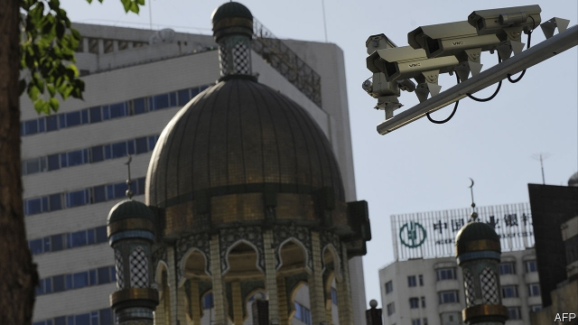

###### One in the AI

# America blacklists China’s best artificial-intelligence firms 

 

> print-edition iconPrint edition | Business | Oct 10th 2019 

FOR TWO years reports of mass incarceration have seeped out of the remote Chinese province of Xinjiang. Over 1m people, mainly Uighurs and other Muslim minorities, have been locked up in camps. Millions more live under a police state. American officials, fearful of upending trade negotiations, have dithered over a response. On October 7th, three days ahead of the 13th round of talks, they put their foot down. The Commerce Department banned American firms from selling software and hardware to 20 public-security organs. It also blacklisted eight Chinese companies whose products, it says, facilitate the Orwellian surveillance in Xinjiang. 

The ban hits at the heart of China’s artificial-intelligence (AI) ambitions. The eight firms include startups working on facial recognition (Megvii, SenseTime, Yitu), voice recognition (iFlytek), digital forensics (Xiamen Meiya Pico) and chipmaking gear (Yixin), as well as Shenzhen-listed makers of video-surveillance kit (Hikvision and Dahua). Together they are worth around $75bn. In August Megvii and Yitu were designated as national champions. 

How much will it hurt? Most of the firms are probably using American components. The 10% post-ban drop in the share price of Ambarella, an American maker of computer-vision chips, suggests that the Chinese are important customers. Huawei, a telecoms giant on the same blacklist since May over concerns that Chinese spooks use its gear to spy on America, expects to lose $10bn in sales this year as a result, mainly from its smartphone business. 

Things may not be so bad for the octet, at least in the short run. They have been hoarding parts in anticipation of a ban and have sought other suppliers. Since the array of components they require is tiny next to Huawei’s needs, they can buy essential ones on secondary markets. Jefferies, a bank, reckons domestic chipmakers such as DeePhi, Horizon and HiSilicon, an arm of Huawei, can make up any shortfall. 

The firms were quick to downplay the ban’s impact on their business. Xiamen Meiya Pico said its hardware was mostly home-grown and “highly replaceable”. iFlytek said the restrictions would have “no significant impact” on daily operations. Most cameras built by Hikvision and Dahua are thought not to contain sophisticated American innards. For the “very small fraction” that cannot be substituted, Hikvision said it would ask clients to source and integrate the parts themselves. 

The ban’s longer-term effects look hazier. It has spooked the firms’ Western research partners, whose help they rely on to develop cutting-edge technology. On October 9th the Massachusetts Institute of Technology, which cut ties with Huawei earlier this year, said it was reviewing those with SenseTime. American suppliers who lobbied their government to keep selling to Huawei may recoil at defending firms suspected of aiding human-rights abuses. 

Foreign customers and investors may be put off, too. Over a quarter of Hikvision’s revenues come from abroad. In 2018 it entered the MSCI index of emerging-market stocks. But foreign shareholders are skittish. After selling down its stake UBS, a Swiss bank, is no longer among its ten biggest investors. This week Goldman Sachs, an investment bank, said it was reviewing its role in Megvii’s forthcoming flotation in Hong Kong. Megvii insists its blacklisting reflected a “misunderstanding” of the company, which earned 1% of its revenue in Xinjiang last year and requires clients “not to weaponise our technology”. 

The ban came days before the latest round of trade talks, due on October 10th, after The Economist went to press. President Donald Trump may see it as a bargaining chip. Samm Sacks of New America, a think-tank in Washington, discerns darker motives. The blacklisting is “a clear shot across the bow from the decouplers of DC”, she says, referring to national-security hawks intent on disentangling the commercial ties that bind the two superpowers. Sure enough, the move led China to decry America’s “wanton interference” in its internal affairs. It threatened retaliation. ■ 

Correction (October 10th 2019): An earlier version of this article implied that all of Huawei's $10bn in reduced revenues would be down to its smartphone business. That is expected to be the main reason for lower revenues, but not the only one. 

