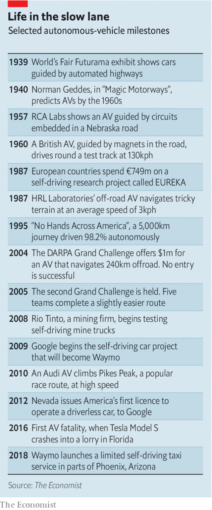

###### Autonomous ways

# Chinese firms are taking a different route to driverless cars 

 

> print-edition iconPrint edition | Business | Oct 12th 2019 

THE SELF-DRIVING cars that cruise around South Ronghua Road look just like their American counterparts: chunky sedans with a rack of sensors bolted to the roof and a supercomputer in the boot. Beijing’s government has dubbed this south-eastern patch of the city Beijing-E-Town. It is one of a growing number of urban spaces across China designated for testing autonomous vehicles (AVs). Digital lane markers can switch parts of the road to AV-only on demand. Signs announce “National Test Roads”. Cars bear the decals of China’s leading AV companies: Baidu, Pony.ai, WeRide. 

For years Western carmakers have promised a world awash with AVs by now, making roads safer and less congested (see table). That it is not shows just how tough a computational and regulatory nut self-driving is to crack. It increasingly seems that if AVs are to become widespread, it may happen first not in the West but in China. A fleet of Chinese firms hope to profit handsomely in the process. 

 

That may seem counterintuitive. Technologically, the West appears streets ahead. “Everybody is behind Waymo and Cruise,” concedes a senior Chinese AV executive, referring, respectively, to a subsidiary of Alphabet (Google’s holding company), and of General Motors (GM), a giant carmaker. Waymo’s cars alone have self-driven more miles than all Chinese AVs put together. Cruise has attracted $6.2bn of investment since GM bought the startup for $1bn in 2016. CB Insights, a research firm, estimates that $11.9bn has been invested in American AV firms since 2014, compared with $4.4bn in China. 

Yet in the absence of driving software which can handle chaotic city streets, some Chinese firms are adopting an alternative strategy. They are turning the streets themselves into something that software can handle. The approach involves installing sensors to guide cars, writing and enforcing rules about how humans move around, designing (or redesigning) urban landscapes to be AV-friendly and, critically, limiting AV firms’ legal liability in the event of inevitable accidents. All this is easier in authoritarian China than in the West’s unruly, litigious democracies. 

It also requires input from companies beyond dedicated AV-makers. Mobile-network operators, such as China Mobile, and telecoms-equipment manufacturers, like Huawei, are building technology into their systems which may in time help cars along the road. Huawei wants its zippy 5G mobile antennas to take on a large part of the processing required to run an AV—and a chunk of AV profits. That leaves a smaller share of the pie for AV companies. But the pie itself should grow more quickly. Lowering the cost of infrastructure per AV deployed should accelerate its roll-out, notes Feng Hao of Bosch, a German engineering conglomerate which supplies high-tech components to Chinese carmakers. 

In a recent speech China’s minister of industry and information technology, Miao Wei, said that the market for connected vehicles is projected to be worth 100bn yuan ($14bn) by next year. And as with just about anything, the potential demand for AVs among 1.4bn Chinese is huge—$2trn by 2040, reckon consultants at McKinsey. 

Chinese firms may prosper well before the eventual arrival of all-out AVs. They already benefit from the leapfrog effect, says Wei Zhou, boss of China Creation Ventures, a venture-capital fund. Cowa Robot, one of his firm’s investments, has sold autonomous street-sweeping robots to authorities in Changsha, the capital of Hunan province. Horizon Robotics, which is valued at $3bn, furnishes specialised AV computers for companies like Cowa. 

The ability to make money now by automating simpler tasks keeps the firms going on the way to fuller autonomy—a luxury few American rivals, up against powerful incumbents like municipal-services companies, enjoy. At the same time, they are shielded from foreign competition by rules that limit overseas AV companies to minority stakes in Chinese-led joint-ventures. 

Chinese AV companies have one final advantage over their Western peers: explicit support from the Chinese state. “There’s a lot of fuel coming from the government planning,” says an executive of one Chinese firm. The government wants companies like his to succeed, and is willing to use its autocratic muscle to build infrastructure, promote new technology and rewrite policy. It will spend up to $220bn on 5G by 2025, according to state media, and plans to install AV infrastructure throughout the 2020s, including telecoms networks to capture data from vehicles and their surroundings, cloud-computing capacity to process these data and map services to guide the cars. 

In addition, the authorities promote AV-friendly standards and regulations. They can stitch “National Test Roads” into the urban fabric without the fuss Western authorities can expect from local residents. In one-party states like China “you have single-focus government that can make things happen”, sums up Amer Akhtar of DeepMap, a Californian maker of software for maps which AVs need to navigate. 

The road is not all smooth for China’s AV industry. Together with the rest of Chinese tech, it is caught up in the Sino-Amercian economic war. In May America’s government barred its companies from supplying Huawei, on the ground that its kit might allow Chinese eavesdropping. On October 7th another eight Chinese companies were added to the blacklist, including those working on things useful to AVs, like computer vision (see article). 

The prospect of losing access to American technology is particularly worrisome for AV companies, because the Chinese car industry relies heavily on foreign suppliers for the electronics that power modern vehicles. Last year Chinese imports of integrated circuits totalled $312bn, ten times the value of imported car parts. Chinese entrepreneurs eyeing the Chinese AV market have founded plenty of promising startups—but many of them in Silicon Valley, subject to American law. Efforts to make more cutting-edge gubbins at home are moving slowly. 

Nor are Chinese AV developers immune from the biggest problem which afflicts their Western rivals. Like them, Pony.ai, WeRide and others continue to lose money. This may not change soon. The desire of motorists to own self-driving cars has yet to be tested. The business model of ride-hailing, where future profitability is in part predicated on the eventual removal of costly human drivers, looks shaky. Investors are growing impatient with loss-making firms such as Uber, which has shed a third of its stockmarket value since going public in May. It may take longer for software to become competitive with Homo sapiens in China, where labour remains relatively cheap. As one global car executive puts it, “If drivers are abundant but space on the road is not, the problems you should be solving first are not about taking the driver out of the car.” 

China’s approach to self-driving reflects its attitude to development more broadly: heavy on infrastructure and government oversight, lighter on cutting-edge technology and civil liberties. It may one day prevail over the Western path to autonomy. Whether Chinese AV companies will stand on their own four wheels as profitable businesses is another matter.■ 

