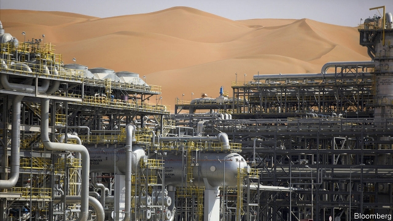
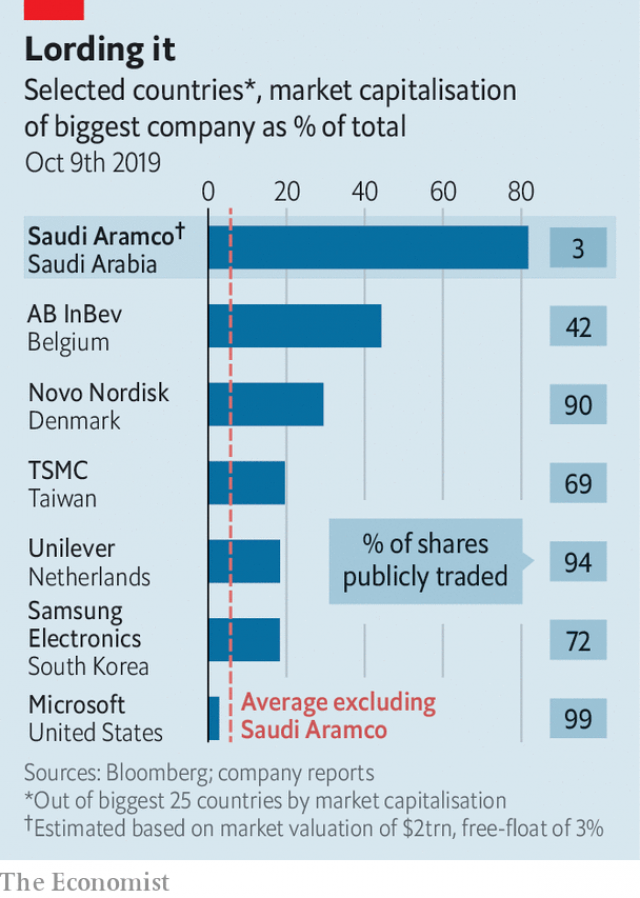

###### Energetic listing

# Saudi Aramco is raring to go public 

 

> print-edition iconPrint edition | Business | Oct 10th 2019 

THREE YEARS ago Muhammad bin Salman, Saudi Arabia’s crown prince, suggested floating up to 5% of Saudi Aramco, the world’s biggest oil company, at a valuation of $2trn. At first glance now is a terrible time to do so. A month ago drone attacks suspended more than half the giant’s output. On October 7th security concerns prompted Fitch Ratings to downgrade Aramco’s credit by a notch. To make matters worse, fears of an economic slowdown that depresses demand for crude has dragged the oil price down below the level before last month’s attack. 

Apparently unfazed, Aramco is forging ahead with plans to list a portion of its shares. Prince Muhammad and the ministers overseeing the offering want this done in short order. To that end, last month they appointed Yasir Al-Rumayyan, the head of Saudi Arabia’s sovereign wealth fund, as Aramco’s chairman. The press-shy company is inviting reporters to its vast complex in Dhahran. When your correspondent visited this week, executives touted Aramco’s capabilities, from drilling analytics to research on fuel efficiency. More important, the company has devised new dividend and royalty policies, presented to bank analysts last month. Nine banks are soliciting feedback from potential investors. An announcement of an intention to float may come by the end of October. 

There is logic to this sprint. There have been many reasons to delay Aramco’s initial public offering, from concerns about the legal risks of listing abroad to uproar over the murder last October of Jamal Khashoggi, a journalist, in the Saudi consulate in Istanbul. But the main reason for pursuing the IPO—to raise money to help the kingdom diversify its economy—remains pressing. And Aramco looks better prepared today than it did last year. 

In March the company announced it would pay $69bn for a 70% stake in SABIC, a petrochemical company owned by the Saudi sovereign wealth fund. In April it issued bonds to help finance the deal, which will help Aramco expand its downstream business, a strategic priority (underscored by its decision in August to buy 20% of the refining-and-chemicals business of Reliance, an Indian conglomerate). The bond prospectus amounted to a 469-page dress rehearsal for required IPO disclosures. 

The market liked what it saw. Aramco’s $111bn in net income in 2018 was nearly twice that of Apple, the world’s most profitable listed company, and more than that of the five biggest publicly traded oil giants—ExxonMobil, Royal Dutch Shell, BP, Total and Chevron—combined. Investors lapped up $12bn-worth of Aramco bonds. 

Aramco has also worked hard in the past few months to assure potential investors that they will not be neglected as the company serves its royal master. In September it said non-state shareholders will get a proportionate share of “an annual base dividend” of $75bn in 2020. The firm intends to maintain the same payout to minority investors until 2024 even if the total dividend declines. If crude prices rise, their dividends could grow, too. The state, meanwhile, would get a progressively larger windfall from royalties when oil fetches more than $70 a barrel. Below that, it would receive a relatively slim royalty of 15%. 

 

The company is moving forward with plans for an initial listing on the Tadawul, Riyadh’s stockmarket. Some large international investors have voiced concerns about a lack of liquidity on the Saudi exchange (see chart). Last year $232bn of shares was traded on the Tadawul, about one-twentieth the volume traded on the London Stock Exchange. 

However, the government has taken steps to liberalise rules on the exchange and is eager to boost the kingdom’s financial sector. A Tadawul listing also avoids the kind of legal liabilities that might arise from listing in, say, New York. Aramco looks likely to list 3% of its shares by the end of the year, according to a person familiar with the matter, before pursuing a secondary listing abroad. 

Whether the IPO will be as Prince Muhammad once envisioned is another matter. Aramco has denied reports that the kingdom is pressing Saudi families to be cornerstone investors. Investors have grounds to be nervous. The company says production has recovered to the level before the attacks but they were a reminder that its 257bn barrels of proven reserves are not just uniquely vast but unusually concentrated and vulnerable. Last, Aramco must decide how much it thinks it is worth. One of the main metrics for valuing an energy firm, notes Oswald Clint of Bernstein, a research firm, is the dividend yield. The best supermajors offer about 6%. For Aramco’s $75bn payout to match this would imply a valuation of $1.2trn or so, well short of the original princely sum. ■ 

