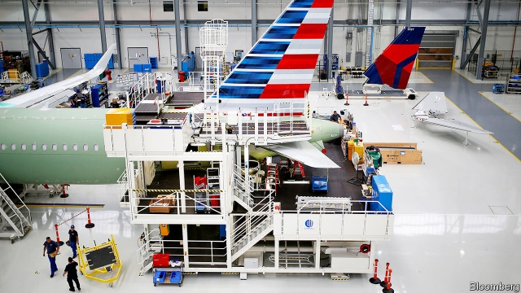

###### In for the long haul

# Trade disputes harden the Airbus-Boeing duopoly 

 

> print-edition iconPrint edition | Business | Oct 12th 2019 

VICTIMS OF A long-running trade dispute between Boeing and Airbus are proliferating. Americans keen on a Spanish olive before a main course dusted with Italian Parmesan and washed down with Scotch will have to stump up more cash. The World Trade Organisation (WTO) has given America the go-ahead to impose $7.5bn-worth of tariffs on a smorgasbord of European imports on October 18th after ruling that Airbus had received illegal state aid in Europe. Passenger aircraft made by Airbus and parts that feed its factory in Alabama will be on the menu. But efforts to tackle anticompetitive practices in aerospace may only strengthen the planemakers’ stubborn duopoly. 

Europe will doubtless retaliate. Shortly after Boeing brought its case against Airbus at the WTO, the European firm launched a similar one against its American rival. After 15 years of legal wrangling both have been found to be roughly equally at fault. Europe can expect to be given the opportunity to levy tariffs of its own in a few months unless a negotiated settlement, which has proved elusive, is agreed. Europe is sure to include Boeings. 

Tariffs will raise the cost of each firm’s aircraft in the other’s market. Airlines play one off against the other to get the best price. In the short term orders will be hard to switch. But industry-watchers predict that, in the long run, America’s carriers will plump for Boeings and Europe’s will favour Airbuses, creating captive home markets. 

It would not be the first instance of trade-dispute mechanisms stifling competition. In 2008 Canada’s Bombardier, a maker of regional jets, launched the C-Series, a plane that competed with some smaller models made by Boeing and Airbus. Cost overruns and delays threatened the C-Series until an order in 2016 from Delta, an American airline, seemed to guarantee its future. But Boeing complained to American regulators about Canadian subsidies, leading to the imposition of a vast tariff. The levy was later struck down by an American tribunal—but not before Bombardier had handed half the struggling C-Series programme to Airbus to keep it alive. 

To keep pace with Airbus, in 2018 Boeing sought a controlling stake in the commercial-aircraft arm of Brazil’s Embraer. On October 4th the European Union opened an investigation into the planned tie-up claiming that it would “eliminate a small but important competitive force” and ultimately hamper rivals making similar planes in China, Japan and Russia. Some suspect that the move to clip Boeing’s wings shortly after America imposed its latest tariffs is not coincidental. 

Another rival to Airbus and Boeing, China’s COMAC, might also suffer. If Europe and America become domestic monopolies, their main battleground may switch to Asia, where demand for air travel is soaring. Airbus’s most recent annual industry forecast for the next 20 years predicts that Asia will account for 42% of new aircraft sales, compared with 36% for Europe and America combined. COMAC’s C919, a supposed short-haul rival to Airbus’s narrow-body A320 and Boeing’s 737, is not taken seriously as a threat by the pair. Boeing’s troubles with the 737 MAX, grounded since March and awaiting regulatory approval to fly again after two fatal crashes, may not provide COMAC with much of an opening. In part this is because the C919, first conceived over a decade ago, has been serially delayed. A recent announcement of yet another hold-up means that the first customer, China Eastern Airlines, may not get its first plane until 2022. Meanwhile, Boeing and Airbus have launched planes widely considered better than the C919, have set up factories in China and are sure to compete fiercely with each other, making COMAC’s life in its home market tougher. 

China’s government has twisted the arms of domestic airlines to order C919s but it will be hard to force a less sophisticated aircraft on Chinese carriers, which already have big fleets of Western planes. Airbus and Boeing are clamouring for business with new ones built in China. Trade disputes, it seems, may help keep the aerospace duopoly aloft.■ 

