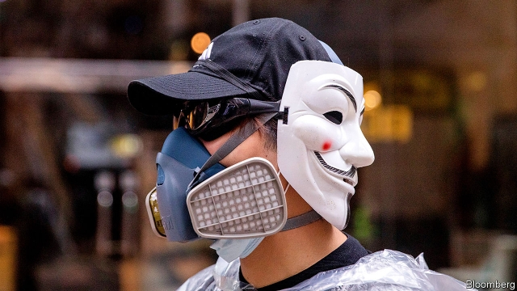

###### Emergency brake

# A draconian law invoked by Hong Kong is unlikely to restore calm 

 

> print-edition iconPrint edition | China | Oct 12th 2019 

“WE ARE INDEED in an occasion of serious danger,” said Hong Kong’s leader, Carrie Lam, when she announced her decision on October 4th to invoke the Emergency Regulations Ordinance, a colonial-era bill—disused for more than 50 years—allowing the government to impose sweeping curbs on civil liberties. Mrs Lam only announced one new restriction: a ban on the wearing of masks during protests. But thousands of demonstrators defied the edict. Widespread violence broke out, paralysing transport. A new cycle of escalation may have begun. 

Mrs Lam’s belief that the mask ban will have a “deterrent effect” may prove wrong. But her description of the problem was close to the mark. “Protesters’ violence has been escalating and has reached a very alarming level in the past few days,” she said. Indeed it has. On June 12th, shortly after the unrest began, young protesters wept after the police fired rubber bullets at them. They have since become battle-hardened (see Chaguan). Once they limited their targets to government buildings, spraying them with slogans and throwing stones and other projectiles at them. More recently they have been attacking businesses and bystanders who oppose their views. Once a café run by someone deemed pro-Communist would have been covered in Post-it notes. These days it might have its windows smashed. 

Just a few days before announcing the mask ban, Mrs Lam had suggested she was aware that invoking the emergency bill might not work. She said she had to assess “whether such laws would backfire on an already chaotic society, or worsen our already damaged reputation in the international community.” Her now-abandoned caution was well-founded. Within hours of her edict being issued, protesters (mostly masked) vented their anger on the territory’s rail network, which they accuse of aiding police by shutting down stations to hinder demonstrators’ movements. The protesters flooded some stations with water and lit fires in others. That night, for the first time in 40 years, the whole network was suspended, leaving many people stranded. Many stations stayed closed all weekend. Some remained shut even after Hong Kongers went back to work on October 8th after a long weekend. 

It was not all mayhem. Tens of thousands of people marched peacefully, also wearing masks. Only a few dozen were arrested for donning them, suggesting that enforcement is a problem. Mrs Lam insists that she has “no plans” to invoke the emergency bill again, but many Hong Kongers believe she may be tempted to use it to declare a curfew or control the use of instant-messaging apps that are often used to organise protests. Such measures would be sure to provoke defiance. 

But some residents wish protesters would change their tactics. They would like an end to the disruption of transport and the violence that makes it difficult for some people to leave home or go to work. The movement’s extraordinary scale and persistence has relied on the tolerance shown by moderates towards radical action, including the throwing of petrol bombs. Recently, however, many moderates have been saying that the “frontline fighters” should back off. Some worry that more violence will give officials an excuse to postpone next month’s district-council elections, in which the pro-democracy camp expects to do well. They also fear that it will erode overseas support for the protesters (such backing has infuriated many people in China; see article). 

But some radicals are itching for trouble, including on October 16th when the Legislative Council will meet for the first time since July. There the government is expected to withdraw the draft bill that triggered the unrest, which would have allowed criminal suspects to be extradited to the Chinese mainland. But the legislature, dominated by pro-government politicians, is likely to endorse the face-mask ban. It will be another day of tension. ■ 

