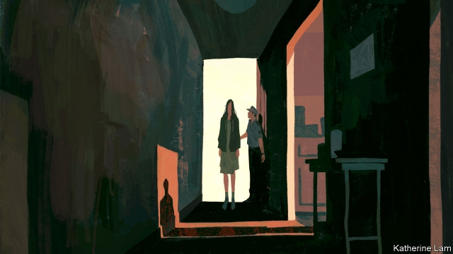

###### No escape

# In China, courts deny women divorces in the name of “social harmony” 

 

> print-edition iconPrint edition | China | Oct 12th 2019 

THE BEATINGS were so brutal that Dong Fang (not her real name) was left partially deaf, and her daughter needed three stitches in her hand. Not long ago, China’s courts would probably have ignored such an assault, because the attacker was both Ms Dong’s husband and the girl’s father. Luckily for the victims, however, the country had recently enacted a domestic-violence bill. This enabled Ms Dong to obtain a restraining order from a court in Chengdu, the south-western city where she lives. Local media praised this as an example of the new law in action. Later came the shock. The same court rejected Ms Dong’s petition for divorce. It reasoned that the marriage was still on a “very firm” foundation and the husband should be given “a chance”, the judge told a newspaper in Beijing. 

Ms Dong’s plight is common. The law on domestic violence, which took effect in March 2016, aims to protect women. But it is also intended to “promote family harmony and social stability”. Judges often consider this more important than women’s well-being. A study of 150,000 divorce cases filed between 2009 and September 2016, more than two-thirds of them by women, found the new law had done little to help female victims. When people file their first petition for divorce (many have several tries), judges are more likely to agree if the plaintiff is a man. They are usually unswayed by claims of violence. “For abused women, courts are the problem, not the solution,” says the study’s author, Ethan Michelson of Indiana University. 

China’s leader, Xi Jinping, is a champion of tradition. He describes families as the “cells” of society (mention of Mr Xi’s divorce from his first wife in 1982, after only three years of marriage, is taboo). Officials fear those cells are decaying as marriage rates fall and divorce rates soar. Last year more than 10m couples tied the knot and nearly 4.5m undid it. This is partly because, for many people, divorce has become much easier. Before 2003 it needed approval from an employer or community leader. Now, if both partners agree, they can quickly unmarry at a local civil-affairs bureau. 

But the one-in-six cases that end up in court are complicated. Last year two-thirds of them were rejected at the first hearing. Domestic violence has been a legal ground for divorce and damages since 2001. But abused spouses often remain trapped. Sometimes judges refuse to approve divorces for the sake of their own jobs. Performance targets often involve finishing a certain number of cases. As citizens become more litigious, caseloads are growing fast. For judges, saying no to a divorce is usually quicker than arranging one. 

Some judges also fear that the anger of an aggrieved party may lead to violence. So when a man threatens to murder his wife—or the judge—if a divorce goes through, courts often prefer to keep the marriage together. Poor odds of success in highly contentious divorce cases dissuade women from attempting divorce in the first place, says Leta Hong Fincher, the author of “Leftover Women: The Resurgence of Gender Inequality in China”. 

Possibly helped by public attention to her case, Ms Dong eventually got her divorce in June, two years after the beating that temporarily damaged her hearing. “Whether or not to permit a divorce should be based on whether feelings between husband and wife have been ruptured,” the court said. In this case, it ruled, they had been. The court said each should have one of the couple’s two houses, and compensate the other for any difference in value. 

But in another twist the judge refused Ms Dong’s application for 50,000 yuan ($7,010) in damages from her ex-husband. The court agreed she had suffered violence, but not with “serious consequences”. 

Such rulings are common, says Xin He of the University of Hong Kong. Judges often allow a divorce while dismissing charges of domestic violence, thus allowing the husband to avoid any penalty. As a result, says Kwai Ng of the University of California San Diego, “the courts have become an unreliable guardian of the lawful rights and interests of women.” Ms Dong still has some faith in the system: she has filed an appeal. She expects a ruling by January. 

The passage of the domestic-violence law was a breakthrough. Activists had been campaigning for one for two decades. Even so, Mr He points out flaws. The bill does not treat domestic violence, including marital rape, as a criminal offence. Getting a restraining order requires strong proof that a threat is posed. The penalty for violators is light: a fine of up to 1,000 yuan or 15 days in jail. In the law’s first 33 months, courts granted more than 60% of requests for such orders. But only 5,860 women applied for them, a tiny fraction of the number of victims. The state-backed All-China Women’s Federation estimates that one in four wives in China suffers domestic abuse—probably an underestimate. Ms Dong, who is a university lecturer, believes her financial independence helped her. “Those who are weaker see no hope,” she says. Online commentators on Ms Dong’s case often argue that “to stay safe, don’t marry and don’t have children”, says her lawyer. 

Since Mr Xi came to power in 2012 he has stressed the importance of the rule of law. But he has also emphasised the judiciary’s subordination to the Communist Party. So judges are inclined to interpret the law in ways that please it. In 2016 the supreme court instructed courts how to handle trials involving family matters. Its words echoed the party line: “The settlement of family disputes concerns not only the happiness of individuals and families, but also social harmony and stability and the advancement of civilisation.” 

Meanwhile Mr Xi has been waging a ruthless campaign against human-rights activists, including those campaigning for better protection of women. Though he has called for an end to “all forms of violence against women”, he is not making it easy. ■ 

