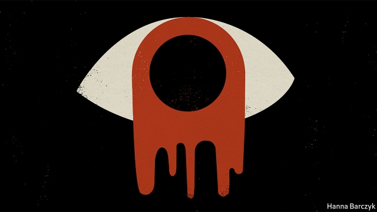

###### Chaguan

# Tiananmen veterans view Hong Kong’s crisis with fatalism 

 

> print-edition iconPrint edition | China | Oct 12th 2019 

HAN DONGFANG learned the hard way that the Communist Party of China will shed blood to enforce its will. As an activist during the democracy protests of 1989, he stood in a rumour-swept Tiananmen Square in early June and assured fearful comrades that, as a former soldier turned railway electrician, he was sure that the People’s Liberation Army would never shoot fellow Chinese. Still haunted by that mistake, he felt alarm in September 2014 at the sight of democracy activists from the Occupy Central movement blocking streets in Hong Kong, his home in exile. Hurrying to the Occupy protests, Mr Han sat beside the youngsters and urged them to see reason. Stop blocking traffic, he advised, you are giving the police, or worse, Chinese soldiers waiting unseen in their Hong Kong barracks, an excuse to attack. 

Jump forward to 2019, and a new generation of radical activists is all but daring China’s rulers to send troops onto Hong Kong’s streets, and, by spilling blood, show China’s true nature. Whether they are trampling the Chinese flag, vandalising metro stations, attacking policemen or brawling with gangsters loyal to the party, hard-core protesters have brought a furious, burn-it-all-down energy to a movement once notable for its moderation. The first big marches, in June, belonged to a more innocent age, when Hong Kongers strolled peacefully in their hundreds of thousands to oppose a law that would expose them to the mainland’s justice system. Some sang hymns or collected water bottles for recycling. 

Today, the risks of provoking those in power are greater than ever. Hong Kong’s police officers—visibly exhausted and embittered after 17 weeks upholding the authority of the territory’s despised political leaders—stand ready to club, tear-gas and arrest anyone they deem a threat, while repeatedly turning a blind eye to violence by pro-Communist thugs. Hong Kong’s military garrison has been reinforced with thousands of soldiers and paramilitary police from the mainland, answerable to the hard men in Beijing. 

Mr Han has much to lose. Hong Kong’s Western-style freedoms have not just offered him a haven. They allow him to run China Labour Bulletin, an organisation that campaigns for the rights of workers on the mainland. Yet for all that, he finds himself rethinking his advice to Occupy protesters to remain moderate. “During Occupy, I felt my experience in Tiananmen Square counted,” Mr Han says. He now thinks his words of caution were “just bullshit” and an arrogant, “dinosaur kind of thinking”. He says today’s youngsters are much wiser about the party than he was 30 years ago. When youngsters declare themselves proud Hong Kongers who feel nothing for China, they are using their city’s political and civic freedoms to define themselves and deny their Chinese identity, he marvels. Turning-points in history are not always rational, or good, or bad, he ventures. They just are. 

Mr Han’s new fatalism is revealing, and reflects a wider shift in public opinion. Though recent acts of violence by protesters dismay many, polls suggest that Hong Kongers are angrier still with the police and government, whose job is to uphold order and the law impartially. In the meantime, even those who oppose radical actions by protesters concede that moderation has not brought many rewards. Asked how this confrontation may end, Mr Han says that, though it may sound cruel to some, “How it ends no longer matters. What matters is that it already began.” Either China can offer real democratic reforms to Hong Kong, he says, or it can use force and risk a crisis that will shake China and its periphery. 

The Reverend Chu Yiu-ming was in his 40s when he witnessed the murderous suppression of the Tiananmen protests. Five years ago Mr Chu, a Baptist minister from Chai Wan in eastern Hong Kong, preached non-violence and quoted Martin Luther King as he co-founded the Occupy movement. Convicted of public-order offences for his role in that, Mr Chu, 75, only escaped prison on grounds of his age and public service. In an interview at his church he talks of sleepless nights worrying about youngsters on the streets today who are being arrested on charges of rioting, which could land them in prison for ten years. Yet he says that even “frontline fighters”, as more radical protesters are known, enjoy support from across society. “When people face a life-threatening situation, it is natural to think of self-defence,” he says. Sometimes sacrifices are needed to defend freedoms, he adds, recalling the church’s past support of uprisings against dictatorships in the Philippines, East Germany and Poland. Hong Kongers are not trying to topple the party, he believes. They just want “one country, two systems” to mean that Hong Kong’s government is answerable to its people. Asked if he fears another Tiananmen, the priest quotes a message from an intermediary familiar with President Xi Jinping’s plans for Hong Kong: “No bloodshed, no compromises”. 

If accurate, that message suggests the party is preparing for a war of attrition. Sadly for China’s rulers, the situation may be too unstable for that. Today’s levels of police violence and political repression disgust many Hong Kongers, but are not brutal enough to deter protesters. Put another way, the crisis must either get better quickly thanks to bold government concessions, or much worse. 

Wang Dan, who was a student leader on Tiananmen, knows which outcome he expects. Reached in Washington where he now lives, he calls himself “extremely pessimistic”. Hong Kongers are asking for democracy, a demand which party leaders will reject, Mr Wang notes. “Both sides do not have space to yield. I can’t see a possible solution.” Beyond the ranks of the most radical protesters, a striking number of youngsters express confidence that China would never dare set troops on them, because the costs to the country’s reputation would be too high. Veterans of 1989 know better. That is why their support for Hong Kong’s young sounds more like a tribute to courage than a prediction of success. The old-timers have seen history made before, and it was cruel. ■ 

