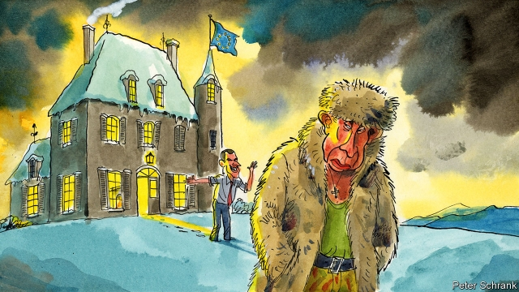

###### Charlemagne

# A thaw in EU-Russia relations is starting 

 

> print-edition iconPrint edition | Europe | Oct 12th 2019 

MOSCOW MIGHT as well have drafted the script of Donald Trump’s leaked call to Volodymyr Zelensky on July 25th. In it, Ukraine’s president endorsed criticism of his European partners and seemed open to a deal by which his country would disclose information damaging to Joe Biden, a possible electoral rival to Mr Trump, in return for aid in its struggle against Russia’s military incursions. The transcript reinforced Moscow’s lie that Ukraine is a decadent Western satrapy. 

Friends of Ukraine need not worry too much about the call. Plenty of European leaders, after all, humour Mr Trump on the phone. But Ukrainians and their allies ought to worry about something else. A partial thaw in EU-Russia relations, produced not by the ramblings of an inexperienced Ukrainian president but by long-term geopolitical shifts, is under way. 

On paper, that seems improbable. Russia’s annexation of Crimea, its invasion of south-eastern Ukraine and its shooting down of an airliner there in 2014 have forged a European consensus in favour of imposing and maintaining sanctions on Moscow. Brokered primarily by Angela Merkel, these measures still hold together the spectrum of countries and opinions that ranges from doves like Italy to hawks like Poland. Russian-backed forces continue to breach the ceasefire in eastern Ukraine and recently seized Ukrainian ships in the Black Sea. The incoming European Commission is uncompromising on Russia. Ursula von der Leyen, its president, is a keen transatlanticist. Josep Borrell, the EU’s next foreign-policy chief, told the European Parliament only this week that in his view sanctions on Russia should continue. Pro-Russian political forces in the EU are stumbling, and recently left the governments of Austria and Italy. 

Actions speak differently, however. In June Russia was readmitted to the Council of Europe, an institution close to the EU that monitors human rights, after five years of suspension. As president, Mr Zelensky has resumed Ukrainian-Russian prisoner-swaps and has prompted protests on the streets of Kiev by moving towards a model for power-sharing in the country’s east that makes hefty concessions to Russia. Such moves free western Europeans to contemplate a new detente. Emmanuel Macron, the French president, is urging a thaw in relations with Moscow, including a summit to resolve the Ukraine crisis, and told his diplomats in August that “Europe will disappear” if it fails. German firms are renewing their pressure on Mrs Merkel, and have been keen to build Nord Stream 2, a big new gas pipeline from Russia. Germany recently sent its business minister to the St Petersburg summit, Russia’s main economic forum, for the first time since 2014. German authorities are making little fuss about the killing of a Chechen exile in Berlin in August. EU diplomats are speculating about a coming relaxation of sanctions. The wheels are turning. 

Politically, the EU and Russia are as unreconciled as ever. Russia has shown almost no deference to European demands. Its undeserved readmission to the Council of Europe created the dangerous precedent of rehabilitation without reform. But the two sides are converging nonetheless, because another force is at work. Big, long-term, transcontinental shifts are pushing Russia and Europe back together. 

One shift is that the transatlantic relationship is faltering. Europe and America no longer feel they can rely on each other to the extent that they could in the past. Mr Trump has proved an unreliable ally, which is perhaps why more and more Europeans talk about the need for “strategic autonomy”. Any such thing is a long way off. The London-based International Institute for Strategic Studies recently estimated that the EU would need to invest between $288bn and $357bn to be in a position to win a limited land war with a power like Russia. But now Europeans are starting to hedge their bets. Standing up to the Russians made sense in the Obama era, when America credibly underwrote a tough European line, but Mr Trump’s attitude to Russia and Ukraine is unclear. At the UN last month, the president blamed Russia’s military action on his predecessor and encouraged the two countries to sort out the problem between themselves. The departure of two crucial Europe-America links—Britain, which is leaving the EU, and Mrs Merkel, who is in the final phase of her German chancellorship—only widens the Atlantic rift. 

Another driver is the rise of China. Europeans fear that China and Russia are edging towards the formation of a new bloc that will dominate Eurasia. Mr Macron’s pivot to Russia is in part intended to stop it from slipping into China’s grasp. It is better, he argues, to make some concessions to solve the Ukraine issue and restart relations with Moscow than to let the world’s largest country by land mass fall into Beijing’s orbit. 

Yet some European diplomats suspect that Mr Macron’s true concerns are closer to home. He realises, they say, that Europe’s security depends on stopping the likes of Islamic State and that this requires the help of Russia, whose grip on the Middle East is tightening. It is a credible argument. Russia has steered the Syrian war and co-opted Iran and Turkey in the process. America is now pulling out of Syria’s north to let Turkey take charge and suppress pro-Western Kurds. A Europe that needs a stable Middle East needs Turkey. And a Europe that needs Turkey, today needs Russia. 

A widening Atlantic, a rising China and crisis in the Middle East are pushing Europe and Russia together. This may be understandable, but it is also very risky. The countries wedged between western Europe and Russia—from Poland to the Caucasus—are understandably alarmed by hints of a thaw. European support for Ukraine matters as a symbol to the world that liberal democracies will always find allies in the EU. The EU is a world power. Its actions set standards. ■ 

