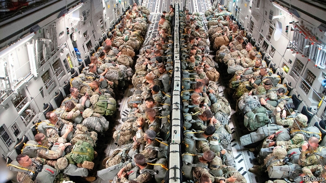

###### A firmer fort

# America pours a thousand more troops into Poland 

 

> print-edition iconPrint edition | Europe | Oct 12th 2019 

LAST YEAR Poland made an audacious bid to coax Donald Trump into permanently placing an American armoured division on its soil, offering $2bn and naming rights. “Fort Trump”, as it became known—jocularly at first, then more formally—is now firming up. In June America said it would send 1,000 troops to join the 4,500 already in Poland. On September 23rd Mr Trump agreed with Andrzej Duda, Poland’s president, where these would go. 

It is not quite the mammoth tank force that Poland wanted, but it is a win nonetheless. Five years ago the American troops in Poland could all fit on a bus. Now thousands will be spread across six sites. “Poland has joined today the small group of countries where US troops are permanently stationed,” boasted the country’s defence ministry. There will be a division headquarters in Poznan, a squadron of Reaper drones in Lask, a helicopter brigade and special forces in Powidz and more special forces in Lubliniec. 

The troops in Poland serve as a tripwire. If Russia were to invade, it would have to kill Americans first, quickly pulling in the superpower. But the new forces will also be useful in circumstances short of all-out war. Lieutenant-General Rajmund Andrzejczak, Poland’s army chief, says that the drones and “low profile” special forces are especially helpful for spotting and countering murkier “hybrid scenarios”—a reference to techniques Russia has honed in next-door Ukraine, such as the use of cyber-attacks, disinformation and soldiers who don’t wear identifiable uniforms. 

Mr Duda hopes this is just the start. America and Poland are now haggling over a seventh site for another American armoured brigade combat team, a unit that can include over 100 tanks and armoured vehicles. America would like it to sit west of the Vistula river. Poland would prefer it in the south-east of the country, pointedly closer to Russia. The “real deal” would be a full-blown defence co-operation agreement, says Michal Baranowski, head of the Warsaw office of the German Marshall Fund, an American think-tank. 

Mr Duda has honed the art of speaking to Mr Trump in the languages he understands best: flattery, money and loyalty. Poland has gone on a spending spree for American arms, signing over $11bn-worth of deals for rocket launchers, Patriot air defence systems and F-35 warplanes. On September 3rd it asked to buy 185 Javelin anti-tank missiles and five Hercules transport aircraft. Poland is not only one of the handful of allies that hits the NATO target of spending 2% of GDP on defence, but also plans to raise that to 2.5% by 2030. 

For Poland, the purpose of this build-up is clear. Russia is “definitely very, very aggressive”, says General Andrzejczak. He points to its military exercises and challenges to Polish airspace using drones. For Mr Trump, it is more personal. Why, he was asked, had he sent troops? Was it because of the Russian threat? “No, I don’t think so at all. I think it’s just because we have a president of Poland who I like, who I respect.” ■ 

