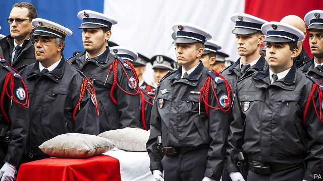

###### An enemy within

# France is shaken by the murder of four police officers 

 

> print-edition iconPrint edition | Europe | Oct 12th 2019 

THE KILLINGS themselves were shocking. On October 3rd four police officers were knifed to death at Paris police headquarters by one of their colleagues. What has emerged since is more sinister. The perpetrator, who was shot dead at the scene, was a suspected jihadist who had access to classified police intelligence files. 

France has been shaken by the revelations. Mickaël Harpon was a 45-year-old French computer technician from Martinique, employed since 2003 at the intelligence service within the Paris police headquarters. He enjoyed high-level security clearance, which was renewed in 2008 and 2013. His job gave him access to a mass of intelligence data, including personal contact details of police officers and of individuals under surveillance, some of which have subsequently been found on a USB key in his possession. The prosecutor has opened an inquiry into an act of terrorism. 

On the morning of the killings Harpon, a convert to Islam, exchanged with his wife 33 text messages “of an exclusively religious nature, ending with Allahu akbar”, said the prosecutor. He then left his office to buy a kitchen knife and an oyster knife in a nearby shop. Returning to work, he fatally stabbed three victims in the office and attacked two more on the staircase, one of whom survived. 

Arriving on the scene, Christophe Castaner, the interior minister, declared that Harpon had “never shown the slightest warning sign” during the time he worked at police headquarters. He had no criminal record, nor was there any sign of concern about him in his work files. It emerges, however, that colleagues were worried. Harpon had voiced approval of the Charlie Hebdo terrorist attacks in Paris in 2015. More recently he adopted traditional dress to go to mosque and refused to shake the hands of female colleagues. He had contacts, said the prosecutor, with Salafists, a radical Islamist movement. “It is very serious, scary,” says François Heisbourg of the Foundation for Strategic Research. “There is no precedent for this: a jihadi mole at the heart of an intelligence service whose basic job was to keep tabs on terrorists.” 

How could such an individual have gone undetected? Battered by bloody terrorist attacks in 2015 and 2016, France has put in place a system designed to detect radicalised people, which was expanded last year. It includes a grid of warning signs, such as a change in dress or behaviour, which are supposed to trigger an alert. The system yields some success. According to a parliamentary report in June, 12,809 people are on a watch list as a result. Such lists are used to help screen recruits to sensitive public services. In 2018, of the 10,840 queries concerning applicants to the police force forwarded to the national security inquiry service, five were judged problematic. It also keeps watch on employees. There are currently around 30 cases concerning suspected radicalisation within the police force and gendarmerie. 

Such procedures are not fail-safe. Colleagues who voiced concerns about Harpon declined to submit written complaints. It is not clear why. A culture of solidarity? A fear of stigmatising Harpon, who was partially deaf? Mr Castaner this week recognised “dysfunctions” in the system. An inquiry is under way. Opposition leaders called on him to resign. The affair leaves many questions unanswered—and a fresh sense of vulnerability in France. ■ 

