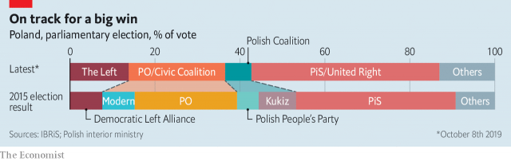

###### PiS at the polls

# In Poland, big handouts and gay-bashing win votes 

 

> print-edition iconPrint edition | Europe | Oct 12th 2019 

POLAND HAS a president and a prime minister. But Jaroslaw Kaczynski, the leader of the nationalist Law and Justice (PiS) party, is its true ruler. From party headquarters on Warsaw’s Nowogrodzka, above a pool club, PiS has moved Poland in a strikingly illiberal direction since coming to power in 2015. At parliamentary elections on October 13th, PiS is offering voters lavish handouts, social conservatism and what Mr Kaczynski calls the fight for “Polish dignity”. Liberals loathe the party’s tactics and much of what it stands for, but polls suggest that PiS is on track for a remarkable re-election win. 

Four years ago the party took Poland by storm. It defeated the centrist Civic Platform, which had governed since 2007, and became the first party to be able to govern the country without the need for a coalition since the overthrow of communism in 1989. Within weeks, it had moved to place the public television broadcaster and the constitutional tribunal in the hands of sympathisers, triggering a lengthy dispute with the European Commission over the rule of law. Later, it tried to overhaul the Supreme Court by lowering the retirement age for its judges, forcing around one-third of them to retire early (under pressure from the EU, this change was later reversed). Some of PiS’s changes echo ones introduced in Hungary by its prime minister, Viktor Orban, who shares its disdain for EU restraints. What sets Poland apart from other countries is the “comprehensiveness and cumulative effect of the ways in which liberal democracy is being undone”, argues Wojciech Sadurski, of the University of Sydney, in a new book “Poland’s Constitutional Breakdown”. 

Many Poles don’t much care. PiS has successfully appealed to people who feel left behind by economic and social changes since 1989, especially outside big cities. After coming to power, it lowered the retirement age, then 67, to 65 for men and 60 for women, despite a rapidly greying population. It introduced a monthly handout to parents of 500 zloty ($127) per child after the first, extended to all children this summer. In the run-up to the elections, it has dished out money in all directions, including a one-off extra pension payment for the elderly, exempting workers up to the age of 26 from income tax and, from October 1st, lowering the income tax rate from 18% to 17%. It promises almost to double the minimum wage if re-elected. The party “might not be a knight on a white horse”, but it is working hard, says the narrator in a PiS campaign video aimed at young voters, which contains an uncharacteristic reference to Tinder, an online dating app. 

 

Uncharacteristic because the party also presents itself as the protector of the traditional Polish family. A future opposition government would be dominated by forces that want “the radical destruction of the moral and cultural order” in Poland, warned Mr Kaczynski (pictured) in an interview with a conservative television channel owned by a Roman Catholic priest, on October 2nd. Portraying refugees from the Middle East as a danger to national security helped PiS win the election in 2015. This time, Mr Kaczynski has identified a new threat: an “attack on the family” by gay people. Backed by the Roman Catholic church, its traditional ally, PiS has tapped into conservative attitudes, especially opposition to adoption by same-sex couples. Homophobic rhetoric has surged. A pride march in the eastern city of Bialystok on July 20th was attacked by thugs who threw stones, firecrackers and bottles. 

The opposition has struggled to respond. Three-quarters of Poles oppose gay adoption, polls suggest, and Civic Platform does not even dare to back gay marriage. After failing to agree on a broad coalition, the anti-PiS parties will contest the election as three blocs: centrists led by Civic Platform, agrarians, and the left, made up of the old social democrats plus Wiosna (Spring), a progressive party founded earlier this year by a gay-rights campaigner. Lacking a charismatic leader, Civic Platform supporters look to Donald Tusk, who served as prime minister from 2007 to 2014. Some hope that he will challenge Andrzej Duda, the PiS-backed incumbent, for the presidency next year after his term as president of the European Council ends next month. He has not revealed his plans, which will depend on the results. 

The economy has counted in PiS’s favour. It grew by 5.1% last year, thanks to an increase in domestic consumption and investment, though it is forecast to slow to 4.4% this year and 3.6% in 2020. Wages have risen and unemployment is 3.3%, one of the lowest rates in the EU. Companies have tried to plug the labour shortage with foreign workers, mostly from Ukraine. The government says it can cover the cost of its new welfare policies by improving tax collection and cutting administrative costs. It has proposed a balanced budget for 2020, the country’s first in three decades. 

Despite facing surgery on his knee after the elections, Mr Kaczynski, who turned 70 in June, has campaigned around Poland, handing out promises. The technical side of governing is managed by Mateusz Morawiecki, a former bank boss, whom Mr Kaczynski promoted to prime minister in December 2017. Polls put PiS far in the lead; one this week gives it 43% of the vote, compared with the centrists’ 28%. With the left’s 14% and the agrarians’ almost 8%, the fragmented opposition would have roughly 50% of the vote, but PiS would still have a majority in the Sejm, the lower chamber of parliament. Voters face “a fundamental choice between two worlds”, Mr Kaczynski told an interviewer (a priest wearing a cassock) on October 2nd. His world seems to be winning. ■ 

