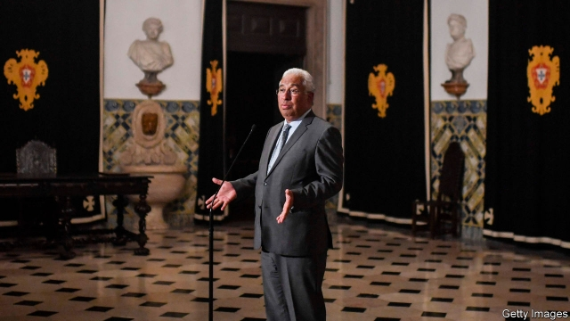

###### Hopes unfulfilled

# Portugal’s Socialists fail to win a majority, but will still form the next government 

 

> print-edition iconPrint edition | Europe | Oct 12th 2019 

ANTÓNIO COSTA put on a brave face for his speech after Portugal’s general election. The prime minister’s centre-left Socialist Party (PS) won almost 37% of the vote and 106 seats in parliament, 20 more than it took four years ago. But that still left it ten short of a majority. 

“Voters want the current political solution to continue,” he told cheering supporters in Lisbon in the early hours of October 7th. “This time with a stronger PS.” Continuing the current solution means another four years of a minority government depending for its survival on the support of the radical left. 

This was not the solution Mr Costa, something of a hero to Europe’s much-diminished centre-left, had campaigned for. In a thinly disguised appeal for a majority of his own, he repeatedly warned that Portugal could find itself in a similar stalemate to neighbouring Spain if the far left gained more leverage over mainstream socialists. Spain is heading for its fourth general election in four years after fruitless coalition talks between centre-left socialists and Podemos, a left-wing party. 

In the event, voters neither gave Mr Costa the outright majority he wanted nor the far left any greater influence. Instead they punished the centre-right opposition, giving left-of-centre parties a combined majority of 27 in the 230-seat parliament, up from eight previously. Mr Costa appears to have read the public mood well in not campaigning openly for an absolute majority; too many Portuguese associate his party with abuses of power and corruption. That is likely to be little consolation, however, as he faces weeks of delicate negotiations to put together a second version of his pact with the anti-capitalist Left Bloc and the hardline Communist Party. 

His task has been complicated by a greater fragmentation of parliament, with three new parties taking one seat each and a small left-leaning environmentalist and animal-rights group winning four, up from one previously. Catarina Martins, the Left Bloc’s leader, said Mr Costa could “choose stability” by negotiating a government programme with her party, or negotiate for its support “budget by budget, year by year”. The Bloc, which took 10% of the vote, retained its 19 seats. The Communists, smarting from the loss of five seats from their previous tally of 17, have ruled out entering into a second formal pact with the PS. 

Renewing a pact with the far left could prove tricky for Mr Costa, however, as Europe braces for a global downturn amid tariff wars and the fallout from Brexit. Having come to office in 2015 vowing to “turn the page on austerity”, he has since recast himself as a champion of fiscal discipline. After enduring one of the worst economic crises since the global financial calamity of 2008, Portugal is now growing robustly. 

The left-wing parties will press for concessions on labour laws, public spending, public-sector pay and state pensions. However, Mr Costa now needs to strike a deal with only one of those parties, rather than both of them, as before, in order to survive any confidence vote or pass a bill or a budget. The parties on the left that had “made it their goal to prevent the PS from winning an absolute majority”, Mr Costa said, “now have a bigger responsibility to bring about a stable outcome.” ■ 

