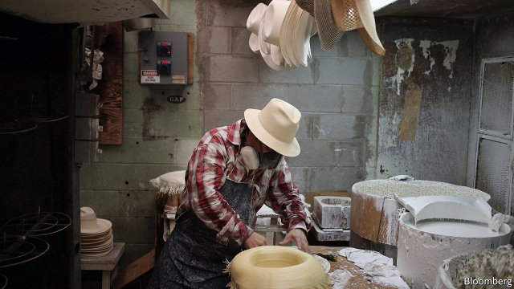
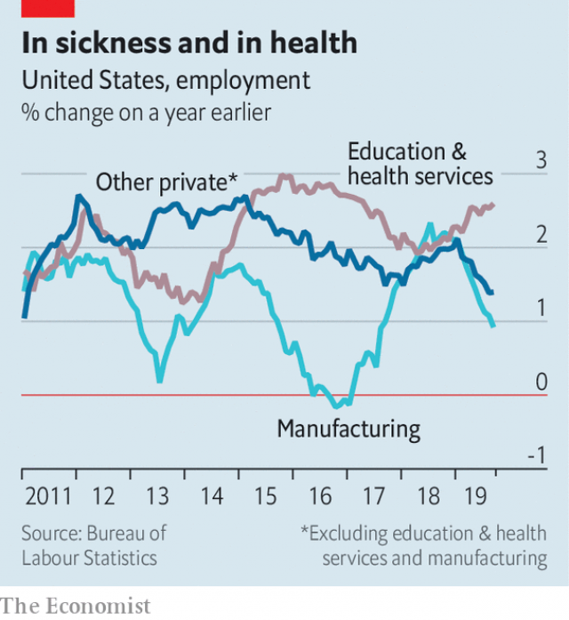

###### Facing factories

# America’s slowing economy could become an election issue 

 

> print-edition iconPrint edition | Finance and economics | Oct 12th 2019 

FINANCIAL MARKETS have seen several episodes of panic since early 2018, often triggered by developments in President Donald Trump’s trade war with China. And in recent months, indicators of economic activity in America have begun to lose momentum. The worst figures are in manufacturing. Growth in the sector almost halted over the summer. Industrial production declined in July, according to the Federal Reserve, and in September the ISM-Chicago Business Survey, another closely watched indicator, hit its lowest level since 2009. 

Jobs figures published on October 4th showed a decline of 2,000 jobs in manufacturing between August and September. In parts of America’s industrial heartland, including midwestern states such as Indiana and Michigan, which helped carry Mr Trump to victory in 2016, the hiring slump has been pronounced. 

Industry is a politically resonant sector. But more than 90% of Americans work in other parts of the economy, in particular services. What happens next depends on whether the weakness in manufacturing spreads. So far it has not. Private employers added a net 358,000 jobs in the third quarter, down from 527,000 during the same period a year earlier, but still well in positive territory. The unemployment rate, meanwhile, fell to 3.5%, the lowest since December 1969. 

Consumer spending is the engine of American growth, and petrol aplenty remains in the tank. Personal consumption grew at an annualised rate of 4.6% in the second quarter of 2019, more than compensating for declining investment and exports. Household debt remains relatively low and incomes are growing. 

 

But here too there are spotty indications of trouble. In September an index of service-sector activity showed signs of a slowdown, and growth in new business was the weakest since the index began in 2009. After stripping out employment growth in the rock-steady education and health sectors, private-sector hiring is trending downward as well (see chart). Wage growth weakened in September, slipping to 2.9% year-on-year from 3.2% in August. 

A slowdown is not a contraction, however. Weaker wage growth in September mostly reflected soggy increases for managers, not workers in non-supervisory roles. And there is recent precedent for consumers helping America’s economy to sail through a manufacturing downturn. Both output and employment in manufacturing fell in 2016. Though growth and hiring slowed more broadly, they stayed positive, and the economy bounced back the next year. 

Yet a repeat performance could be hard to pull off. In 2016, as now, America’s factories were hit by a worldwide manufacturing slowdown and a slump in global trade. Then, in 2017, trade recovered strongly as China’s government sought to pep up domestic growth. American exports to China, which shrank in 2015 and 2016, surged in 2017. Barring a miraculous resolution of the trade war, nothing similar is likely this time round. 

Moreover, in 2017 America’s economy received a boost from the prospect of Mr Trump’s tax cuts. But the impact of expansionary fiscal policy peaked in the second quarter of this year. By 2020 the federal budget is forecast to reduce, rather than add to, economic growth. As the Democrats’ impeachment inquiry gains steam, and congressional business is halted, the prospects of another round of stimulus look dim. 

Most probably, the American economy will neither sink into recession nor regain full vigour in the year between now and the presidential election in November 2020. But that will be small consolation to Mr Trump. A similar scenario in 2016 deprived the Democrats of the chance to campaign on a strong economy, and probably contributed to Hillary Clinton’s defeat. In the absence of a large, and positive, surprise, the economy may not be the electoral asset Mr Trump had probably been expecting. ■ 

