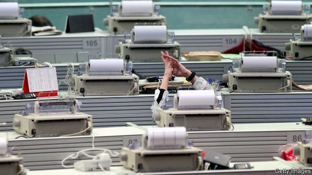

###### Loved and lost

# Hong Kong’s pursuit of the London Stock Exchange ends in tears 

 

> print-edition iconPrint edition | Finance and economics | Oct 12th 2019 

FEW BOURSES have been wooed as often as the London Stock Exchange Group (LSE). It has been the target of a bid every two and a half years on average since going public in 2000, according to Berenberg, a bank. All have failed, including the latest, a £32bn ($39bn) offer from Hong Kong Exchanges and Clearing (HKEX) in September that would have created the world’s second-largest exchange group by market value (behind America’s CME Group). On October 8th HKEX called the whole thing off. 

Charles Li, HKEX’s boss, styled himself as a Romeo to the LSE’s Juliet, and held out the prospect of a tie-up between East and West. HKEX is China’s main gateway to Western capital markets. It offered a 23% premium to the LSE’s share price. But the LSE’s shareholders wanted more, and a greater share of cash, at which point HKEX’s shareholders reportedly balked. 

HKEX’s management had been planning a run at the LSE for about a year, but delayed it because of Brexit uncertainty. Then their hand was forced. In August the LSE had said it would buy Refinitiv, a data conglomerate, for $27bn. Though the timing was terrible, with protests roiling Hong Kong and an escalating trade war between America and China, HKEX realised it was now or never. 

The LSE will now return to its original plan of buying Refinitiv. That will probably leave it too large for any other suitor. The deal is due to be voted on later this year and—regulators willing—to be completed by the end of next year. 

As HKEX toured LSE shareholders seeking support, it made sure that they understood the drawbacks of the Refinitiv deal. The main one is Refinitiv’s slow growth compared with the LSE. Its data platform is healthy, and combined the two firms’ trading platforms should create a formidable business. But its desktop-terminal business, where it competes with Bloomberg and low-cost providers such as FactSet, is weak. Commerzbank, a bank, reckons that just over a third of Refinitiv’s assets are in structural decline. 

After several acquisitions, Refinitiv’s information-technology systems are poorly integrated. Its size relative to the LSE makes it a mouthful. It has nearly four times as many staff, and its revenues and profits are bigger. The purchase “could really penalise the LSE if execution goes badly”, says a former LSE executive. Since Refinitiv’s purchase last year by Blackstone, a private-equity firm, growth has picked up slightly—revenues increased by 3% in the first half of 2019. But the LSE will need to spend heavily, and perhaps dispose of part of the desktop business. 

HKEX’s ties with Hong Kong’s government mean that its purchase of the LSE would have faced close political and regulatory scrutiny. For the LSE-Refinitiv deal, the big obstacle is competition law. The LSE will become a leading creator and distributor of financial data, the high price of which is raising concerns globally. In 2017 the European Commission blocked a merger between the LSE and Germany’s Deutsche Börse on competition grounds. The LSE may have to agree to substantial remedies. Still, British regulators will probably give strong backing to a deal that will ensure it continues to be run from London. 

The abortive tie-up inspires thoughts of future matches. The world will probably soon have a few giant global bourses and a constellation of small national ones. HKEX could one day be acquired by a privatised Shanghai exchange; two of America’s giant exchange groups—ICE and Nasdaq, say—could combine. Some LSE shareholders are thought to be trying to provoke a bidding war before the vote on the Refinitiv deal, in the hope that ICE might join in. Just three years ago, after all, the LSE was fending ICE off. But stepping in so soon after HKEX’s stumble would require strong nerves. ■ 

