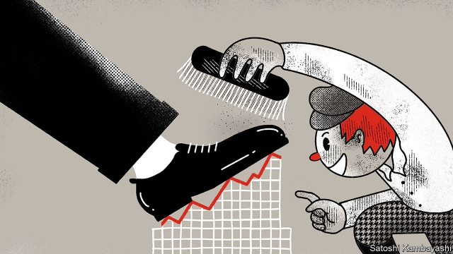

###### Tale risk

# How stories can help explain booms and busts 

 

> print-edition iconPrint edition | Finance and economics | Oct 12th 2019 

EVERYONE KNOWS, or thinks they know, the story of the Wall Street shoeshine boy. In 1929 Joseph Kennedy, patriarch of the Boston-Irish political clan, had an epiphany while his shoes were being cleaned. When the boy who shined his shoes offered him stock tips, he realised the stockmarket was about to implode. Kennedy promptly sold all his shares and took a short position, betting that the market would fall. When it crashed that October he made a killing. 

In his new book, “Narrative Economics”, Robert Shiller, a Nobel laureate, offers this tale as an example of a contagious narrative that becomes part of folk wisdom. A story need not be accurate to spread. Mr Shiller searched archives of newspapers from the period, and could find no record of it. But he did find a similar kind of story in the Minneapolis Morning Tribune. The stockmarket, it said, could not yet have peaked because “we do not hear of the chamber maids and bootblacks who have cleaned up fortunes by lucky plays.” That story was published in 1915. 

Whatever their provenance, says Mr Shiller, it matters which kinds of narratives are contagious and why. The ones that catch on have the power to influence behaviour. Stories sway decisions to hire or fire; to buy or sell; to spend or save. These individual choices, writ large, move markets and drive the business cycle. Fundamentals such as prices and profits are just one part of the reckoning. The stories that people tell themselves and each other matter at least as much. 

To wield such influence, economic narratives must first become popular. Epidemiology offers a model for how they take hold. Disease epidemics are hump-shaped when plotted on a graph. In the rising phase, the rate of increase of newly infected people (the contagion rate) is faster than the recovery rate plus the death rate. When the recovery rate exceeds the contagion rate, the epidemic falls off. It is the same with stories. A growing number of “infected” people spread the narrative; later on comes a period of lost interest and forgetting. 

The most contagious economic narratives drive boom-and-bust cycles. Such narratives have common features. They tend to be oversimplified models of reality and thus catchy. Their success may owe to a “super-spreader”, perhaps a celebrity, capable of infecting many people. And they are often part of a narrative cluster, which adds weight to their plausibility. The stockmarket boom of the 1990s was powered by an array of stories: the triumph of capitalism; the rise of the internet; the decline of inflation; and so on. 

Some of the most contagious narratives are newer, more resistant variants of old ones. Behind every property boom is a mutation of the eternal narrative about the scarcity value of land. “Who could think of tilling or being contented with a hundred acres of land, when thousands of acres in the broad west were waiting for occupants,” says a tract documenting the follies of America’s land boom of the 1830s. The global housing boom that led up to the Great Recession of 2007-09 was driven by narratives that persuaded people to think of their homes as speculative investments in scarce land. 

A science of economic narratives, of the kind Mr Shiller calls for, would require high-quality data. It would need regular surveys designed to draw out people’s justifications for their economic decisions. But interpreting even good data would be tricky. Narratives tend to be ignored by economists because their links to events are complex and variable—as Mr Shiller himself notes. Any official data on narratives would, once published, surely become part of the narrative itself. 

The most prominent economic narratives today are not cheery. A monthly survey conducted by Bank of America finds that two-fifths of fund managers expect a recession in the next year. The same proportion thinks the trade dispute between America and China will never be resolved. Besides the trade war, fund managers list the impotence of central banks and a bubble in bond markets as their biggest worries. 

Take these messages, add to them bleak surveys of business confidence worldwide, and you might decide to batten down the hatches for a coming storm. If so, you may still be troubled by a nagging doubt, a sense that the story does not quite add up. The usual end-of-cycle euphoria, which causes companies to make unwise investments and draws greenhorns into speculative assets, is not there. The chambermaids and bootblacks have gone missing. 

