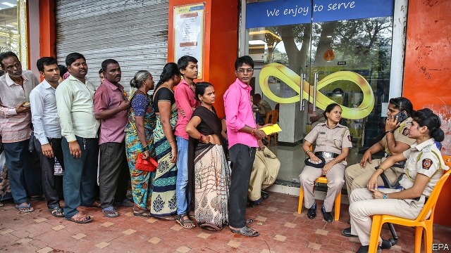
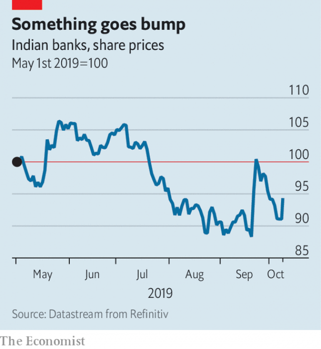

###### Skeletons in the closet

# Indian banks’ share prices are being hammered 

 

> print-edition iconPrint edition | Finance and economics | Oct 12th 2019 

THE RUN on the Punjab and Maharashtra Co-operative Bank (PMC), a small Indian lender, is now in its third week. At a branch in Mumbai near the Reserve Bank of India (RBI), the central bank, depositors wait in line, scanning their mobile phones. But the calm is deceptive. A single bankrupt borrower, Housing Development and Infrastructure Limited (HDIL), accounted for 73% of PMC’s loan book. As part of the elaborate deception it created 21,000 fake customer accounts. 

Posted outside PMC branches is a letter from the RBI dated September 23rd. A passage is highlighted in pink: withdrawals are to be limited to 1,000 rupees ($14) over six months. That fired the starting pistol for the bank run. Protesters showed up at the gates of the RBI. The withdrawal limit was raised in response, first to 10,000 and then to 25,000 rupees. That was high enough to cover the balances of 73% of customers, but represents just 7.75% of the bank’s $1.7bn of deposits. Government-backed deposit insurance covers just 100,000 rupees per account. 

PMC’s chairman, Waryam Singh, as well as the head of HDIL, Rakesh Wadhawan, and his son Sarang, have been arrested. Local papers are plastered with tales of the Wadhawans’ close relationships with politicians, lavish parties with Bollywood stars and assets seized or sought by enforcement agencies, including Rolls Royces, private planes and a yacht thought to be in harbour in the Maldives. 

During the past six years the government has done much to clean up India’s banks. Bad loans have been identified and written off. The bosses of three of the four largest private banks have been pushed out because of lax lending practices. On paper, the bigger ones, at least, look in fine shape. The 18 banks classified as “public sector” look weaker, but in August the government said they would be consolidated into 12 in the hope of boosting their performance. 

 

But PMC’s collapse has investors on edge. The shares of all but a handful of banks have suffered. At another moment, the failure of a minnow like PMC would have been seen as a singular tale of wrongdoing and excess. Now, says one financier in the midst of the tumult, it seems like proof of systemic failings. India’s financial sector needs to restore trust, wrote S&P, a rating agency, in a recent note. “Contagion risk”, it added, “cannot be ignored in a market when paranoia sets in.” 

In the past the authorities have avoided forcing losses on account-holders after banks have failed, by arranging shotgun marriages with healthy institutions. That solved immediate problems but created moral hazard. Co-operative banks typically offer high interest rates in order to attract funds, but with no salutary past examples of losses, customers regard high rates as an opportunity, not a warning. According to Credit Suisse, just 30% of deposits across India’s banking system are insured. A bill that would have allowed failing banks to force losses on all depositors lingered in parliament. After criticism it was dropped last year. Recent weeks have seen calls for its revival—and vociferous objections. 

This moral hazard is just one of the weaknesses of India’s financial architecture thrown into stark relief by PMC’s troubles. Another is an awkward structure that PMC shares with many lenders. As a bank it is supervised by the RBI, but since it is a co-operative, the state where it is located shares responsibility. That split too often means lax oversight—and increases the possibility that PMC is not an outlier. India has around 1,500 co-operative banks, accounting for 8% of bank deposits and 11% of assets—a small but by no means insignificant share. 

And then there are the non-bank financial companies (NBFCs). These make loans but do not have the same obligations as banks to tie up a hefty chunk of their capital with the RBI and in “priority lending” (meaning to agriculture and a range of government-endorsed activities). As a result, they have become essential to everything from auto to consumer to company finance. According to a study by BCG, a consultancy, the NBFCs account for 55-60% of first-time borrowers. 

But NBFCs also suffer from a handicap compared with banks: they are forbidden from raising funds through ordinary deposits. The solution that lenders elsewhere would naturally turn to—issuing bonds with maturities of a decade or more—is rarely used in India. Instead NBFCs fund themselves with short-term loans from mutual funds and—oddly—banks. 

This mismatch between short-term funding and long-term obligations is inherently unstable. And in 2018 it came tumbling down when IL&FS, a large NBFC, went bust, making it harder for other NBFCs to raise funds. Many are now struggling. In June one of the largest, Dewan Housing Finance Corporation, run by Rakesh Wadhawan’s nephews, defaulted on a loan, triggering a $12bn bankruptcy. On September 12th Altico Capital, a smaller property-finance company, defaulted too. Many more are at risk. 

As credit growth has slowed, India’s broader economy is feeling the effects. Manufacturing and retail are showing signs of strain. Construction is going through a particularly torrid time. Big cities are littered with frozen projects. One financier in central Mumbai with a particularly panoramic view can count 35 skyscrapers on which work has halted—and with it, any hope that the lenders behind them will be fully repaid. ■ 

