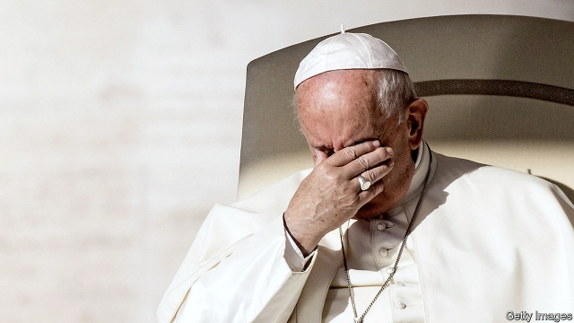

###### Divine speculation

# Raids and arrests cast doubt on the Holy See’s clean-up 

 

> print-edition iconPrint edition | Finance and economics | Oct 12th 2019 

THE BLOCK of shops, offices and apartments at 60 Sloane Avenue was once a warehouse for Harrods of London. Now it is the focal point of the latest financial scandal to rock the Vatican—potentially the worst since Archbishop Paul Marcinkus, whose buccaneering presidency of the Vatican Bank in the 1970s and 1980s led it to deal with Masons and mobsters. At stake now, as then, is not just the probity of an individual, but the trustworthiness of the Holy See’s system of financial governance. 

On October 1st the Vatican’s gendarmes, on orders from its prosecutors, raided the offices of the Financial Information Authority (AIF), the banking regulator, and the Secretariat of State, which combines the roles of prime minister’s office and foreign ministry in the Vatican administration. They were looking for “documents and electronic devices”, the Vatican said. A leaked circular to the Swiss Guards, who control access to the walled city, showed that among the five officials suspended pending the outcome of the investigation was the AIF’s director, Tommaso Di Ruzza. 

“It’s a nightmare,” says a senior Vatican official. “It risks undoing everything we have achieved in the past eight years.” In 2011 the Vatican agreed to inspection of its financial sector by Moneyval, Europe’s anti-money-laundering and anti-terrorist-financing watchdog. It has since created an institutional framework similar to those of more conventional states. Dodgy accounts have been closed at the Vatican Bank (properly known as the Institute for the Works of Religion, or IOR). On the day of the raids the IOR passed the latest milestone on its road to respectability when it began using the money-transfer services of the Single Euro Payments Area. 

But the IOR’s employees are not the only ones handling money in the Vatican. The Administration of the Patrimony of the Apostolic See (APSA) acts as the sovereign-wealth fund of the Holy See, the central administration of the Catholic church. The government of the Vatican City State earns revenue from the lucrative Vatican museums. And several of the Holy See’s ministries, known as dicasteries, manage pots of money without oversight by the AIF. 

In 2014 Pope Francis created a Secretariat for the Economy to oversee all the financial activities of the Holy See and the Vatican City State. Its first boss, Cardinal George Pell, who is appealing against a conviction for child abuse in Australia, said that after he took over he discovered “hundreds of millions of euros” that did not appear on the balance-sheet. Some in the Vatican, where conspiracy theories flourish, believe he would not be in jail had he not tried to seize control of those funds. 

Also notionally under the new body’s remit is the Secretariat of State, which reportedly manages around €800m ($880m). It controls the contributions of the faithful to the papacy—charmingly, if modestly, known as Peter’s Pence (St Peter being the apostle chosen by Jesus to lead his church). It is also said to control a pot of cash known as the Paul VI Fund, and assets transferred to the Vatican from the Papal State when it was dismembered in the 19th century. 

L’Espresso, a news magazine, reported that in 2011, under Pope Benedict, the Secretariat of State sank almost €200m in a fund registered in Luxembourg. Among its investments was a 45% stake in a London property. A Vatican official identifies it as the converted Harrods depository. The building’s managers did not respond to a request for confirmation. 

A Vatican source says that the prosecutors’ investigation centred on a chain of transactions to extract the Secretariat of State from the fund and give it full ownership of the London property, once more acting through an intermediary. According to this account, the Secretariat sought a loan from the IOR to pay off a mortgage on the property. But the IOR refused to get involved, even though the overall operation had been remodelled at the behest of the AIF to ensure compliance. In an otherwise-vague statement, the Vatican said the investigation was launched on the basis of reports from the IOR and the office of the Vatican’s auditor-general, which is also the Holy See’s anti-corruption authority. 

Why these apparently routine transactions raised such concerns is unclear. Other questions include why the Secretariat of State should twice have made investments in such a roundabout way, especially since it could have benefited from sovereign tax exemptions; why the Vatican Bank and the auditor-general’s office went to the prosecutors instead of reporting to the AIF; and why the prosecutors felt the need to involve Mr Di Ruzza since the search warrant accuses him of nothing specific, merely stating that the role of the AIF in the affair was unclear. Noting that the warrant was not signed by the prosecutor hired by the Vatican to investigate financial offences, Andrea Gagliarducci, Vatican analyst at the Catholic News Agency, ventures another question: “Did the green light for the investigation come directly from the pope?” 

Among all the questions one thing is clear: the job of keeping the Vatican and its officials out of financial mischief is far from over. That has implications beyond the city-state: the Vatican’s secretive culture and sovereign privileges make it ideal for dubious transactions. Yet responsibility for overseeing its sprawling financial sector is divided between departments whose competences overlap and conflict. 

The Secretariat for the Economy was meant to bring most of it under a single authority. Yet it has never been incorporated into the Vatican constitution. “It exists, yet does not exist,” says Mr Gagliarducci. Currently, it has only an acting head. The same is true of the auditor-general’s office. The original appointee, Libero Milone, resigned in 2017. He later claimed he was threatened with arrest on “prefabricated charges” if he refused to go. “Evidently, they didn’t want me to report some things I’d seen,” he said. 

It is into this murky scene that the Vatican’s latest external hire is due to step. On October 3rd Pope Francis named a retired anti-Mafia prosecutor, Giuseppe Pignatone, as president of the Vatican court. One of his first trials will be that of the former IOR president, Angelo Caloia, who is accused of skimming tens of millions of euros from property deals. Mr Pignatone is best known for his role in busting an organised-crime network in Rome. He says that he is looking forward to a “new and extraordinary experience”. ■ 

