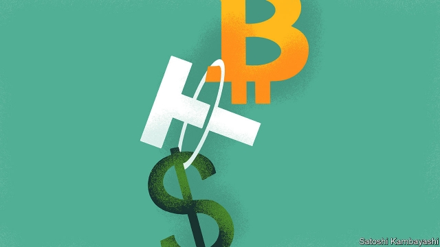
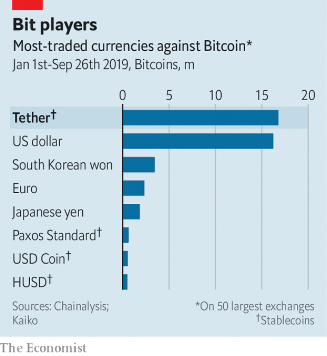

###### Bitfinessed

# The issuer of a star cryptocurrency is being sued for $1.4trn 

 

> print-edition iconPrint edition | Finance and economics | Oct 12th 2019 

LAUNCHED AS REALCOIN in July 2014, Tether aimed to become a more reliable alternative to Bitcoin, the best-known cryptocurrency. With a $4.1bn market capitalisation, it is now the fifth-largest virtual currency. But its efforts to gain investors’ trust have fallen short. On October 6th a group filed a class-action lawsuit in New York, accusing Tether of being “part-fraud, part-pump-and-dump, and part-money laundering”. They call for truly startling damages: more than $1.4trn. 

In response to The Economist’s queries, Tether’s general counsel said that “the lawsuit is meritless and the plaintiffs’ complaint is rife with errors.” The firm “has not used Tethers to manipulate any market”, he added, and operates in “full conformity with applicable laws”. 

 

In 2014 Tether adopted its current moniker, which made its selling point explicit. With dollar reserves that it said matched Tethers one-to-one, it was one of the first “stablecoins”—digital currencies that seek to avoid price swings by pegging their value to the greenback. That made it a useful unit of exchange. Many crypto-trading platforms struggle to secure banking services, and thus dollars, because lenders worry about shady transactions. Punters find it easier and quicker to trade Bitcoins in Tether, and it is the most popular crypto currency pair (see chart). 

But Tether is also opaque. When and why it mints coins is unclear. Its general counsel says: “We issue Tethers when customers want them, full stop.” In China, where crypto-exchanges are illegal, buyers can swap wads of cash for Tethers, says Philip Gradwell of Chainalysis, a blockchain-analysis firm. Tether’s reserves have not been independently audited. It hired Friedman, an accountancy firm, in 2017. In 2018 the firms parted ways. Later that year Tether’s general counsel told Bloomberg that an audit “cannot be obtained”, citing risk aversion among potential auditors. 

And yet its influence on crypto-markets is large. TokenAnalyst, a data-provider, says that Bitcoin prices track issuances of Tethers. On days when new Tethers are minted, the price of Bitcoin, which can be bought with them, rises 70% of the time. 

The class action alleges that Tether and Bitfinex, a crypto-exchange that shares the same managers and owners, manipulated markets and raked in profits. In 2017 and 2018, it claims, Tether issued “extraordinary amounts” of unbacked coins to flood Bitfinex, propping up demand for Bitcoin and creating “the largest bubble in human history”. Bitcoin prices rose 19-fold between January 1st and December 17th 2017, to more than $19,000 a coin, before falling below $4,000 at the end of 2018. The boom-and-bust, the complaint alleges, destroyed some $265bn in Bitcoin wealth. 

Tether’s general counsel is adamant that the currency is fully backed. For years, when the firm said reserves it meant hard cash. Yet in March, under criminal probes by America’s Department of Justice, its futures-market watchdog and New York’s attorney-general, it said that reserves “from time to time may include other assets”. A month later its lawyer said in court that Tether was then only 74% backed by cash and cash equivalents. 

None of this seems to deter crypto-traders. That may be because Tether is the main provider of liquidity to crypto-markets, accounting for 96% of trading volume in stablecoins. It would be hard to replace. Since April Tether’s market capitalisation has more than doubled. In September it launched a new stablecoin—pegged to the offshore Chinese yuan.■ 

