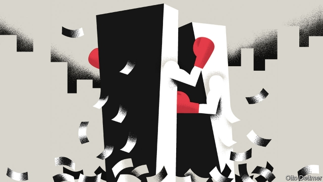

###### Free exchange

# What to make of the strife at the ECB 

 

> print-edition iconPrint edition | Finance and economics | Oct 10th 2019 

NOT LONG ago it was hard to find anyone with a bad word to say about Mario Draghi, the Italian boss of the European Central Bank (ECB). He is credited with saving the euro by pledging, in the depths of a crisis in 2012, to do “whatever it takes” to stop the currency from breaking up. He seemed certain to leave office at the end of October to gushing tributes and an assured place in the pantheon of Europe’s great leaders. Instead, his critics are out in force. 

Their fury was aroused by the stimulus package Mr Draghi unveiled on September 12th, which included cutting interest rates from -0.4% to -0.5% and resuming quantitative easing (QE), the purchase of bonds with newly created money. In the hope of reviving inflation, the ECB has pledged to keep rates low and continue buying bonds until underlying inflation returns to its target of “close to, but below, 2%”. At least seven members of its 25-strong rate-setting body, including the central-bank governors of France and Germany, opposed restarting QE. Klaas Knot, the head of the Dutch central bank, called it “disproportionate”. 

On October 4th the old guard joined the fray. Six former Austrian, Dutch, French and German central bankers released a memo criticising the ECB’s direction under Mr Draghi. The bank misinterprets its job of maintaining price stability, they say, and its policies have become entangled in politics. One of the signatories, Otmar Issing, the ECB’s first chief economist, was its intellectual leader for its first eight years. If Mr Draghi is the euro’s preserver, Mr Issing is one of its creators. How to interpret the strife? 

To make the single currency palatable to the inflation-phobic Germans, the ECB was modelled on their central bank, the Bundesbank, with control of inflation at the heart of its mission. (In 1992 Jacques Delors, then the president of the European Commission, joked that “not all Germans believe in God, but they all believe in the Bundesbank.”) On Mr Issing’s watch, the ECB began life with a “reference value” for growth in the money supply and a flinty view of inflation: anything below 2% counted as price stability. But the reference value fell by the wayside. Mr Draghi views the bank’s inflation target as symmetrical, not an upper limit, and has said he would tolerate prices growing faster for a spell. 

Teutonic toughness was necessary to tame high inflation in the 1970s and 1980s. But that world is gone. Inflation has exceeded 2% in only 29 of the past 120 months; core inflation, not once. In this environment the memo’s worry that the ECB’S symmetrical target might stoke runaway inflation seems absurd. It confirms what Mr Draghi told the Financial Times on September 30th: that he inherited a “very conservative” institution. This rankles with old-timers, but it is true. On the eve of the great recession in 2008, the ECB raised interest rates as other central banks were loosening. In 2011, as the euro zone’s economy teetered on the brink of a double-dip downturn, it raised rates twice. Those mistakes, and its slowness compared with America and Britain to start QE, left it struggling to convince investors that it would act speedily to head off deflation. 

Critics of negative interest rates fear that they do more harm than good by reducing bank profits, thereby deterring lending. But in June the ECB’S economists concluded that banks were passing negative rates on to their borrowers and depositors, thus avoiding a squeeze on their margins and providing an economic stimulus. Even some of the hawks on the ECB’s governing council think interest rates can safely be pushed even further below zero. 

A fear often heard in the northern countries of the currency bloc—and one implied by the memo—is that QE, by lowering the financing costs of indebted southern governments, allows them to avoid painful reforms. It is true that loose money has benefited highly indebted countries the most. But the old guard are wrong to say that the ECB is deliberately cosseting the southerners. Northerners, too, have enjoyed lower debt-service costs—the German state, for instance, to the tune of €368bn ($402bn), or 11% of a year’s GDP, according to the Bundesbank. 

Now the ECB is wading into deeper political waters. It has set a limit of 33% on the share of a government’s public debt that it will buy. That ceiling will soon be reached in countries, including Germany and the Netherlands, with little debt relative to their size. The bank will then face an unpalatable choice. If it raises the limit it could become such a significant creditor that it might one day have to decide whether or not to veto a country’s debt restructuring—a highly political question. If it keeps the limit where it is, it will be able to buy more assets only in those countries where the limit has not yet been reached—making it even clearer that the main beneficiaries of QE are indeed the southerners. 

The ECB’s critics tend to miss the underlying cause of low interest rates: weak demand across most of the rich world. Ironically, the problem is particularly acute in the euro area, precisely because of fiscal reforms by its southern members. For the euro’s first decade, growth and inflation trundled along because excess savings in the north were matched by excess spending in the south. But wage restraint and improved competitiveness in the south since the zone’s sovereign-debt crisis has turned those countries into savers, too. The northerners have never adjusted. Their governments remain preoccupied with paying down debt. Their companies gain from a weak euro, but hoard cash rather than investing more or paying higher wages. The result is huge current-account surpluses in Germany and the Netherlands of 7-10% of GDP. The euro area as a whole runs a surplus of 3%. 

The critics’ timing seems calculated to influence Christine Lagarde, the former boss of the IMF, who takes over from Mr Draghi on November 1st. She has promised to review the ECB’s strategy. Ms Lagarde must listen to northerners but also tell them some unwelcome truths. Quelling the dissent would be the first step towards an eventual legacy as significant as that of Mr Draghi. ■ 

