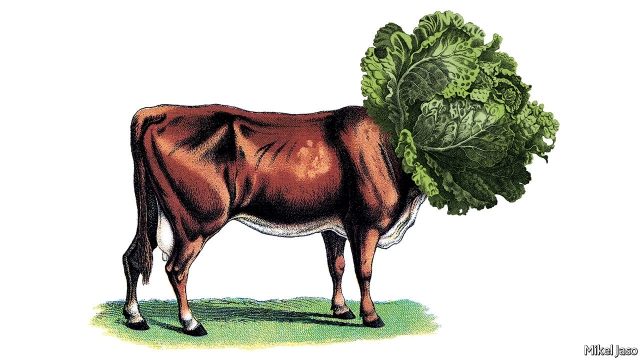
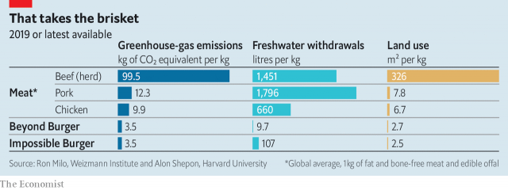
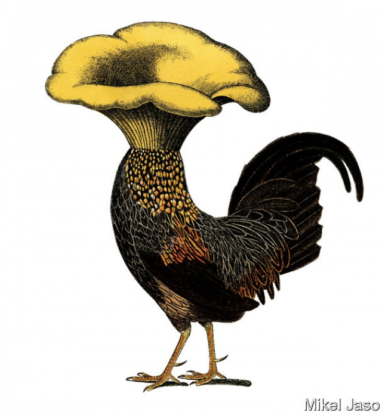

###### Fake moos

# Plant-based meat could create a radically different food chain 

 

> print-edition iconPrint edition | International | Oct 12th 2019 

A JOURNALIST WALKS into Honest Burgers, a small chain of restaurants in Britain. Mindful of the carbon emissions that come from raising cows, he orders a plant-based burger. It tastes convincingly beefy, at least when encased in a brioche bun and loaded with vegan Gouda and chipotle “mayo”. He asks where this wondrous environmentally friendly virtueburger was made? Sheepishly, staff inform him that the patty—supplied by Beyond Meat, a California-based company—has been flown in from America. 

To be fair, Beyond Meat has plans to begin production of its foods in the Netherlands. The company’s expansion is just one sign of a step-change in the demand for foods aiming to replace meat on people’s plates. A niche business is becoming mainstream. Startups and established food conglomerates are hungry for a share of a rapidly growing market for plant-based meats—foods that mimic the taste, texture and nutritional qualities of meat, without a single animal in sight. 

At the moment, the market for meat substitutes is tiny. Euromonitor, a market-research firm, estimates that Americans spend $1.4bn a year on them, around 4% of what they spend on real meat. Europeans also chomp through about $1.5bn-worth of meatless meat a year, but this is 9-12% of what they spend on animal flesh. 

Euromonitor expects the market for meat alternatives in both Europe and America to double by 2022. Analysts at Barclays, a bank, estimate that global sales of alternative meats could grow from 1% of the total market for meat to 10% over the next decade. 

If so, the implications are vast. Until recently, the only way to make meat was for an animal to eat a plant and then be killed. Now, with better technology, it may be possible to create radically different, animal-free food chains. And boffins are constantly improving what bogus burgers taste like. 

Demand for plant-based meat is driven by a combination of environmental, ethical and health concerns. Raising animals for meat, eggs and milk is one of the most resource-intensive processes in agriculture. According to the UN’s Food and Agriculture Organisation, it generates 14.5% of global greenhouse-gas emissions. Globally, demand for meat from animals is shooting up as people in developing countries grow richer and can afford to feast on flesh. In rich countries, by contrast, an increasing number of people say they would like to eat fewer animals. They may even mean it. 

Nearly two-fifths of Americans who described themselves as carnivores told a survey by Mintel in February that they wanted to add more plant-based foods to their diet. Some call themselves “flexitarians”: not wholly vegetarian or vegan, but anxious to reduce their meat consumption nonetheless. Young people are the most fervently flexible. Around a third of those under the age of 35 in Britain told a poll by Mintel in September 2018 that they wanted to cut the amount of meat they eat, compared with less than a fifth of older people.  

Partly because of this, demand for meat substitutes has grown by 37% in America in the past two years and by 30% in western Europe. Beyond Meat and Impossible Foods, another plant-based food company in Silicon Valley, have entered the market. Impossible has raised $700m in private funds; its backers include Bill Gates. Since Beyond Meat went public in May its valuation has more than quintupled, to $8.4bn. 

Many of these companies look to plant-based milks as a precedent. The market for these took off in the mid-2000s, recalls Matt Ball from the Good Food Institute (GFI), a non-profit group in Washington, DC, that monitors and promotes awareness of plant-based meat. That owes something to canny marketing. In 2002 Dean Foods bought Silk, a soya-milk brand, and insisted that it was placed next to cows’ milk on supermarket shelves. That made consumers think of it as just another variety of the white stuff you pour on cereal, rather than a weird product for people with allergies. 

Plant-based milk—including almond, oat and hemp—now accounts for about 15% of retail milk sales in America and 8% in Britain. Over the past year nearly two-fifths of American households bought alternative milks. Often they do so alongside dairy products; in a poll by Ipsos-MORI 38% of American consumers said that they guzzle plant-based milk, but only 12% did so exclusively. The others were flexitarian, drinking both moo juice and the nutty or beany variety. In Britain 20% of people surveyed by Mintel glugged such products, but only a third of those did so because of an allergy or intolerance. The rest said the new milks were healthier or more ethical. 

Meatless meat has been around for a while. In 1901 John Harvey Kellogg, the inventor of the cornflake (which he hoped would make people less keen on sex), was granted a patent for protose, a “vegetable substitute for meat” made of wheat gluten and peanuts. For a long time, however, the market for pseudomeat was small, and the incentive for making it tasty was accordingly modest. This is perhaps why so many early veggie burgers had the taste and the texture of heavily salted woodchips. 

Today’s alternative-meat makers are more ambitious. They aim to outcompete the conventional meat industry. Their scientists are designing plant-based meats that taste a lot like the real thing.  

What makes meat taste like meat? The full sensory experience of eating a slab of meat starts when the constituent proteins, fats and sugars within it interact during cooking. Apply heat and the amino acids and sugars react. The meat goes brown and releases dozens of volatile molecules that give it its flavour and odour in a process known as the Maillard reaction. Afterwards, as the meat is eaten, the bite, texture, umami flavour and melting fats combine to give meat-eaters an experience that they know as “meaty”. 

Each new entrant to the market has tried to recreate these sensations of meatiness as closely as possible. Their products are generally based around a source of plant protein such as soya, wheat or legumes, which are then combined with a range of fats, colours and flavourings. The soya-based burger from Impossible Foods, for example, also contains haem, an iron-rich molecule that exists in living things to help proteins carry oxygen. Haem gives beef its reddish colour. It helps to create a meaty aroma and flavour once the meat is cooked. In the Impossible Burger, the formulation uses leghaemoglobin. This occurs naturally in the roots of soya but is made for Impossible Foods using genetically modified yeast. 

Beyond Meat’s burger is made from proteins that come from peas, mung beans and rice, and is laced with beetroot to give the patty a reddish hue and the ability to “bleed” when bitten. It also contains specks of coconut oil and cocoa butter that give the burger a marbling when cooked, akin to the fat in a beef burger.  

Many plant-based food firms hope one day to make pseudomeats that even more closely resemble animal muscle itself. This is tricky. To get the texture of their plant-based burgers and nuggets right, manufacturers use a process called extrusion, in which the mixture of ingredients is pushed through a small hole to create meat-like fibres. However, real animal muscle tends to have more complex structure than anything extrusion can achieve. 

Most of these companies argue that their products are healthier than animal meat. Some claims are more convincing than others. A plant-based burger tends to provide the same number of calories as a similar-sized slab of beef. Plant-based meats contain no cholesterol, have less fat and more fibre and vitamins. They also avoid the increased risk of colorectal cancer that, according to the World Health Organisation, is linked to eating a lot of processed red meat. However, they also tend to contain more salt and less protein. 

A big difference between meat and plant-based products is that the latter are continually improving. Since they are designed from scratch, manufacturers can keep tweaking the recipes to make each bite yummier or more nutritious. Whereas meat firms constantly search for ways to raise animals more efficiently, pseudomeat makers adapt and refine the product itself. Like the software-writers of Silicon Valley, their recipes are never complete.  

From the moment Impossible’s burger was released, the company began gathering feedback. Consumers told the company they wanted a burger with a better “bite” and they wanted to be able to grill it themselves without it falling apart. Impossible also wanted to reduce the amount of salt and saturated fat while adding more protein. The Impossible Burger “2.0”, released earlier this year, replaced wheat protein with soya, which had the added advantage of making the burger gluten-free. Future iterations are planned. Researchers want to make the burgers juicier, so they do not become dry when cooked beyond medium. “The cow is not going to taste better,” says David Lipman, the chief scientist at Impossible Foods. But plant-based meats will.  

Atze Jan van der Goot at the Food Process Engineering Laboratory at Wageningen University has been working with a Dutch firm called the Vegetarian Butcher (a pioneer in the plant-meat industry). Their latest invention can create muscle-like structures and textures within slabs of plant-based meats using a device called a Couette cell. This consists of two concentric cylinders, one of which rotates around the other while the ingredients are sandwiched in between. By exerting force on the proteins in the mixture, the ingredients lengthen into fibres and wind around one another. The result is a gelatinous red slab of plant meat that contains long, thick, elastic muscle-like fibres which look and flake apart like pulled pork or beef. Dr van der Goot’s team has shown that when grilled, cuts from this “muscle” can sizzle, brown and give off aromas like a steak. 

From an environmental perspective, the new meats are surely better. Rearing and slaughtering animals is an inefficient way to produce food, says Bruce Friedrich of the GFI. Most of the energy that goes into making a cow is used as it walks around, digests food and grows the non-edible bits of its body such as bones and hooves. 

As yet, rigorous environmental assessments of plant-based meats are rare. But both Impossible Foods and Beyond Meat have commissioned independent researchers to carry out life-cycle analyses of their products. Their findings are encouraging. “The main message is very clear—the two plant-based burgers represent very large, often ten-fold, savings in the environmental burdens of food consumption,” says Ron Milo, a biologist who studies sustainability at the Weizmann Institute of Science in Israel. “These savings are true for greenhouse emissions, land use and water use.” (See chart.) 

 

Such greenery appeals to the young, the urban and the wealthy. However, to make a difference to the planet, meatless meat needs to be on billions of plates, not just millions. Over the past two years both Beyond Meat and Impossible Foods have worked with chains such as Burger King, Dunkin’ and Kentucky Fried Chicken, making sure that their brands feature prominently on menus. The Impossible Burger is also served in the British Airways first-class lounge in New York; the Beyond Burger, in business class on some Virgin Atlantic flights. (Before they start feeling smug, passengers should bear in mind that eating plantburgers on a flight is not a meaningful way to offset the carbon emissions of a transatlantic journey.) 

Selling alternative meat in restaurants allows customers to try it in a setting where they are less price-sensitive, says Justin Sherrard of Rabobank, a Dutch lender. A bigger test, he says, will be how these patties fare in supermarkets, where shoppers watch pennies. 

Hoping to mimic the success of plant-based milks, Beyond Meat insisted that its products were placed in the same refrigerated aisles in supermarkets as its animal-based competitors—a condition that Whole Foods, a supermarket chain, acceded to in America in 2016. Sainsbury’s, a British supermarket, now stocks plant-based meat in the meat aisle. 

Price, however, is still a problem. According to analysts at Bernstein, a research firm, a Beyond Burger retails at $11.50 per pound in supermarkets, compared with $7-9 for posh meat patties. On September 20th Impossible Burgers made their debut in America’s supermarkets, retailing for around $12 per pound. But competition should lower those prices. Consumers’ appetite for plant-based meat is bound to attract new entrants with cheaper offerings. 

For its part, Beyond Meat hopes that as it ramps up production, prices will fall. Peas, the main source of protein used in its burgers, are in plentiful supply worldwide, thanks to an import ban in India last year. But getting them from the field to the plate has been tricky. The protein is extracted by firms such as Puris or Roquette and then transformed into burgers by Beyond Meat. Bottlenecks in the pea-protein supply last year delayed the firm’s launch in Europe. Limited production capacity prompted it to fly patties to Europe from its only plant in America (hence your correspondent’s peripatetic patty at Honest Burger in London). Only more recently has production capacity risen to meet demand. Beyond Meat’s new Dutch plant will help. Puris has teamed up with Cargill, one of the big four grain traders, to expand capacity. Roquette is investing €500m to do the same. 

Smaller firms that specialise in ingredients for plant-based food have started to spring up, and more established ones, such as Ingredion, are moving into this space too. Its researchers are investigating whether other crops, such as yellow peas and fava beans, can make good meatless meat. They are also hoping to breed new varieties of soya and wheat. Earlier this year Motif Ingredients, a startup created by Gingko Bioworks, a biotech firm in Boston, raised $90m to develop specialised ingredients for plant-based products. Jon McIntyre, Motif’s boss, aims to make flavourings and other additives (to improve texture or bite, say) by inserting specific DNA sequences into the genomes of yeast. Fermenting that yeast will then produce their desired products. Both companies hope that their products will help even the smallest firms to create their own plant-based meats from scratch.  

 

Plant-based-meat firms are ramping up their research and development departments. Producing Impossible’s burger has involved countless experiments and prototypes, since 2011, to identify which proteins could best bind the patty together or to understand the ratios of the various ingredients needed to produce a meaty flavour. Mr Lipman, the chief scientist, boasts that his company’s offices contain the tools of a modern biotech lab. All this costs money. 

Big food producers are getting involved. Kraft, an American firm, funds an incubator that invests in “disruptive” food brands. Unilever, a big conglomerate, bought the Vegetarian Butcher last year for an undisclosed amount. When it comes to R&D, Niko Koffeman, one of the founders of the Vegetarian Butcher, says that Unilever will invest as much as is needed to make the company the “world’s biggest butcher”. 

None of these developments has escaped the attention of traditional meatpackers. Tyson Foods, a large meat processor based in Arkansas, was an early investor in Beyond Meat. In June it joined the fray more directly, launching a range of plant-based “chicken” nuggets and “blended” burgers, made with both plants and animal meat, which it claims are healthier than the traditional kind. 

Other firms are trying to woo customers by making animal husbandry greener. Danish Crown, Europe’s largest pork producer, has said it wants to halve its emissions by 2030 by using energy and water more efficiently, and using greener packaging. More investors are demanding transparency on how meat is sourced, says Aarti Ramachandran of the FAIRR Initiative, a group that tells investors they might lose money if they back environmentally dodgy meat producers. 

Other meat makers are lobbying for protection. Terrified of the prospect of meat grown from stem cells in labs, the beef industry in America has been urging legislatures to restrict the use of the word “meat” to that which comes from an animal carcass. At least nine American states—including Arkansas, Missouri and Mississippi—have now agreed. The National Cattlemen’s Beef Association is also asking the Food and Drug Administration, the federal regulator, to outlaw what it sees as misleading labelling of plant-based meat. In April the European Parliament’s agriculture committee recommended the introduction of a ban on plant-based meat producers using such terms as “burgers” and “sausages”, although the proposal has not yet been debated or voted upon by the full parliament. The European Court of Justice ruled that many plant-based alternatives could not be labelled “milk” in 2017, but this did not noticeably affect demand. 

The fight over labels is a sign that meat producers are on the defensive, says Mr Friedrich of the GFI. “The meat industry attempting to define meat as something that comes from a slaughtered animal is every bit as absurd as trying to say that your phone is not a phone because it doesn’t plug into a wall any more,” he claims. 

When plant-based meat becomes common, language will no doubt adapt. The word “meat” may one day simply evoke the sensory experience that comes from eating a particular blend of fats, amino acids, minerals and water. Whether that is made by slaughtering animals or by some other means depends on the ingenuity of the new meat makers. ■ 

