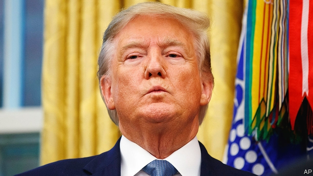

###### The man without a plan

# Donald Trump suddenly withdraws from northern Syria 

 

> print-edition iconPrint edition | Leaders | Oct 12th 2019 

BEHOLD THE “great and unmatched wisdom” of President Donald Trump. On October 6th he announced that American troops would withdraw from northernmost Syria, all but endorsing a Turkish offensive against America’s Kurdish allies in the region. He did not warn the Kurds, who had fought bravely against the jihadists of Islamic State (IS). It was time to let others, such as Russia and Iran, “figure the situation out”, he said. But hours later, after even his Republican colleagues objected, Mr Trump stepped back. Turkey, he warned, should not do anything that he considers “off limits”. Ignoring him, Turkish forces launched a campaign on October 9th that threatens not only to revive IS, but also to condemn Syria to yet another cycle of slaughter. 

The conflicting signals, sent by Mr Trump in a series of incoherent tweets, have confused everyone. But they should surprise no one. This is what American diplomacy looks like in the Trump era. When the president’s closest advisers are not chasing up conspiracy theories in Ukraine (see Briefing), or defying the constitution by refusing to testify to Congress (see article), they are coping with a commander-in-chief who, according to his own former secretary of state, “is pretty undisciplined, doesn’t like to read, doesn’t read briefing reports, doesn’t like to get into the details of a lot of things, but rather just kind of says: ‘This is what I believe.’” That is no way to make policy anywhere in the world, least of all the Middle East. 

Mr Trump is understandably frustrated by being stuck in the region. America has had troops in Syria for five years and Iraq for a decade and a half. His solution, backed by many Americans, is “to get out of these ridiculous Endless Wars”. In December, with a similarly rash announcement, he began withdrawing from Syria, prompting his secretary of defence, James Mattis, to resign. About 1,000 American troops are now in the country, down from 2,000 last year. Only about a dozen diplomats remain in America’s once-teeming embassy in Baghdad, a city beset by deadly protests. When Mr Trump visited the city last winter, he stuck to a remote air base and left without seeing Iraq’s leaders. 

America’s allies should shoulder more of the burden in the Middle East, as Mr Trump keeps saying. But he is wrong to think that he can leave the region without any consequences (see article). In Syria America’s withdrawal and a Turkish invasion risk throwing the north into chaos and exacerbating ethnic tensions. That would please IS, which the Pentagon warns is resurgent, as is al-Qaeda. In 2011 Barack Obama also hastily pulled out of Iraq, leaving behind a cauldron of ethnic hatred that gave rise to IS. Mr Trump, like his predecessor, may find that withdrawal is soon followed by re-engagement—when he might regret abandoning his Kurdish allies. 

The president’s retreat creates a vacuum, allowing America’s enemies to exert more influence in the region. The abandoned Kurds are already talking of turning for support to Russia and Bashar al-Assad, Syria’ s dictator. Iran is an even bigger concern. Last year Mr Trump abandoned a deal that curbed its nuclear programme (and might just have smoothed America’s path out of the Middle East) in part because it said nothing about Iranian meddling in the region. But after stoking tensions with a policy of “maximum pressure”, Mr Trump has allowed Iran or its proxies to attack shipping and Saudi oil facilities with nothing more than a few sanctions in return. Nor has Mr Trump worked hard to counter Iran’s increasing sway in Syria and Iraq, where the American-backed government is wobbling. 

The reason presidents find it hard to leave the Middle East is that America has interests there. Pulling back requires planning to protect them. But, as the confusion over Syria shows, Mr Trump has no plan. When faced with the thorny issues presented by withdrawal, which had presumably featured in those unread briefings, his response has been to throw up his hands and turn his back. There is nothing wise about that. ■ 

