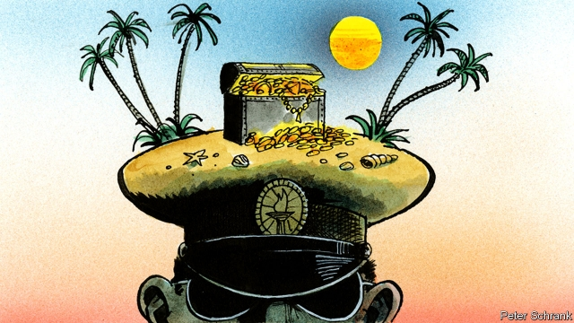

###### Personal finance for pilfering potentates

# How to hide a billion dollars 

 

> print-edition iconPrint edition | Leaders | Oct 12th 2019 

SO YOU’VE STOLEN a billion dollars. That was the easy part. The country of which you are president may be poor, which is a pity, but it is also lawless, which creates opportunities. The auditors, police and prosecutors who should have slapped the hand you put in the treasury chose to kiss it instead. So your pockets are bulging with ill-gotten loot. There is just one snag: the world has grown less tolerant of kleptocrats. 

Back in the good old days of the cold war, strongmen could be strongmen. When Mobutu Sese Seko, the late dictator of what is now the Democratic Republic of Congo, robbed his country into a coma, no one cared. (Apart from his subjects, of course.) When his household drained 10,000 bottles of pink champagne a year and Mobutu kept a Concorde idling on the runway of his tropical palace, his Western backers turned a blind eye, so long as he did not invite the Soviets into central Africa. Likewise, the Soviets overlooked the equally egregious thievery of their clients in Angola. And a kleptocrat in those days had no trouble finding places to park his squillions. Swiss bankers vied to offer him roomy vaults. Estate agents on the Côte d’Azur rolled out the gold-thread carpet. 

Recently, however, Western governments have been confiscating looted assets and prosecuting those involved in corruption far beyond their borders (see Middle East & Africa section). This year America’s Justice Department indicted a former finance minister of Mozambique and won convictions against several ex-Credit Suisse bankers over the embezzlement of $2bn in loans. Malaysia’s former prime minister, Najib Razak, lost his job and his liberty after America revealed that he had $700m in personal bank accounts; American prosecutors are still pursuing his alleged money-launderer. Last month Swiss authorities auctioned off $27m-worth of sports cars seized from Teodorin Nguema Obiang, the unaccountably wealthy son of the president of Equatorial Guinea, a tiny oil-rich dictatorship. It was not his first brush with foreign law enforcement. In 2014 he had to hand over assets worth $30m after America’s Justice Department said he had embarked on a “corruption-fuelled” shopping spree “after raking in millions in bribes and kickbacks”. Everywhere, pilfering potentates and their progeny must be nervous. 

So here are some steps they can take to safeguard their loot. First, stay away from social media. The younger Mr Obiang posed on Instagram in fancy cars and on private jets. That may have impressed his friends, but it also raised awkward questions about how he could afford such extravagant toys. 

Second, avoid purchases so conspicuous that they make headlines. Kolawole Akanni Aluko, a Nigerian businessman accused of bribery, not only spent $80m on a superyacht—he also reportedly rented it to Jay-Z and Beyoncé for $900,000 a week. These (blameless) singers attract a certain amount of attention. Mr Aluko might have avoided unwelcome scrutiny had he bought a less blingtastic boat. 

Third, keep an emergency stash close to hand. The late Robert Mugabe, who misruled Zimbabwe for three decades, always travelled with a suitcase of “coup money”, in case he was ousted while abroad. Cash piles must be looked after, mind. A former ruler of Equatorial Guinea, Francisco Macías Nguema, kept a large portion of the country’s foreign reserves in a bamboo hut in his garden. He forgot to waterproof the hut, alas, and much of his stash rotted. 

One way to protect overseas assets is to claim they belong to the state. The younger Mr Obiang stopped France from selling his home in Paris by insisting it was owned by his country’s embassy. His lawyers also say that a $100m superyacht seized by the Netherlands was a naval vessel. Prosecutors are mystified as to what military purpose might be served by the upper deck’s jacuzzi. Another way to elide the distinction between public and personal property is to be royal. Mswati III, the absolute monarch of Eswatini (formerly Swaziland) lives like a king—and it’s legal. Gulf royals were reportedly among the bidders for Mr Obiang’s cars. 

One final thought. How about ruling honestly? This is not as crazy as it sounds. Mo Ibrahim, a Sudanese-British telecoms tycoon, has endowed a $5m prize each year for an African president who governs well and retires when his term is up. You can live quite well on $5m. Yet for seven of the 12 years since the Ibrahim prize began, no worthy recipient has been identified. ■ 

