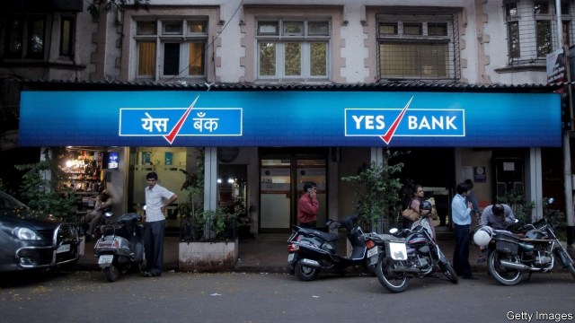
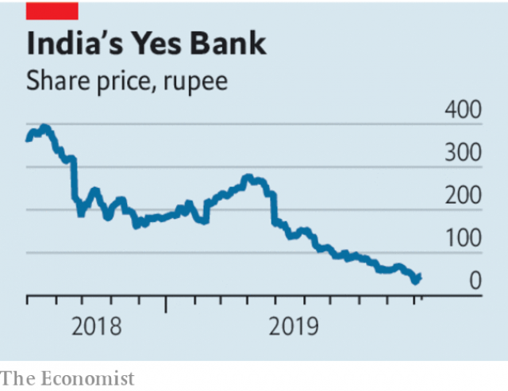

###### A big stink on the brink

# The risks from India’s rotten banks 

 

> print-edition iconPrint edition | Leaders | Oct 12th 2019 

IMAGINE A CENTRAL bank tweeting that, yes, there are rumours of “certain” banks facing deposit runs but “there is no need to panic”. Would you feel reassured? That is the unenviable position Indians found themselves in last week as a financial storm rumbled on in the world’s fifth-biggest economy with no sign of the authorities getting a firm grip. In the latest fiasco a co-operative bank, PMC, is accused of fraud, prompting depositors to yank their cash out. Meanwhile shares in Yes Bank, a private lender, have collapsed by 40% in the past month as rumours swirl. These are not isolated incidents. Roughly a third of the financial system is on crutches or under suspicion. Dazed by the scale of the task, the government and the Reserve Bank of India (RBI) are dithering. Until they act, India’s economy will not perk up—and there is a danger of a full-blown crisis. 

The origins of this mess go back to 2005. In the first phase conventional banks, which control about four-fifths of the system’s assets and are mostly state-run, lent too freely to infrastructure and industrial projects, sometimes ones backed by well-connected tycoons. The plight today is a continuation of the second phase: a boom-and-bust in lightly regulated shadow banks, which control the remaining fifth of the system. The danger grew in 2016 when the government temporarily abolished large banknotes, leading many people to deposit money in banks and mutual funds. These, in turn, used the windfall to make loans to shadow banks, which went on their own lending binge, often using the money to finance property projects. 

Today the financial system is stuffed with bad debts. Perhaps a tenth of loans are dud, maybe more. The shadow banks are vulnerable because they use short-term debt (rather than ordinary deposits, which they are mostly restricted from raising) to fund long-term loans of their own. There is also an undercurrent of fraud and bogus accounting. In 2018 Punjab National Bank said that a diamond dealer had stolen $2bn from it. Later that year IL&FS, a big shadow bank with government links, collapsed. Credit-rating agencies have been giving high ratings to flaky firms. With suspicion rife, a handful of shadow banks face a severe funding squeeze, and the entire financial sector is wary of lending. As a result credit is growing at near its slowest pace in 20 years. The ripple effect has stalled building projects, starved wholesalers of loans to buy inventory and prevented farmers from borrowing to buy tractors and motorbikes. 

 

The response of Narendra Modi’s government and the RBI has so far been halting. The government has repeatedly but belatedly pumped inadequate sums of capital into the state banks, and promised to merge some of them. On September 20th it slashed corporate taxes to try to revive animal spirits. The RBI, meanwhile, has cut interest rates five times this year. Presumably they hope that this will be enough to boost the economy, while the big state banks slowly regain their strength and the remaining well-run private banks, such as HDFC and Kotak, lend more freely. 

The crisis, however, cannot be compartmentalised. Shadow banks have borrowed from bad banks which may have borrowed from good ones. Another collapse in one corner could easily cause panic elsewhere. Because the banks are in poor shape, the RBI’s interest-rate cuts are not being passed on to consumers and firms. Another lurch down in the economy threatens a new series of bad debts at the recuperating state banks. And there is a palpable sense that governance is broken. Bank boards, auditors, rating agencies and the RBI have all failed to stop the rot. 

India needs a two-pronged clean up. In the short term the RBI should do another “stress test” of the banks, and test the shadow banks, too. The results should be made public. If state banks need capital they should get it. Some shadow banks will fail and should be wound up. The approach taken with IL&FS offers a template. It was put into a form of administration and creditors face a big haircut (although the process could be quicker). In the longer run, India should privatise its state banks so that they can escape control by politicians. Shadow lenders, meanwhile, should face the same prudential rules as banks. The RBI needs to overhaul its system of ongoing supervision. It used to be widely admired, but is starting to look like part of the problem. 

This ought to be India’s moment. It has a big domestic economy and lots of entrepreneurs, oil prices are fairly low—helpful for a big importer—and multinationals are keen to shift their factories out of China. Cleaning up the financial system is a gigantic task. But until it is done India will not thrive.■ 

