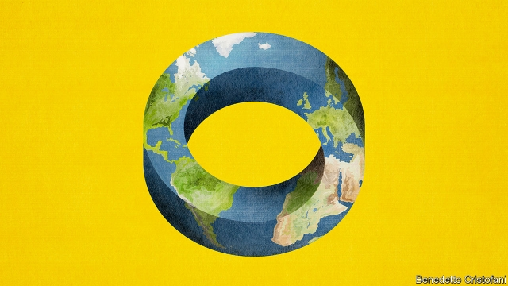

###### Macroeconomics

# The world economy’s strange new rules 

 

> print-edition iconPrint edition | Leaders | Oct 10th 2019 

RICH-WORLD economies consist of a billion consumers and millions of firms taking their own decisions. But they also feature mighty public institutions that try to steer the economy, including central banks, which set monetary policy, and governments, which decide how much to spend and borrow. For the past 30 years or more these institutions have run under established rules. The government wants a booming jobs market that wins votes but, if the economy overheats, it will cause inflation. And so independent central banks are needed to take away the punch bowl just as the party warms up, to borrow the familiar quip of William McChesney Martin, once head of the Federal Reserve. Think of it as a division of labour: politicians focus on the long-term size of the state and myriad other priorities. Technocrats have the tricky job of taming the business cycle. 

This neat arrangement is collapsing. As our special report explains, the link between lower unemployment and higher inflation has gone missing. Most of the rich world is enjoying a jobs boom even as central banks undershoot inflation targets. America’s jobless rate, at 3.5%, is the lowest since 1969, but inflation is only 1.4%. Interest rates are so low that central banks have little room to cut should recession strike. Even now some are still trying to support demand with quantitative easing (QE), ie, buying bonds. This strange state of affairs once looked temporary, but it has become the new normal. As a result the rules of economic policy need redrafting—and, in particular, the division of labour between central banks and governments. That process is already fraught. It could yet become dangerous. 

The new era of economic policy has its roots in the financial crisis of 2007-09. Central banks enacted temporary and extraordinary measures such as QE to avoid a depression. But it has since become clear that deep forces are at work. Inflation no longer rises reliably when unemployment is low, partly because the public has come to expect modest price rises, and also because global supply chains mean prices do not always reflect local labour-market conditions. At the same time an excess of savings and firms’ reluctance to invest have pushed interest rates down. So insatiable is the global appetite to save that more than a quarter of all investment-grade bonds, worth $15trn, now have negative yields, meaning lenders must pay to hold them to maturity. 

Economists and officials have struggled to adapt. In early 2012 most Fed officials thought that interest rates in America would settle at over 4%. Nearly eight years on they are just 1.75-2% and are the highest in the G7. A decade ago, almost all policymakers and investors thought that central banks would eventually unwind QE by selling bonds or letting their holdings mature. Now the policy seems permanent. The combined balance-sheets of central banks in America, the euro zone, Britain and Japan stand at over 35% of their total GDP. The European Central Bank (ECB), desperate to boost inflation, is restarting QE. For a while the Fed managed to shrink its balance-sheet, but since September its assets have started to grow again as it has injected liquidity into wobbly money-markets. On October 8th Jerome Powell, the Fed’s chairman, confirmed that this growth would continue. 

One implication of this new world is obvious. As central banks run out of ways to stimulate the economy when it flags, more of the heavy lifting will fall to tax cuts and public spending. Because interest rates are so low, or negative, high public debt is more sustainable, particularly if borrowing is used to finance long-term investments that boost growth, such as infrastructure. Yet recent fiscal policy has been confused and sometimes damaging. Germany has failed to improve its decaying roads and bridges. Britain cut budgets deeply in the early 2010s while its economy was weak—its lack of public investment is one reason for its chronically low productivity growth. America is running a bigger-than-average deficit, but to fund tax cuts for firms and the wealthy, rather than road repairs or green power-grids. 

While incumbent politicians struggle to deploy fiscal policy appropriately, those who have yet to win office are eyeing central banks as a convenient source of cash. “Modern monetary theory”, a wacky notion that is gaining popularity on America’s left, says there are no costs to expanding government spending while inflation is low—so long as the central bank is supine. (President Donald Trump’s attacks on the Fed make it more vulnerable.) Britain’s opposition Labour Party wants to use the Bank of England to direct credit through an investment board, “bringing together” the roles of chancellor, business minister and Bank of England governor. 

In a mirror image, central banks are starting to encroach on fiscal policy, the territory of governments. The Bank of Japan’s massive bondholdings prop up a public debt of nearly 240% of GDP. In the euro area QE and low rates provide budgetary relief to indebted southern countries—which this month provoked a stinging attack on the central bank by some prominent northern economists and former officials (see Free exchange). Mario Draghi, the ECB’s outgoing president, has made public appeals for fiscal stimulus in the euro zone. Some economists think central banks need fiscal levers they can pull themselves. 

Here lies the danger in the fusion of monetary and fiscal policy. Just as politicians are tempted to meddle with central banks, so the technocrats will take decisions that are the rightful domain of politicians. If they control fiscal levers, how much money should they give to the poor? What investments should they make? What share of the economy should belong to the state? 

In downturns either governments or central banks will need to administer a prompt, powerful but limited fiscal stimulus. One idea is to beef up the government’s automatic fiscal stabilisers, such as unemployment insurance, that guarantee bigger deficits if the economy stalls. Another is to give central banks a fiscal tool that does not try to redistribute money, and hence does not invite a feeding frenzy at the printing presses—by, say, transferring an equal amount into the bank account of every adult citizen when the economy slumps. Each path brings risks. But the old arrangement no longer works. The institutions that steer the economy must be remade for today’s strange new world. ■ 

