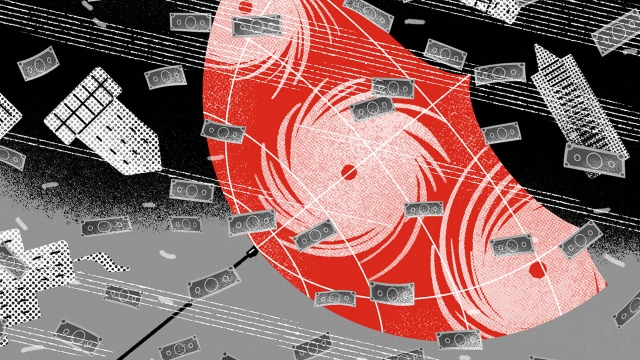
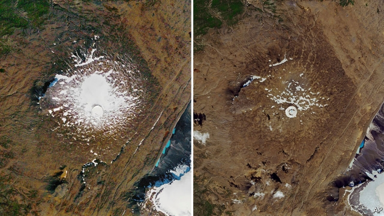

###### On our climate change issue

# Letters to the editor 

> Oct 12th 2019 

Limiting temperature rises to 2°C above pre-industrial norms would still leave atmospheric carbon dioxide at well over 450 parts per million (ppm) (“What goes up”, September 21st). We evolved, and until less than a century ago, lived, on a 300ppm planet. We need to return the Earth’s climate to its pre-industrial state, without doing the same to our economy. 

The UN recently hosted the first Global Forum on Climate Restoration. Entrepreneurs and climate scientists discussed the undoubtedly gargantuan challenge of removing and permanently storing around a trillion tonnes of carbon from the atmosphere by 2050, and presented technically viable ways to do this. Even if market-based approaches to remove carbon dioxide fail entirely, and they won’t, a reasonable estimate is that it would cost 3-5% of global GDP for 20-30 years to return the atmosphere to 300ppm. As a comparison, ten years ago America diverted 3.5% of its annual GDP to prevent the financial system from collapsing. That felt like a good investment. So does this. 

JON SHEPARDGlobal Development IncubatorLondon 

 

Your article on British offshore wind suggested that the technology remains expensive (“The experiment”). Yet the latest auctions produced a price of about £40 ($50) per megawatt hour, well below the current wholesale price of electricity. Offshore wind is now the cheapest way of producing power in Britain. 

You also supported Dieter Helm’s acerbic criticisms of British energy policy for directing subsidies towards particular technologies, such as offshore wind. The recent auctions are a spectacular rebuttal of Professor Helm’s theory. It is precisely because Britain has protected offshore wind over the past 15 years that the technology has now become unbelievably cheap. It is often difficult for economists such as Professor Helm to recognise this, but active industrial policies can work. 

Lastly, you repeated the conventional final attack on offshore wind, pointing out that it is intermittent. Other countries around the North Sea have woken up to this problem, usually focusing on various technologies for converting “power to gas” as a way of ensuring this intermittency can be managed at enormous scale. The hibernation of energy policy over recent years has held up progress, but my hypothesis is that Britain will soon conclude, like other countries, that using surplus power to make renewable hydrogen is the logical route forward. This hydrogen will then be used to generate power when electricity supplies are scarce from the North Sea. 

CHRIS GOODALLOxford 

Polluting cannot be free. A strong price on carbon will incentivise producers and consumers to reduce emissions and innovators to create low-carbon technologies. And returning all the funds raised back to the economy means little to no economic loss and a much healthier future. Though the politics are challenging, as advocates are up against a wall of money, the American House of Representatives is considering four bipartisan bills that do just this, and one, the Energy Innovation Act, has 64 co-sponsors. 

JERRY HINKLEGoverning boardCitizens Climate LobbyCoronado, California 

 

You observed that most of the benefits from reducing greenhouse-gas emissions “will be accrued not today, but in 50 or 100 years.” It is worth adding that societies reap meaningful and immediate benefits from transitioning away from fossil fuels. In a recent research paper, our team found that replacing fossil fuels with renewable energy yields substantial short-term benefits associated with cleaner air, improved health and fewer premature deaths, which exceed policy costs. We also estimated that these immediate benefits may be larger than the near-term gains from mitigating climate change. Societies, therefore, have ample reason to act on climate change now. 

EMIL DIMANCHEVSenior research associateMIT Centre for Energy and Environmental Policy ResearchCambridge, Massachusetts 

In your article on small island states and climate diplomacy, you failed to mention the effects of rising and shifting sea floor, and that volcanic islands can and do naturally sink (“Nothing so concentrates the mind”). Balanced reporting would merit at least a quick mention of these facts. 

JOY SAVAGE D’ANGELOFort Worth, Texas 

It is true that climate change is not just an environmental problem and cuts across all activities. Yet the recipe for economic growth from mainstream economists, including The Economist, disregards climate change. Yes, economics textbooks cover externalities or spillover effects, but these have not been integral to growth analysis. A search finds abundant climate studies, but less than 0.5% of the numerous growth articles over the past 50 years seem to factor climate effects. 

That allows politicians such as Jair Bolsonaro, Brazil’s president, to argue that environmental protection is inimical to growth, even as the emerging reality is the opposite. American policy, too, sees any deregulation, including policy that mortgages the environment, as pro-growth. Yes, environmental destruction may boost short-term growth, but the climate outcomes hurt long-term growth and welfare. 

So, changing the conduct of growth economics is essential if we are to avert a climate catastrophe. Unless the economics profession stops ranking and rewarding countries based primarily on how much they deregulate and boost short-term GDP, the climate action that you rightly call for will continue to lag dangerously. 

VINOD THOMASA former senior vice-president at the World BankBethesda, Maryland 

 

Climatologists are like economists. They repeatedly produce false predictions based on skewed statistics and erroneous models. Neither wholly understand their respective cycles. Climatologists want to twiddle the carbon-dioxide knob just as central bankers twiddle interest rates. 

The Economist is fuelling peak-hysteria near the top of a climate bull market. The inevitable climate bear market will be more sudden, geologically, longer and colder than any climatologist can at present imagine. 

JAMES HOLMEBickenbach, Germany 

Your newspaper has now shown itself to have joined the alarmist warmists. You have lost your way and attached yourself to the ranks of the activists. Very disappointing. In order to avoid misleading your readers you should rename your publication The Alarmist. 

TONY POWELLNiagara-on-the-Lake, Canada 

 

As a longtime reader of The Economist, I have often been moved by the Obituary column, but I was astonished to find myself weeping over the death of the Okjökull glacier in Iceland, a response triggered as much by the beauty of the writing as the poignancy of the event. Later that day I called my broker and divested all my fossil-fuel holdings. 

PAGE NELSONCharlottesville, Virginia 

