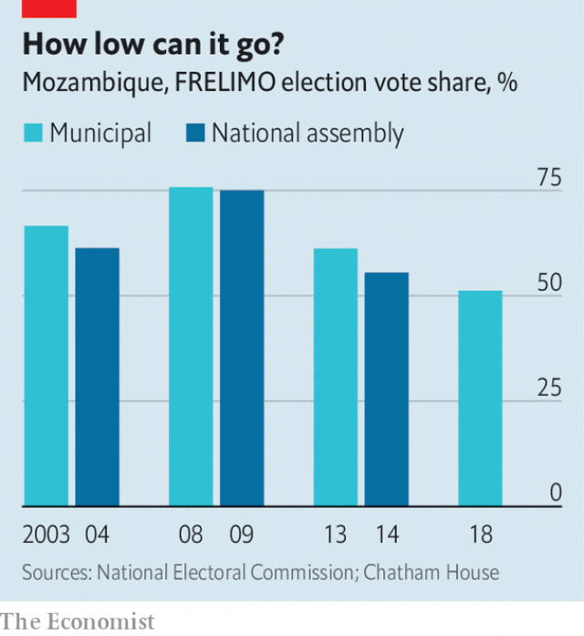

###### War wounds

# A violent election in Mozambique threatens a hard-won peace 

 

> print-edition iconPrint edition | Middle East and Africa | Oct 12th 2019 

ON OCTOBER 7TH Anastácio Matavele left a training session for election observers in Xai-Xai, the capital of Gaza province in southern Mozambique. Matavele, an experienced observer, was chased in his car by men allegedly belonging to a specialist police unit, who then shot and killed him. Authorities were already struggling to explain how the electoral roll in Gaza, a stronghold of FRELIMO, the ruling party, came to have 300,000 more names on it than there are adults in the province. Now they must explain whether the state murdered a warden of Mozambican democracy. 

Matavele’s death is just the latest cause for concern ahead of elections on October 15th. These are the sixth presidential and parliamentary votes since the end of the civil war, which ran from 1977 to 1992. They will be among the most violent, says Zenaida Machado of Human Rights Watch, an NGO. Campaigning is taking place against the backdrop of two conflicts: one old, the other relatively new. 

The old is between FRELIMO and RENAMO, former guerrilla fighters who are now the main opposition party. After 1992 the end of civil war gave way to a mostly peaceful impasse, whereby FRELIMO kept control of the state, which it has persistently looted, while leaving RENAMO with enough support and fighters to retain influence. But in 2013-14, and again in 2015-16, RENAMO resumed attacks so as to extract more concessions from the ruling party. 

A peace deal was signed between the two sides in August. In exchange for laying down its arms RENAMO received pledges of jobs and pensions for its ageing fighters, as well as an agreement to devolve power to provinces, whose governors will henceforth be indirectly elected, rather than appointed by the president. Negotiators hoped that the deal would be the prelude to peaceful elections. 

 

That has proved naive. Since RENAMO gave it a scare in elections in 1999, FRELIMO has been accused of rigging votes, including those it might have won anyway. Although President Filipe Nyusi will retain power in the presidential race, elections to the national assembly will be close. RENAMO is hoping for victory in five of the ten provincial votes. FRELIMO’s share of the vote has slipped in the past four elections (see chart); many expect it to use any means necessary to slow its decline. 

Evidence of chicanery is growing. Opposition presidential candidates have been stopped from holding rallies in some areas. Thousands of election observers have been prevented from registering. Victims of Cyclone Idai, which struck in March, have reportedly been told that if they vote for the opposition they will not get food aid. Dozens of journalists and pro-democracy activists have been harassed, assaulted and detained in recent years. Some, like Matavele, have been killed. 

Then there is the second, newer conflict looming over the ballot. In Cabo Delgado, a province in the far north-east, a poorly understood Islamist-linked insurgency has terrorised local people since 2017. It has also led to an influx of private security firms to protect the installations that will tap vast offshore reserves of natural gas. This year 184 people have died in attacks, estimates Jasmine Opperman, an analyst. 

Mr Nyusi claims the situation is under control. It is not. Violence has increased since election campaigning officially began on August 31st. On September 23rd ten people were killed in a single attack, which also saw the local FRELIMO office set on fire. The army is “totally ill-equipped”, says Ms Opperman. 

The discovery of gas ought to be great news for Mozambicans, 62% of whom live on less than $1.90 per day (adjusted for purchasing power). But there is nothing in FRELIMO’s record to suggest that the proceeds will be evenly shared. Nor is there much sign of peaceful democracy. ■ 

