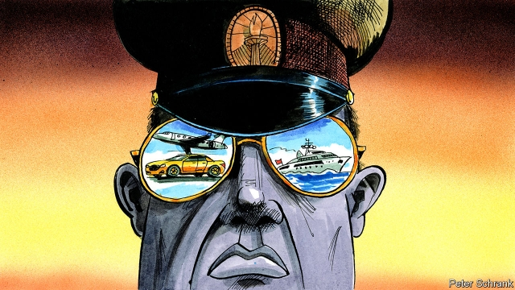

###### Catch me if you can

# African kleptocrats are finding it tougher to stash cash in the West 

 

> print-edition iconPrint edition | Middle East and Africa | Oct 12th 2019 

LIGHT-FINGERED tyrants are looking back wistfully. In past decades they could stash their illicit wealth in the West. Friendly lawyers, banks and middlemen were on hand to park the loot. Sani Abacha, the military dictator who ran Nigeria in the 1990s, deposited billions of dollars in banks across the rich world, no questions asked. Western governments often seemed equally unfussed. Valéry Giscard d’Estaing, a former president of France, attended soirées in chateaux owned by the late Emperor Jean-Bedel Bokassa of Central Africa. Mr Bokassa would slip his guest diamonds to thank him for France’s support. 

Such brazenness is becoming a bit harder to get away with. Anti-corruption campaigners and muckraking journalists have busied themselves trying to uncover stolen assets. Western governments, tired of seeing aid money stolen, have toughened up money-laundering and bribery laws. 

On September 29th Swiss authorities auctioned a fleet of sports cars seized from Teodorin Obiang, son and heir apparent to the president of Equatorial Guinea. The $27m raised is to be returned to Mr Obiang’s benighted people. Days earlier San Marino confiscated €19m ($21m) from accounts linked to Denis Sassou Nguesso, the president of Congo-Brazzaville. 

Yet so much has been pilfered from Africa that tracking it all is tricky. Chatham House, a British think-tank, estimates that $582bn has been stolen from Nigeria alone since it won independence in 1960. Britain’s International Corruption Unit says its investigations have led to the confiscation of £76m ($117m) in laundered loot since 2006. Another £791m has been frozen worldwide thanks to its work. Yet that barely makes a dent in the £100bn of illicit funds which Steve Goodrich at Transparency International, a watchdog, reckons enters Britain every year. “Seizures are still the exception,” says Jason Sharman, an expert in international corruption at Cambridge University. “Dirty money still gets through most of the time.” 

The best way to hide and move stolen wealth is to set up a raft of anonymous shell companies and bank accounts. Questionable payments linked to Mr Sassou Nguesso’s son passed through Cyprus, Poland, Portugal, Spain and Switzerland, Global Witness, another watchdog, reported in August. The EU is trying to make this sort of thing harder by forcing member states to publish registers disclosing the beneficial owners of companies. 

Britain has introduced another innovation. Unexplained Wealth Orders allow courts to order “politically exposed persons” to explain why their assets are so much larger than their salaries back home. The first was issued last year. 

Yet tough laws do not work unless everyone imposes them. “If there is a gap, then the money-launderers will find it,” says Max Heywood, Transparency International’s global advocacy co-ordinator. 

Willing and effective implementation is vital. Some surprising places, such as Switzerland and Jersey, have grown more robust in this regard. But America leads the way. The Kleptocracy Asset Recovery Initiative at the Department of Justice has seized stolen loot not just in America, but abroad. “The US is aggressive in enforcement,” says Matthew Axelrod, a former DoJ official now at Linklaters, a law firm. “Penalties are very high and prosecutors are insulated from political interference.” 

Europe lags behind. Its law-enforcement agencies are often under-resourced. Investigators struggle when dirty money is held in several countries. Britain has spearheaded the International Anti-corruption Co-ordination Centre, created in 2017. Its head, Rupert Broad, says pooling intelligence has led to the arrest of five senior officials in four African states. 

The most important thing, campaigners say, is to take steps to stop dirty money arriving in the first place. Banks are becoming better at reporting dodgy deposits. Purveyors of luxury goods are less alert. Boat dealers in the Netherlands are supposed to flag suspicious purchases. But of 40,959 suspicious-activity reports to Dutch authorities in 2015, just three came from yacht-dealers, Transparency found. 

African states also complain that little of what is recovered is ever sent back. America, Britain and Switzerland have had some success. More than $1bn seized from Mr Abacha’s bank accounts has been returned. But many African states have not helped their cause, often because thieving politicians are still in charge. When Switzerland returned $500m of Mr Abacha’s money, most of it disappeared again. The World Bank has programmes to guard against such things, but some Western states remain wary, and rightly so. 

James Ibori, a former governor of Nigeria’s Delta State, served a prison sentence in Britain after admitting to plundering $79m from the public purse. His lawyers have managed to frustrate efforts to repatriate most of the funds frozen in his British bank accounts. Displaying a cheerful shamelessness, Mr Ibori is again active in Nigerian politics. In August Ifeanyi Okowa, the state’s present governor, called Mr Ibori “a true patriot” and praised him for his “uncompromising posture on...good governance”. There are surely better ways of showing that Africa is doing its bit than heaping plaudits on a felon.■ 

