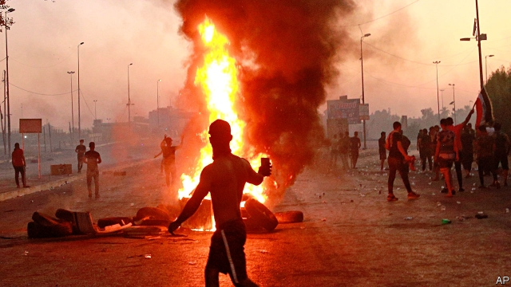

###### Streets of fury

# Iraq’s government seems powerless to halt protests in the Shia heartland 

 

> print-edition iconPrint edition | Middle East and Africa | Oct 12th 2019 

MILLIONS OF SHIAS will walk to the holy city of Karbala this month, ending the annual mourning period for Hussein, grandson of the Prophet Muhammad, who was killed 14 centuries ago. But Iraqi pilgrims will also wail for the 110 people, all Shia, whom their government has killed during recent protests. The authorities have imposed curfews, switched off the internet and arrested hundreds. Nevertheless, many Iraqis say that after Karbala they will walk to Baghdad, 105km away, to confront their rulers. 

In recent years the government has been buffeted by uprisings in Sunni areas and a separatist push by the Kurds. But unrest in the Shia south, the government’s heartland, could prove its greatest challenge. What began as small rallies by unemployed graduates and unhappy street vendors has mushroomed. The government’s violent response has brought thousands onto the streets. They complain, as ever, of too few jobs, poor services and rampant corruption. Western diplomats wonder whether Adel Abdul-Mahdi, the 77-year-old prime minister, in office only for one year, can regain control. 

There have been big protests before. In 2016 thousands of Iraqis stormed the then-fortified Green Zone, the seat of government in Baghdad, demanding economic and political reforms. But little progress has been made. Despite increased oil revenues and relative peace after years of civil war, the government has been unable to deal with high poverty rates or with youth unemployment of around 25%. War-torn areas remain in ruins. In recent days Mr Abdul-Mahdi has unveiled several measures, such as land distributions and increased welfare payments. He vows to tackle corruption and punish those responsible for the violence. But few Iraqis believe he will keep his promises. 

The problem, in part, is the design of the government. After toppling Saddam Hussein, Iraq’s former dictator, in 2003, America wanted to prevent another strongman from emerging. But the new set-up has allowed parties based on ethnicity and sect to dominate. They dish out government jobs to loyalists and treat ministries like cash machines. The prime minister, himself beholden to the Shia factions that appointed him, is in no position to take on his colleagues. Protesters accuse politicians of plundering Iraq’s oil wealth. “It goes on mansions for their families in London,” says a demonstrator in Hilla, south of Baghdad. Ironically, many are now calling for a return to strongman rule. 

Economic and political frustrations are at the heart of the protests, but anger has also been directed at Iran, which is seen as having undue influence over the government. The dismissal of Abdul-Wahab al-Saadi, a popular army commander, brought many of his southern tribesmen out in protest. They believe he was ousted for trying to root out corruption in the army, particularly among Shia militia groups with close ties to Iran. Some of those same groups are now thought to be leading the violent response to the protests. “Out, out Iran. Set our country free,” chant the protesters, some waving placards with Mr Saadi’s face. 

America is making little effort to counter Iranian influence. The State Department evacuated hundreds of diplomats in May, after receiving intelligence that Iran (or its proxies) might attack American interests in the region. It accelerated the pullout in June, after attacks on a site used by international oil companies and on Iraqi bases where American troops are stationed. Once the world’s largest, America’s embassy in Baghdad now has just over a dozen diplomats, says a foreign observer. They rarely leave the compound. 

In the past, Shia protesters listened to the clergy in Najaf, a holy city in the south. But Grand Ayatollah Ali al-Sistani, the chief cleric, is losing his authority as arbiter between the government and the masses. His Friday sermons appealing for moderation on all sides meet with derision. “The clergy aren’t siding with the people,” says a protester in Basra. “They’re living on government money.” Muqtada al-Sadr, a firebrand cleric who previously spoke for the dispossessed, also appears to be losing his sway. His nationalist party, Sairoun (“Marching to Reform”), won the most seats in parliamentary elections last year. But since joining the government Mr Sadr has spent much of his time in Iran. Protesters say he has been co-opted. 

Officials admit that they are running out of options. “There’s no magic solution,” says Mr Abdul-Mahdi. Protesters throw Molotov cocktails and torch the branches of Shia political parties. Officials say they have come under fire. Some talk ominously of Iraq going the way of Syria, where protests descended into civil war, and where the government is beholden to Iranian-backed Shia militias. Iraq’s young democracy, no stranger to tumult, may be facing its most dangerous moment yet. ■ 

