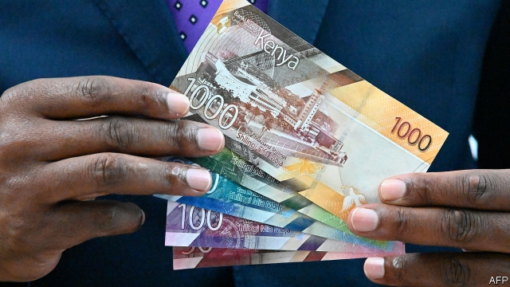

###### Money to burn

# Kenya’s demonetisation was unexpectedly orderly 

 

> print-edition iconPrint edition | Middle East and Africa | Oct 12th 2019 

WHEN KENYA announced in June that it would issue new 1,000 shilling ($10) notes and destroy the old ones to fight corruption, many predicted chaos. India’s efforts to do the same by “demonetising” rupees in 2016 led to riots, deaths and a dent in economic growth. 

Few doubted the need for Kenya to do something: corruption and tax evasion are pervasive. Tax revenue as a share of GDP has slipped steadily since 2014 to less than 16%, which is less than half of the average of countries in the OECD. The central bank hoped that by abolishing the old notes it would flush out criminals and well-heeled tax dodgers when they brought out large sums of hidden cash to exchange for the new notes. 

But critics fretted that the plan would hurt the poor, many of whom live deep in the countryside, and the millions of Kenyans who do not have bank accounts. “My aunties and grandma in the village have had challenges trying to get the new notes,” says Peter Ndegwa, a taxi driver in Nairobi. “They’ve been conned by being issued fake currency.” Traders were also hit when businesses in Uganda and Tanzania sniffed at Kenyan notes. 

Even their design caused controversy. Activists took the central bank to court, arguing the notes were unconstitutional because they featured an image of Jomo Kenyatta, Kenya’s first president and the father of the current president, Uhuru. This seemed to violate a constitutional ban on banknotes showing the “portrait of any individual”. After a review of dictionary definitions the court ruled that since the image showed his feet it was clearly a sculpture and not a portrait, which would have shown him only from the “bust or head upwards”. 

At least Kenya learned from India by giving people four months to change their money (in India the old bills became invalid overnight and people had just 50 days to exchange old bills for new). Yet this may also have allowed time for crooks to launder their money. Many rushed to buy dollars. Others handed over wads of cash for new cars. By the time the deadline had passed, the authorities were able to identify only a few thousand suspicious transactions for further investigation. 

The central bank declared a success, saying that 96% of the old notes had been handed in. But teething pains continue. “The new notes don’t fit in the parking meters,” grumbles Anstes Agnew, a visitor from Rwanda who got stuck in the airport garage. “You have to go on a hunt and hoard the old notes.” 

