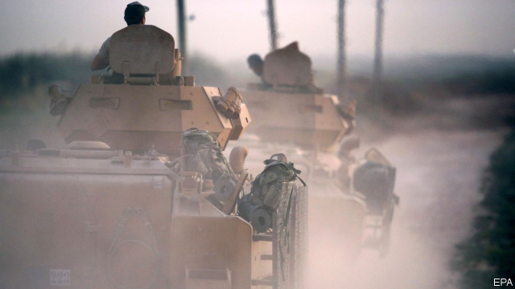
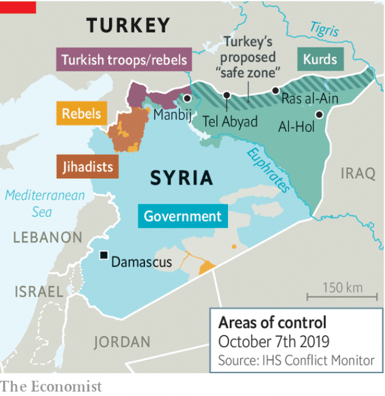

###### Green light, go

# Turkey launches an attack on northern Syria 

 

> print-edition iconPrint edition | Middle East and Africa | Oct 10th 2019 

AFTER YEARS of threats, it took Turkey mere days to strike. On October 9th the Turkish armed forces began bombing parts of north-east Syria. Controlled by a Kurdish-led militia, the region had been an American protectorate until just days before, when President Donald Trump abruptly decided to abandon it. Turkish troops are now moving into Syrian towns, backed by local rebels under their command. The nascent offensive will have implications far beyond Turkey’s intended 30-kilometre-deep “safe zone” inside Syria. It will displace hundreds of thousands of people, complicate an already-chaotic war and offer the jihadists of Islamic State (IS) a chance to regroup. 

President Recep Tayyip Erdogan of Turkey says his aim is “to destroy the terror corridor which is trying to be established on our southern border”. In other words, he wants to oust the Kurds from their Syrian statelet. The main Kurdish force, called the People’s Protection Units, or YPG, gained control of the area while fighting with America against IS. That created an intolerable situation for Turkey, because the YPG has close ties with the Kurdistan Workers’ Party (PKK), a separatist group that has fought the Turkish army for 35 years. 

As Turkey advances, the fighting will probably grow bloodier. Civilians have begun fleeing towns under bombardment. The incursion could displace many of the 750,000 people living along the border. But Kurdish fighters deprived of American support are unlikely to want open conflict with the larger Turkish army. The YPG is already talking of cutting a deal with Bashar al-Assad, Syria’s dictator, that might see them relinquish some autonomy in exchange for the regime’s protection. 

 

The fighting risks benefiting IS, which has been kicked off the territory it once held, but which is resurgent, says the Pentagon. Operations against the jihadists have reportedly stopped. The Kurds, reasonably, say they have other priorities. They are still holding tens of thousands of IS detainees and their families in camps like Al-Hol, home to some 70,000 people who live in increasingly desperate and unsafe conditions. America says the IS prisoners will become the responsibility of Turkey. But Mr Erdogan’s proposed safe zone does not include Al-Hol. And Turkey does not have a good record when it comes to jihadists. Many first reached Syria by taking advantage of lax Turkish border controls. On October 10th President Donald Trump tweeted that America had taken custody of the most notorious prisoners and moved them out of the country—a tacit admission that Turkey was not up to the job of holding them. 

In general, though, Mr Trump has cleared the way for Turkey. On October 6th he announced that he was withdrawing the 100 or so American troops in northernmost Syria. They had been in the awkward position of standing between a NATO ally, Turkey, and a reliable partner, the YPG. The open-ended deployment of American troops in Syria (who, in total, number about 1,000) frustrates Mr Trump. He tried to withdraw all of them in December. That decision (announced, naturally, on Twitter) prompted his defence secretary, James Mattis, to resign. 

His equally abrupt decision this month blindsided American officers, to say nothing of the Kurds, and was followed by more erratic behaviour. Mr Trump argued America owed the Kurds no lasting loyalty since they “didn’t help us in the second world war”. In fact, the Kurds fought under allied command in Albania and Greece. As for Turkey, in the space of 48 hours he all but endorsed the Turkish operation, threatened Turkey with sanctions should it cross his unspecified red lines and then praised its contribution to NATO. 

The Pentagon worries about how the limited withdrawal in the north will affect the rest of its deployment in Syria. As the Turkish army advances, backed by rebel groups that are not terribly fond of America, it will grow ever harder to protect American troops stationed elsewhere. What began as a limited pullout may end with America abandoning all its positions. 

In a rare split with the president, Republican lawmakers joined their Democratic colleagues to condemn the move. Lindsey Graham, a Republican senator close to Mr Trump, introduced a bill to sanction Turkey’s leaders, armed forces and energy sector until it withdraws troops from Syria. Turkish officials who thought they had a deal with Mr Trump were left puzzled and fuming. “We don’t see only a single US any more, but many voices coming from different interest groups,” says Mesut Hakki Casin, an adviser to Mr Erdogan. 

Apart from Turkey’s own Kurds, and some liberals, most Turks are likely to cheer the offensive. Opposition parties tend to defer to Mr Erdogan whenever he invokes national security. He suffered a setback earlier this year when his Justice and Development party lost control of Turkey’s biggest cities in local elections. Success in Syria could offset the damage. 

Most Turks are also likely to back Mr Erdogan’s plan to flood the areas now under Kurdish control with some of the 3.6m Syrian refugees living in Turkey. Opinion polls show mounting levels of resentment towards the guests. Since the start of the year, Turkey has sent thousands of them back to Syria. Mr Erdogan says the 30km “peace corridor” his army plans to create would be a magnet for up to 2m refugees. This is either delusional or a euphemism for forced resettlement. Sending mostly Arab refugees to a region populated mainly by Kurds risks fanning tensions and future conflict. 

On paper the Turkish offensive seems simple enough, an attempt to deny territory to a hated foe. But capturing and holding hundreds of kilometres of territory will be a costly and perhaps bloody slog. The fighting could force a flood of refugees into Iraq, which has its own problems. And by giving Syrian rebels a new foothold in the north-east, it will complicate matters elsewhere in Syria, where Russia and Iran are trying to help Mr Assad consolidate control. Almost nine years into a conflict that reshaped the Middle East, there is still no end in sight. ■ 

