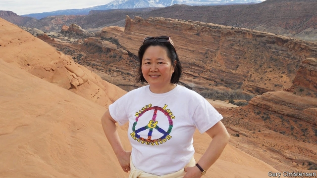

###### The truth-teller of Henan

# Obituary: Shuping Wang died on September 21st 

 

> print-edition iconPrint edition | Obituary | Oct 12th 2019 

A SWARM OF battered bicycles and pedicabs, cramming the narrow street, was usually the first sight that greeted Shuping Wang at the Zhoukou Anti-Epidemic Station, in Henan province. Most belonged to poor farmers who had ridden into the city in the small hours, eager to give blood. Every day around 500 would come. They were recruited from their mud-brick villages by local cadres, called bloodheads, who organised them into groups. The aim of this programme, run by the government, was to build up China’s stocks of blood and plasma so that tainted blood was not brought in from abroad. How ironic that would seem, in time. 

Naturally the government looked to Henan, where Dr Wang had been born: in central China south of Beijing, a remote place of poor but supposedly pure-blooded people. Farmers there struggled to make any sort of living. For each cow or lamb they raised local officials took a fee, and for each infringement of regulations—failing to grow tobacco and cotton together, having more than one child—they imposed a fine. For anyone worried and in debt, as many were, giving blood was easy money. As the official slogan said: Lie down, hold out your arm, make a fist, earn 53 yuan. 

When Dr Wang started at the blood bank in 1991, excited to be a front-line doctor like her mother, it had only just opened. The equipment was good and the rules were followed; she saw to that. But blood-collection stations were popping up in Henan like mushrooms, and procedures in some were shocking. There were no preliminary blood tests for donors, though many were coming back several times a week. Tubing, syringes and centrifuges were sterilised only once a day. Blood from several donors, once the plasma had been extracted, was mixed in tubs before it was reinjected. Even in her own clinic nurses messed up, going too fast. At medical school in Beijing in 1988 she had taken a course in field epidemiology run by America’s Centres for Disease Control; she knew the dangers of tainted blood by heart. By taking random samples from 64 donors in 1992, she found a hepatitis C infection rate of 34%; locally, more than 80%. 

She reported this back to local medical officers, as well as the Ministry of Health in Beijing. She wanted all deficient blood stations cleaned up or closed. Staff should be trained medically and, as important, morally. For blood collection, far from being “sacred” and “glorious” as the government claimed, was just a money machine, not least for the local medical and government officials who sold the plasma to pharma companies. They had no interest in monitoring for disease or bad practices, saying it was too costly, fearing too for their jobs. In the end she was kicked out of the blood bank for being trouble. She had to use her own savings to buy testing kits and to set up a testing centre of her own. But she did it gladly to save the people of Henan—because if hepatitis C was being transmitted, then HIV, leading to AIDS, was clearly coming too. 

Here, though, she could make no headway. At least, when it came to hepatitis, the central government introduced screening for all donors from July 1993. But HIV, which she first found in early 1995 in a Mr Guo who had given blood in several stations, was a different story. This was seen as a Western infection, a foreign disease that could not be admitted to. And here she was, a young woman whose father had fought with nationalist forces against Mao Zedong, a spy’s daughter, expelled from school, reporting an HIV infection rate in 1994-95 of 13% in the Zhoukou region. Worse than gathering the data, she had taken them to Beijing, when officials both there and in Henan wanted them well hidden. This time officers not only trashed her research, but drove her out of meetings and sent a man to wreck her testing clinic with a birdcage pole. 

She was not easily discouraged. Her own name for herself was “Sunshine”: a maker of demon-hot sauce with an exuberant laugh, a fondness for jazzy socks and a habit of tickling her much too serious husband. Yet these encounters left her in tears. With her job prospects in Henan demolished, she left for Beijing to do research with the one person there who had treated her warmly, Zeng Yi, the head of the Institute of Virology at the National Academy of Sciences. As a doctor she had to go on helping people, whether anyone liked what she did, and said, or not. 

The farmers of Henan stayed on her mind. As central government slowly began to own up to HIV and the AIDS that followed, illegal blood stations continued to flourish down those forgotten, dusty tracks, and officials raked off their money. She had ceaselessly visited the villagers for years, and she went on going in secret, buying cough syrup and diarrhoea medicine to ease their symptoms, though she could not cure them. She also gathered evidence, partly clinical, partly pictorial, for she keenly took photographs anywhere. In several the villagers returned her happy grin. In others, sick and skeletal figures merely stared at her. 

She kept none of this to herself. In Beijing she passed her findings carefully to journalists and to officers from the American embassy, explaining too which articles they should read and whom they should see, slipping them secret government reports. She also passed data to Gao Yaojie, a gynaecologist 30 years her senior who was now the public face of the HIV/AIDS campaign in China. Dr Gao, who became a dear friend, wrote the books and pamphlets and spoke out; Dr Wang, under cover, provided much of the evidence that underpinned her certainty. Then in 2001, when she could no longer return to Henan, she left for America. 

Everything there was new: the culture, the language, the techniques. She found a new husband, and a new field of research at the University of Utah. Two things, however, were grimly familiar. Whenever her name was publicly attached to HIV/AIDS in China—as to a play, based on her career, being staged in London this autumn—Chinese state security would begin to pester. And not far from her house in Salt Lake City, under Mount Olympus which she loved and painted, donors would sit in their cars pressing cotton wads to their forearms, outside a blood clinic that offered cash bonuses and never closed, even on Sundays. ■ 

