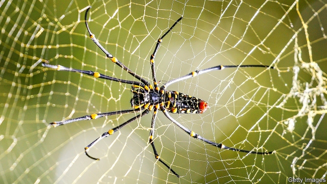

###### Natural materials

# How spider silk avoids hungry bacteria 

 

> print-edition iconPrint edition | Science and technology | Oct 12th 2019 

TOUGHER THAN any fibre made by humans and extraordinarily good at transmitting vibrations to the predators that weave it, spider silk has been a source of inspiration for the development of everything from scaffolding for regenerating bones to bulletproof vests, remote sensors and noise reducers. Yet one of its most remarkable attributes, its resistance to decay, has received little attention. Some researchers speculate that spider silk keeps hungry bacteria at bay by being laced with antibiotics. But work by Wang Pi-Han and Tso I-Min at Tunghai University, in Taiwan, published in the Journal of Experimental Biology, suggests this is not the case. Rather, silk manages to avoid being eaten by locking the nutrients it contains behind an impenetrable barrier. 

Spider silk is made of proteins that ought to be attractive to microbes. Moreover, because webs are often built in environments, like forests and bogs, that are rife with these bugs, there should be ample opportunities for bacteria to settle on the strands and feast. Remarkably, this does not seem to happen. 

Dr Wang and Dr Tso were curious about how spiders manage this. They began their investigation by putting bacteria and spider silks together in laboratory conditions perfect for bacterial growth. They worked with silk strands collected from three species of spider that build their webs in different environments, and set these down on nutrient-rich plates. Each plate had one of four bacterial species growing on it. The team then used microscopes to monitor the behaviour of the bacteria over the course of 24 hours. 

After repeating the experiment three times, they found that the bacteria never fed on the silks. They also found, however, that the strands were not immune to having bacteria grow over and around them—suggesting that those strands were not laced with antibiotics. 

The two researchers then tried growing their bacteria directly on silk strands, by providing them with a range of nutrient supplements. Only one of these supplements, nitrogen, encouraged consumption of the silk. When the strands were lathered in a nitrogen-rich solution, bacteria ate them. Without nitrogen, they were held at bay. This is odd, because proteins (of which silk is made) are, themselves, rich in nitrogen. 

That led Dr Wang and Dr Tso to conclude that the antibacterial properties of spider silk are caused not by any sort of antibiotic but, rather, the structure of the silk itself. Natural selection, it seems, has driven spider silk to store the proteins it is composed of behind a layer made impenetrable by its physical rather than its chemical structure. 

What, exactly, that structure is the two researchers have yet to determine. Once it has been elucidated, though, the discovery should pave the way for artificial antibacterial materials that do not use antibiotics to keep the bugs away. 

