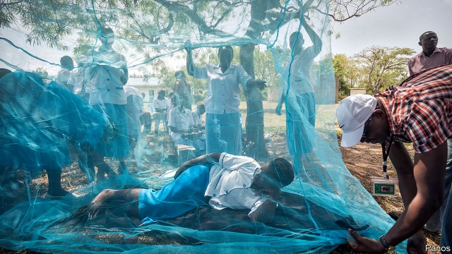

###### Global health

# How to defeat AIDS, malaria and tuberculosis 

 

> print-edition iconPrint edition | Science and technology | Oct 12th 2019 

AT THE TURN of the millennium it was clear a new approach was required in the war against three of the biggest threats to human life and development. There was need for a trustworthy international organisation that could solicit donations from rich countries and wealthy organisations, and spend that money on combating those threats in collaboration with the governments of afflicted poor countries, but with appropriate oversight to ensure effectiveness and avoid theft. The result was the Global Fund to Fight AIDS, Tuberculosis and Malaria. 

And it worked. Though it is impossible to say what would have happened without the Global Fund, as it is now formally known, the fund’s officials claim to have saved 32m lives since it opened in 2002. As with liberty, though, the price of success is eternal vigilence—and many in the field fear further progress is under threat. To remain on course to hit its self-proclaimed target to save 16m lives by 2023, the fund says it will need pledges of at least $14bn by the end of this year. This week, at a so-called replenishment meeting in Lyon, France, it has been setting out its stall. 

Fourteen billion dollars is a 15% increase on the fund’s current three-year budget. It will, though, be more than matched by $46bn raised to combat the diseases in question by recipient countries themselves. And that spending will be a good deal. The returns on the best health investments are between 900 and 2,000%. Conversely, as with all infectious diseases, if efforts slacken, those illnesses will be back with a vengeance. 

Of the three targets, tuberculosis (TB) is the worst. Every year, it is estimated, more than 10m people catch the bacterium which causes this illness, and 1.6m die of it. Tuberculosis, though, is an odd infection. Often, the bacteria remain dormant and an individual hosting them presents no symptoms. As a consequence (and also because some people delay seeking treatment) nearly 40% of cases are missed. At the same time, there has been a worrying rise in drug-resistant forms of TB. These are a challenge everywhere—including rich countries—and cause a third of all deaths from the disease. The UN’s goal is, with 2015 as the baseline, to reduce the number of deaths by 95% and the incidence of the illness by 90% by 2035. That goal, most agree, will be missed without shifts of strategy. 

One such shift may be to screen the whole population of high-burden countries. A study published recently in the New England Journal of Medicine tested this idea in part of Vietnam. Researchers collected saliva from people once a year for three years—and offered treatment to the infected. If this intervention were widely deployed it could, they calculate, decrease prevalence by 15% a year, rather than the 3-7% typical in currently affected places. 

What would really transform prospects for TB, though, would be a vaccine. Here there is good news and bad. The good is that a vaccine made by GlaxoSmithKline, a big drug company, has showed promising results in a trial in southern Africa. The bad is that since this result was published 18 months ago little has happened. 

In the case of malaria there has been great progress. Between 2000 and 2015 6.8m deaths were averted and 20 countries eliminated the disease altogether. However, malaria is now on the rise again. The fund says this is because spending on prevention has stalled in countries with rapid population growth. 

On top of that, there is concern about increasing resistance to insecticides among the mosquitoes that spread the malarial parasite. In particular, these insecticides are used to coat bednets employed to keep mosquitoes away from people when they are asleep. Here, a new bednet called the “Interceptor G2” will help. It is coated with two insecticides instead of one. Resistance is also on the rise, though, to the drugs used to treat people infected with malaria. The most successful and widely deployed of these are based on a chemical called artemisinin, but in parts of South-East Asia resistance to artemisinin is spreading. If such resistance were to spread from there to India and Africa it could be a catastrophe. 

The fund’s third target is AIDS. As with malaria, there has been much progress. The number of new cases is falling every year and the number of lives saved by antiretroviral therapy is rising. But, again, demography is moving the goalposts. In sub-Saharan Africa, the number of young people is expected to increase by 40% over the next decade. And the young, who are the most sexually active part of the population, are those most at risk of infection by HIV, the AIDS-causing virus. 

The lesson from malaria, where constant funding levels have led to a decline in the amount of money available per person, is that if spending does not increase, HIV will bounce back—taking human lives with it. Moreover, the burden of infection will fall heavily on girls and women, 1,000 of whom are infected every day around the world. In sub-Saharan Africa, for example, girls and young women aged 15-24 are now eight times more likely than men of the same age to be infected, because of sexual violence, lack of economic opportunity and educational disadvantages. 

All these problems are solvable with innovation, effort and cash. But there also has to be political will. That seems to be forthcoming. Britain, one of the fund’s biggest supporters, pledged £1.4bn ($1.7bn) in advance of the meeting in Lyon. That is a 16% increase on the last three-year round. Other countries are also upping their contributions. Denmark’s has increased by 16.6%, Sweden’s by 14%, Italy’s by 15%, Germany’s by 17.6% and Canada’s by 15.7%. As The Economist went to press, an American congressional delegation was proposing to offer $1.56bn a year—a 15% increase. This would provide a third of the fund’s needs. There are few guarantees in life. But it is safe to say that if the Global Fund receives all the cash that it has been promised, it will be money well spent. ■ 

