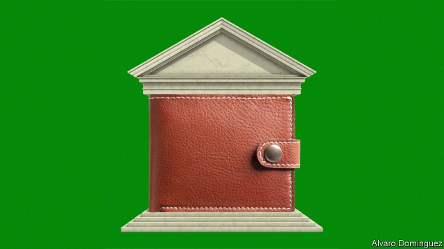

###### Central banks

# How to make economic policy fit for a world of low inflation 

 

> print-edition iconPrint edition | Special report | Oct 10th 2019 

THE HISTORY of monetary policy is one of intermittent revolution. In the whole of the 19th century, constrained by the gold standard, America’s prices rose only 12%. After the second world war countries pegged their currencies to the dollar, which was in turn redeemable for gold. That system broke down in 1971 when it was abandoned by America. Its collapse ushered in the era of fiat currencies and preceded the inflation of the 1970s. Inflation-targeting was born out of that debacle and simultaneous intellectual advances by economists, who realised the importance of credible institutions. Over time more central banks committed to “flexible” inflation-targeting, meaning that in a crisis they could prioritise fighting unemployment. 

Shortfalls in inflation, combined with very low interest rates, are causing another rethink today. In 2020 the Federal Reserve will report on a review of its targets and tools. The ECB is searching for new ways to fight low inflation in the euro area. Meanwhile economists are increasingly willing to question the dictum set out by Milton Friedman in 1963 that inflation is a monetary phenomenon. A decade of below-target inflation suggests that “what was previously treated as axiomatic is in fact false,” according to Larry Summers and Anna Stansbury of Harvard University. “Central banks cannot always set inflation rates through monetary policy.” 

Central banking has also become more politicised. One of the few ideas to unite President Donald Trump with Alexandria Ocasio-Cortez, a left-wing congresswoman, is the belief that the Fed should stop worrying about inflation and gun for growth. Mr Trump has called Jerome Powell, the Fed’s chair, an “enemy” for failing to cut rates as much as he would like as America fights a trade war with China. In Europe the ECB is facing fierce hostility to its negative-interest policy among the German public. 

Central banking has become more politicised 

On the left, wacky schools of thought like “modern monetary theory” (MMT), which says, roughly, that as long as inflation remains contained the government can borrow as much as it likes and that fiscal policy should manage the economic cycle, have influenced some people such as Ms Ocasio-Cortez. 

This environment brings risks. A history of inflation by economists at Deutsche Bank warns that periods of high inflation have tended to accompany transitions between monetary-policy regimes like the abandonment of Bretton Woods. Nobody should welcome reforms to central banks led by populists. It would be wrong to suppose that low inflation expectations are immutable or there to be exploited, whether to boost growth or to fund more government spending. Stimulated too much, economies will eventually overheat. An environment of low inflation does not justify tearing down institutions that guard against currency debasement like that seen in Argentina and Turkey. 

Yet reform is needed to achieve three goals. First, central banks must improve how they fight recessions. Second, they must find ways to steer the economy despite a flat and uncertain short-term Phillips curve, the relationship between inflation and unemployment. Third, fiscal policy must act as the stimulus-of-last-resort if economies weaken and inflation falls while interest rates can fall no further. These needs are increasingly recognised, but the reforms that are under consideration mostly lack ambition. 

Take each aim in turn. First, recession-fighting. For several decades economists have had a prescription for monetary policy when nominal interest rates can fall no further: reduce real interest rates instead, by promising more inflation in the future. At the very least, inflation expectations should not be allowed to slip. To that end the Fed may soon commit to targeting 2% inflation on average over the economic cycle rather than at any one point in time. In booms, inflation would be allowed to run a little higher than 2%. In a downturn, this should brighten the economic horizon. 

A more effective reform would be to target a long-run path for the level of prices, rather than year-to-year inflation. Policymakers would have to correct their mistakes if prices veered off course. There could be no repeat of the persistent policy timidity seen in the 2010s. After a long downturn and disinflation central banks would have to push to find the limits of the economy’s capacity. 

Yet this would do nothing towards the second goal: freeing central banks from having to divine the short-term trade-off between inflation and unemployment. To target prices they would still have to judge whether movements in inflation were being driven by the labour market or by supply-side factors, such as technological change or global shocks reverberating through cross-border supply chains. Worse, they would lose some flexibility to ignore temporary distortions. Phenomena such as rising tariffs or oil prices that pushed inflation up and growth down could force central banks to tighten monetary policy to get prices back on course even as the economy suffered. 

It would be better for them to remain agnostic on economic relationships that they do not understand and target a single, simpler variable: the level of nominal GDP, or, loosely speaking, output plus inflation. Such a target would incorporate both central bankers’ underlying goals of stable inflation and a healthy economy. It would replace their faulty judgment about the Phillips curve with a better, implicit test: only when growth and inflation rose in combination—a sign of overheating at home, rather than a shock to supply—would they need to get hawkish. There would be no more fine-tuning of the labour market. 

The third aim, reform of fiscal policy, is the hardest to achieve. One idea is to sharpen the so-called automatic stabilisers, such as unemployment benefits, which ensure a mini fiscal stimulus during downturns. Governments could legislate in advance to cut, say, payroll taxes when the unemployment rate rises sufficiently. This would not hurt. But it would be an incremental reform that cannot compensate for a total loss of monetary-policy firepower. Calibrating a sufficient fiscal stimulus without knowing the economic circumstances in which it would apply is too difficult. 

In addition to beefing up automatic stabilisers, governments should also find a way to give central banks some scope for fiscal action that can be used at their discretion. A recent paper by Blackrock, an asset manager, whose authors include Stanley Fischer, a former vice-chair of the Fed, suggests central banks should have a “standing emergency fiscal facility”. The idea is that in a deep slump, central banks would be authorised to create money to finance new spending or a tax cut. 

Technocrats cannot easily oversee a fiscal stimulus. Monetary policy is not about building bridges or setting rates of income tax. The redistributive effects of low rates, which some say has exacerbated wealth inequality by boosting asset prices, are controversial enough without central banks deciding how society’s resources should be spent. So politicians would need to agree on the structure of the central bank’s fiscal tools in advance. One simple option would be a uniform handout to the public in which every adult received an equal share of newly created money. Central banks’ role would be what it has always been: to calibrate the size of the stimulus and ensure a credible commitment not to overdo it. 

It is wishful thinking to imagine that these reforms can happen quickly, not least because they involve handing more power to technocrats. For good reason the role of monetary policy is constrained by law. In Europe it is set by treaty. It may take a downturn to create political impetus for change. But sooner or later economic policy will have to adapt to today’s disinflationary world. ■ 

See previous article: Most, but not all, emerging markets have overcome high inflation 

