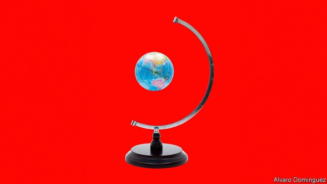
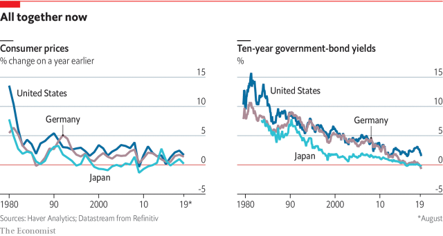

###### Globalisation

# Low inflation is a global phenomenon with global causes 

 

> print-edition iconPrint edition | Special report | Oct 10th 2019 

ECONOMIC MODELS say that less slack in an economy leads to more inflation. But what defines an economy’s borders? As inflation-targeting took off in the 1990s, globalisation also accelerated. Trade grew from 39% of world GDP in 1990 to 51% at the turn of the millennium, cross-border finance was liberalised and the internet slashed the cost of communicating. In the 2000s policymakers began to wonder whether integrated markets had made inflation a global process. Economists generally pooh-poohed the idea. But with central bankers searching for explanations for today’s low inflation, the idea that global forces might be at work has come back into fashion. It has also become more relevant. If globalisation has held down inflation, might its reversal—thanks to the trade war and Brexit—send it shooting back up? 

Inflation has been getting more synchronised across borders. On average, a common global trend accounts for nearly a quarter of the variation in national inflation rates since 2001, according to Jongrim Ha, Ayhan Kose and Franziska Ohnsorge of the World Bank. Add in factors specific to advanced economies and emerging markets, respectively, and trends spanning borders account for more than half the movement in inflation in the rich world and nearly a third of it in poorer countries. 

This partly reflects simultaneous trends in monetary policy. But it may also indicate a growing role for global factors. Kristin Forbes of MIT, formerly a Bank of England rate-setter, has studied the drivers of inflation in 43 countries between 1990 and 2017. She includes in her models global factors such as exchange rates, an estimate of global economic slack, and commodities prices, and finds that their input appears to have increased over the past decade. This is especially true when considering only temporary deviations in inflation from its long-term trend. 

There are three main sources of global influence on inflation: the price of commodities, trade in goods, and capital flows. Commodities prices are the most obvious and longstanding. Synchronicity of inflation rises after large movements in the oil price, such as the shocks of the 1970s. More recently commodities prices have, on the margin, been driven by demand in emerging markets, especially China. Between 1996 and 2016 the seven largest emerging markets accounted for almost all of the rise in global consumption of metals and two-thirds of the rise in global consumption of energy. As a result, booms and busts in emerging-markets’ demand for commodities are felt everywhere. In the mid-2010s it was a commodities bust that helped push Europe into deflation. 

That much is not controversial. But another effect of globalisation has been to bring down the price of manufactured goods as their production has shifted to economies with low labour costs. Unlike with commodities, this has been a one-way bet, not a cycle. For decades goods have been getting cheaper relative to services. 

 

Economists can get annoyed by claims that goods trade has dragged down overall inflation. In theory just some things getting cheaper should not be disinflationary because, with the right monetary policy, average prices will still rise fast enough to make up the shortfall. In practice monetary policy works only with a delay. That means changes in relative prices matter. Today, because the Phillips-curve relationship seems to have weakened, central banks often find themselves at the mercy of short-term trends (see article). 

Goods trade does not just mean imports of finished products. The recent growth in cross-border supply chains has created conduits along which cost changes in one part of the world flow into the prices of goods that emerge from factories elsewhere. Research by Raphael Auer of the Bank for International Settlements (BIS), Andrei Levchenko of the University of Michigan and Philip Sauré of Johannes Gutenberg University in Mainz has found that half of global synchronisation in producer-price inflation is attributable to prices that can be traced through supply chains. Via this mechanism the average country imports one-fifth of any change in inflation in the rest of the world. Prices are more intertwined in integrated trading regions such as America, Canada and Mexico. 

If firms can locate their supply chains where costs are lowest, it becomes easier to avoid economies that are running hot. Only if inflation is driven up everywhere are rising costs inescapable. In other work with his colleagues at the BIS, Claudio Borio and Andrew Filardo, Mr Auer finds that the greater a country’s integration into cross-border supply chains, the more inflation tracks slack in the global economy. If imports of inputs to production double as a share of GDP, the sensitivity of inflation to global economic conditions also appears to double. Messrs Ha and Kose and Ms Ohnsorge also find that global factors explain a greater share of inflation in countries which participate more in global supply chains. 

This view implies that prices in non-tradable sectors, such as services, will remain sensitive to domestic economic conditions. That is what James Stock of Harvard University and Mark Watson of Princeton University find in America. Hotels and restaurants, for example, remain fairly sensitive to labour-market slack. Messrs Stock and Watson are even able to separate inflation into an index that is “cyclically sensitive” and one that is not. 

The effects of excess saving spill across borders 

The third global factor is capital flows. As inflation has synchronised across borders, so too have long-term real interest rates. For the past four decades they have moved in tandem as saving and investment have been brought into balance globally. And they have moved in one direction: down. In other words, there appears to be a glut of global saving. The potential reasons for this phenomenon, which was first identified in the mid-2000s, include ageing populations, slower productivity growth, a scarcity of safe assets relative to risky ones, and a dearth of lucrative opportunities for private-sector investors. 

It is not just long-term rates that have fallen in tandem. So have the “equilibrium” short-term rates which anchor monetary policy, according to estimates by John Williams, president of the New York Fed, and Kathryn Holson and Thomas Laubach of the Fed in Washington, DC. Falling equilibrium rates mean that any interest rate central banks choose is less stimulative than it would have been a decade or two ago. In other words, the effects of excess saving spill across borders. Current-account surpluses in, say, Japan and Germany, which together totalled nearly half a trillion dollars in 2018, bear down on the interest rates that must be set by the central banks of other countries to keep inflation on target. 

That is fine if central banks adjust accordingly. The problem is that equilibrium rates have been driven close to zero. Unable to cut rates much, central banks find that the only way to fight disinflationary pressure is with unconventional measures like quantitative easing (QE). These are themselves policies with global consequences. QE is supposed to work in part by getting investors to buy riskier assets. That adjustment happens on the balance-sheets of asset managers who invest worldwide. As a result it sends billions of dollars of capital looking for interest rates to drive down elsewhere. 

Ironically, the recent incremental reversals of globalisation provide good examples of the importance of global financial conditions to inflation. In theory tariffs should boost inflation in the country that sets them. But as the trade war between America and China heated up during 2019, it sparked fears about global growth and triggered a rush into safe assets such as Treasury bonds. Long-term bond yields fell to new depths and the dollar surged. In response the Fed has cut rates and the ECB has restarted QE. 

The deflationary impact of a change in global risk appetite has proved far more significant than the modest inflationary impact of the tariffs themselves. Only in Britain has the rolling back of globalisation, via its vote to leave the EU, had a very noticeable upward effect on prices. But even that was due to a fall in the value of the pound; the direct effect of Brexit, if and when it happens, could seem small in comparison. 

One group of countries feels the effects of the global financial cycle above all others. For emerging markets, it is so important that they face a distinct set of monetary-policy challenges.■ 

See previous article: Technology is making inflation statistics an unreliable guide to the economySee next article: Why onions and pigs can give economists a headache 

