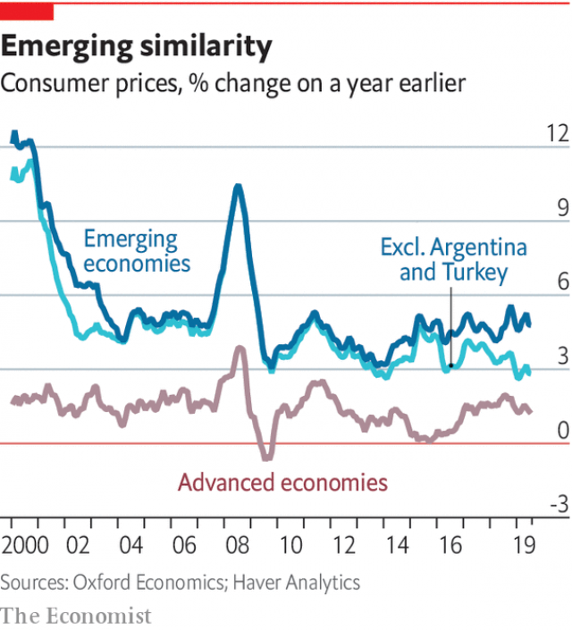

###### Emerging markets

# Most, but not all, emerging markets have overcome high inflation 

 

> print-edition iconPrint edition | Special report | Oct 10th 2019 

THIS YEAR marked a quarter of a century since Brazil beat hyperinflation with a conjuring trick. The old currency, the cruzeiro, had been debased, suffering annual price rises reaching 2,500%. Following the advice of a small group of economists, the government required firms to list prices and wages in “units of real value”, a new unit of account linked loosely to the dollar. Cruzeiros—ever more of them—continued to be used for payment, with the exchange rate between the unit and the currency widely publicised. Eventually the authorities simply scrapped the cruzeiro, replacing it with the freshly-minted “real”, which by then was a trusted yardstick. Inflation tumbled to 22% in 1995. 

It seemed like a miracle. Yet arguably what came next, both in Brazil and other emerging markets, was more remarkable still. Since then, many emerging-market economies have defeated not just hyperinflation but high inflation too. In 1995 median inflation among emerging markets was over 10%. By 2017 it was only 3.3%. Exclude crisis-struck Turkey and Argentina, and at the start of 2019 the gap between average inflation in emerging markets and advanced economies was at a record low (see chart). In Brazil today inflation is just 3.4%. 

This longer, slower miracle was achieved using rich-world methods but in harsher conditions. By the 1990s, and especially after a speculative attack on Thailand’s currency in 1997 sparked a financial crisis in Asia, emerging markets were moving away from the old monetary paradigm of fixed exchange rates. At the end of the decade they began to embrace inflation targets. The first to transition was Poland in 1999, followed by Brazil in 1999, South Africa in 2000, Hungary in 2001 and the Philippines in 2002. Today 24 emerging markets have inflation-targeting central banks. 

 

On average they have been a clear success. Inflation has fallen, as has its volatility. Prices still rise faster than in the rich world but targets are also higher: typically closer to 5% than the 2% advanced-economy norm. Yet the landscape is varied. In countries like Chile, with transparent central banks, low public debt and high openness to trade, inflation expectations are pinned down. In others, like India, with higher public debt and less credible institutions, they remain volatile. And emerging markets still provide the main exceptions to global disinflation, including Argentina and Turkey, where inflation is running at 54% and 15% respectively. 

This variation is one reason why there is not much head-scratching about low inflation in emerging markets. Another is that fewer central banks than in the rich world—a little more than half of the total—are undershooting their targets. And monetary policymakers are not pressed up against the lower bound on interest rates, at which low inflation becomes a greater threat. But this poses its own problem. Higher rates make emerging markets potentially attractive sources of yield for rich-world portfolio investors, who tend to be fickle. Capital flowing in and out can send exchange rates haywire, affecting not only inflation but also trade and financial stability. 

In such an environment anchored inflation expectations take on more importance. They make the response of inflation to exchange-rate fluctuations transient and less severe, thereby allowing central banks to focus on the health of their economies. Last year the IMF found that from 2011 to 2015 monetary policy reacted more to local economic conditions in emerging markets where inflation expectations were better anchored. That was particularly helpful during the “taper tantrum” of 2013, in which the prospect of less quantitative easing in America sent many emerging-market currencies tumbling. 

The trouble is that the exchange rate partly determines the local economic conditions to which central banks must respond. As well as boosting inflation, a cheaper currency makes it harder for emerging-market corporations that have borrowed in dollars to service their debts. These dollar debts have grown from 14% to 20% of GDP since 2009, on average. And although in theory a falling exchange rate should at least boost exports, this effect is limited by the fact that so much trade is invoiced in dominant currencies like the dollar or the euro. Research by Gita Gopinath and Emine Boz of the IMF and Mikkel Plagborg-Møller of Princeton University has found that a strong dollar tends to gum up world trade, as well as making dollar debts harder to repay. 

As a result, even emerging markets with independent central banks and floating exchange rates can appear to be at the mercy of international financial conditions, in particular the policy of the Federal Reserve. Certainly many still mimic the Fed. As of August, 13 emerging-market central banks had followed the Fed’s interest-rate rises in 2018 and cuts in 2019. Several, such as Indonesia and Thailand, raised rates in 2018 even with inflation well under control. And many continue to intervene directly in currency markets, accumulating and running down foreign-exchange reserves even as they maintain a notional commitment to floating exchange rates. “The textbook version of the inflation-targeting framework is obviously too narrow for emerging-market-economy central banks,” said Agustín Carstens, head of the Bank for International Settlements and former governor of the Bank of Mexico, in May. 

That casts some doubt on the simple story that inflation targeting in emerging markets has been a triumph for conventional economics. What is more, it is uncertain how secure emerging markets’ low inflation is. Three factors threaten it: the strength of institutions, fiscal policy and the global environment. 

One of the curiosities of the rich world’s low inflation is that it has coincided with the rise of populism. Yet it is only in emerging markets, specifically in Argentina and Turkey, that institutional weakness has led to runaway prices. In Argentina President Mauricio Macri’s government tried to establish inflation-targeting at the central bank in 2017, but a series of missteps hurt its credibility before a weakening of Mr Macri’s re-election prospects caused a further run on the currency. Turkey has an inflation-targeting central bank but it has come under relentless attack from President Recep Tayyip Erdogan, who claims, wrongly, that higher interest rates cause inflation. 

Not all populists have laid siege to their central bank. In Mexico President Andrés Manuel López Obrador has promised not to interfere with the Bank of Mexico. In Brazil President Jair Bolsonaro’s Chicago-educated economy minister Paulo Guedes has defended the independence of the central bank, and the legislature is considering granting it formal independence. Still, emerging-markets institutions are clearly more vulnerable to populists than the rich world’s. Even in India, where the central bank is older than the republic, the head of the central bank resigned in December 2018 after a string of conflicts with the government, which pressed for looser policies and a large bite of the central bank’s capital. 

Fiscal policy is the second worry. Unlike in advanced economies, budget-balancing played an important role in emerging markets’ battle against inflation. Their government debt peaked at over 70% of GDP in the mid-1990s. By the eve of the financial crisis in 2007 it was down to about half that. This was partly just luck. A commodities boom boosted growth and filled government coffers, creating space for central banks to establish credibility, says Guillermo Tolosa of Oxford Economics, a consultancy. It soothed worries about so-called “fiscal dominance”, when governments are tempted to inflate away their debt problems. 

Since then, however, debt has been rising again. It is forecast to average 53% of GDP this year, and 60% of GDP by 2024. Mr Tolosa is unworried, pointing out that even in Brazil, which has a huge hole in its budget caused by public pensions, inflation expectations are under control. But others, such as the World Bank, have issued warnings about debt. Although economists are revising up their estimates of the debt that advanced economies can bear in a world of low interest rates, the same argument does not apply in emerging markets, where rates are higher and investors flightier. 

The final factor is the external environment. Those who champion inflation-targeting reject the idea that emerging markets’ disinflation is a result of global factors rather than better economic policy. That is surely right when looking at the long-term trend. But because inflation expectations are less anchored in emerging markets, the short term matters quite a bit. In that respect today’s global disinflationary environment surely helps. So whereas the rich world might breathe a sigh of relief were global inflation to rise, it would not benefit emerging markets. And higher inflation in America would probably mean higher interest rates there and hence disruptive capital flight. 

The upshot is that emerging markets must remain more vigilant about inflation than the rich world. They have not yet reached the point where more inflation looks desirable. That is true only in advanced economies, and calls for its own policy agenda. ■ 

See previous article: Why onions and pigs can give economists a headacheSee next article: How to make economic policy fit for a world of low inflation 

