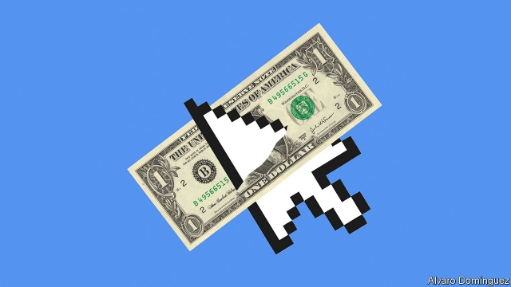
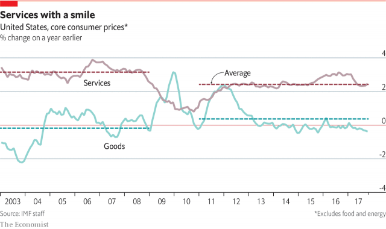

###### Technology

# Technology is making inflation statistics an unreliable guide to the economy 

 

> print-edition iconPrint edition | Special report | Oct 10th 2019 

AMAZON IS USED to fielding accusations: that it has killed off physical retail business, that it mistreats warehouse workers, that it abuses its dominant platform in online sales. So perhaps it is not a surprise that some people also blame it for low inflation. In 2017 Janet Yellen, then chair of the Federal Reserve, wondered aloud if cut-throat online competition might be stopping goods-producers raising prices even in a world of rising demand. Alberto Cavallo of Harvard Business School has found that Amazon’s prices are 6% lower than those of eight large retailers, and 5% lower than on those retailers’ websites. The internet in general is no place to go in search of inflation: in America online prices have been falling fairly steadily since about 2012 and are lower than they were at the turn of the millennium. 

Yet the so-called “Amazon effect” should not seem so novel. The winds of disinflation have been blowing through American retail for decades. In the 1990s and 2000s big-box retailers like Walmart and Target ruthlessly cut goods prices as they optimised their supply chains. Cheap imports from China and other emerging-market economies squeezed domestic producers. One study in 2008 found that low-wage countries capturing 1% of market share in America was associated with a 3.1% fall in producer prices. There has been barely any cumulative rise in American consumer-goods prices, excluding food and energy, for two decades. Before the financial crisis, inflation as a whole behaved normally because services inflation held up. Today, both goods and services inflation are low (see chart). The rise of online retail does not easily explain that broader shift. 

Nonetheless, technological advance is a disinflationary force worth pondering. At a basic level, it allows an economy to produce more with its finite resources. If aggregate demand does not keep up, prices will fall—or at least not rise as fast. The idea that inflation has been low lately because productivity growth has been strong seems laughable everywhere except Silicon Valley because economic statistics have documented a global slowdown in productivity growth. Yet there is an argument that statisticians fail to capture some technological advances, making productivity seem lower and inflation higher than they really are. 

 

The basic concern is a longstanding one. Because it takes a while for statisticians to notice that consumers are buying new products, they miss precipitous price falls early in a product’s life. It is also hard to tell how much better new products are than what went before. In today’s economy the missed value comes from smartphones, social media and online streaming. Spencer Hill, an economist at Goldman Sachs, recently calculated that the measured growth in consumption of personal electronics, communications and media was lower in the 2010s than in any of the five preceding decades. That was despite the fact that in 1990 it would have taken perhaps $3,000 to replicate even the basic functions of a modern phone—and only by using very bulky devices. In real terms, consumption in this category is surely soaring. The statistics must be missing something. 

Statisticians are constantly battling the problem. But a review of America’s inflation indices in 2018 by Brent Moulson, a former top government official, estimated that the inflation index targeted by the Fed remained upwardly biased by almost half a percentage point, primarily because of new products and quality changes. The shift to online sales could be making new-product bias worse. A paper by Austan Goolsbee and Peter Klenow of Stanford University found that even excluding clothing, for which tastes are fickle, 44% of online sales in a database produced by Adobe Analytics, a computing company, were of goods that did not exist in the prior year. With such high churn the basket of goods monitored by official statisticians would quickly go stale. Messrs Goolsbee and Klenow have, for some categories of goods, helped Adobe Analytics to construct its own “digital price index” which shows much less inflation than official measures. For example, they find that furniture and bedding fell in price by almost 12% online between January 2014 and June 2019, while the official consumer price index records a fall of only 2.1%. 

A bigger problem than falling prices is prices that are zero from the start. Most consumers today carry devices in their pockets with which they can make a video-call anywhere in the world, access information on any subject and translate languages instantaneously, all for free. The explosion in the provision of free services is usually cited as a reason to doubt the accuracy of GDP. But it is as big a problem for inflation. First, free services sometimes replace ones that were previously paid for, which puts new-product bias on steroids. Second, if consumers derive a greater share of their well-being from things that come free, inflation ceases to be a good measure of the cost of living or of the purchasing power of incomes. 

Measuring the price of something and measuring its value to consumers are two different tasks. Erik Brynjolffson of MIT and two co-authors have run experiments in an attempt to do the latter. They asked 3,000 online participants what they would need to be paid to give up Facebook for a month, offering to enforce the deal for a few randomly selected participants using Facebook features that reveal to friends when somebody last logged on. The median response was $42. About a fifth of users quoted somewhere near $1,000. In another experiment they struck similar agreements with participants at a Dutch university, enforcing the contract by getting users to change their passwords, in effect locking them out of their accounts, or to submit to monitoring of their electronic devices. The median figure participants quoted to give up mapping services for a month was about €59 ($64); for WhatsApp it was €536. In another paper Mr Brynjolffson and his colleagues asked consumers what they would need to be paid to forgo free online search engines for a year: the median response was over $17,500. 

These figures can mislead. People will always fear the social isolation that would come with being cut off from the predominant communications technology of the day, whether it is telephones, texts or TikTok. Inflation and GDP were never intended to measure consumer welfare. Some free services are displacing activity which has never been counted in GDP, like casual matchmaking. Free services funded by advertising are not new: radio and television have been around a long time. And advertising is only small relative to the economy. John Fernald of the San Francisco Fed argues that many of the consumer benefits from modern technology are “conceptually non-market”. 

Yet the line between market and non-market services is hazy. Imputed rent, the money homeowners would have to pay to rent a house equivalent to the one they own, is included in inflation and GDP, despite not representing any market transaction. In another recent paper David Byrne of the Federal Reserve and Carol Corrado of the Conference Board, a business group, argue that smartphones, broadband connections and Netflix subscriptions should be viewed as investments that reap variable dividends over time depending on how intensively they are used. Armed with trends in data usage and time-use surveys Mr Byrne and Ms Corrado construct a quality-adjusted price index for digital access services that shows prices falling by 21% between 2007 and 2017. The official price index for internet access, by contrast, shows prices up 4.5% over the same period. 

The fact that inflation may be even lower than is reported is, in one respect, good news: it means that growth in living standards has been understated. But it is troublesome for central bankers who are already undershooting their inflation targets. Moreover, the justification for targeting inflation in the first place rests on the notion that the number is a meaningful representation of the economic experiences of the public and of firms. The more economic activity shifts into a domain where price is a slippery concept, the weaker that link will become. And there is another source of breakdown in economists’ understanding of how prices are formed: globalisation. ■ 

See previous article: Economists’ models of inflation are letting them downSee next article: Low inflation is a global phenomenon with global causes 

