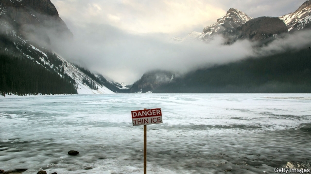

###### Pocketbooks and the planet

# Climate change dominates Canada’s election 

 

> print-edition iconPrint edition | The Americas | Oct 12th 2019 

LAST TIME Canadians had a general election, in 2015, many felt it was a struggle for the soul of the country. It pitted Stephen Harper, a cantankerous Conservative from the oil-producing province of Alberta who had governed for nearly ten years, against Justin Trudeau, the handsome dynast in charge of the Liberal Party. To his fans Mr Trudeau’s victory heralded a return of Canadian values—tolerant, open, progressive—that Mr Harper had abandoned. 

The election to be held on October 21st is not like that. Slip-ups and scandals have dulled Mr Trudeau’s sheen. He urges voters to “choose forward”, which could mean “don’t dwell on my mistakes” as well as “let me build on the progress I’ve made.” His main rival, the Conservatives’ Andrew Scheer, is affable but quickens no pulses. His campaign combines pocketbook promises with put-downs of Mr Trudeau (he’s a “high-carbon hypocrite” because he campaigns using two aeroplanes). Pundits grumble that the campaign, like “Seinfeld”, an American sit-com, is “about nothing”. 

In some ways that is a good thing. Unlike many other democracies, Canada is not fighting its election on the dangerous ground of identity and culture. Mr Scheer has not picked a fight over immigration and race, as some analysts feared he would. He accepts immigration at today’s levels, while wanting to be tougher on asylum-seekers walking across the border from the United States. Last year Canada admitted at least 321,000 new permanent residents, equivalent to nearly 1% of the population. Mr Scheer is sceptical of gay marriage (he once said in Parliament that it was like counting a dog’s tail as one of its legs), but has no plans to challenge its legality. The election’s Seinfeldian quality may vindicate Mr Trudeau’s central political thesis: that boosting the middle class is a good way to fend off populism. Both the main candidates are now peddling tax cuts for the middle class. If he wins, Mr Scheer would spend less freely than Mr Trudeau but is unlikely to depart radically from the course Mr Trudeau has set. 

Except in one crucial respect. The candidates’ biggest area of disagreement is over the environment. Mr Scheer says his first priority as prime minister will be to scrap the national carbon-price floor agreed on by the provincial and federal governments. He says Canada will hit its target for reducing emissions of greenhouse gases—down by 30% from 2005 levels by 2030—by other means. A “national energy corridor” would carry oil from Alberta and his home province of Saskatchewan to the Atlantic and Pacific coasts. Mr Trudeau, by contrast, has stepped up his ambitions for Canada in the fight against climate change, pledging to cut its emissions to “net zero” by 2050. So the election’s main consequence may be to determine whether Canada remains credible as a global cheerleader in the campaign against climate change. 

Mr Trudeau has other boasts. In his four years in office Canada became the first big country to legalise recreational cannabis. It passed laws to allow medically assisted suicide. His government has skilfully handled President Donald Trump. Along with Mexico it negotiated a successor to the North American Free Trade Agreement and persuaded the United States to drop tariffs on steel and aluminium. 

 

It kept its biggest promise: to help the middle class and “those aspiring to join it” by cutting taxes and boosting benefits. This included a transfer to families of up to C$6,600 ($5,000) a year per child (see chart). Mr Trudeau’s priorities for his next term include another middle-class tax cut and a ban on assault weapons (though Canada has much less gun crime than across the border). 

With this record, Mr Trudeau should be racing to re-election while dispensing advice to other leaders on how to soothe middle-class discontents and achieve liberal goals. But his mistakes, coupled with the high expectations he raised, have made his campaign more of a slog than a sprint. 

Trouble began when he failed to keep a promise from the last campaign to change Canada’s British-style electoral rules. These award a seat in Parliament to the candidate who wins most votes in a riding (constituency), even if that is not a majority. This “first-past-the-post” system favours big parties. A decision in February 2017 to scrap electoral reform “was the first unveiling that Justin Trudeau was not Jesus after all”, says Richard Johnston of the University of British Columbia. 

It was not the last. In August Canada’s ethics commissioner scolded him for leaning on the justice minister last year to drop a prosecution for corruption of SNC-Lavalin, an engineering firm based in Quebec, a province vital to the Liberals’ electoral prospects. Then pictures emerged of Mr Trudeau as a young man wearing black- and brownface, embarrassing the world’s most “woke” head of government. 

Mr Scheer has capitalised on this, telling voters the prime minister is “not as advertised”. His other big message is that a Conservative government will help Canadians “get ahead”, mainly by cutting taxes and fees. A “universal tax cut” will lower the rate on the lowest income bracket from 15% to 13.75%. Mr Harper’s boutique tax credits, for children’s sport and taking public transport, which were axed by the Liberals, will be reinstated. National museums will be free. Some of the money to pay for all this will come from a 25% reduction in foreign aid. The Conservatives promise to help homebuyers by easing mortgage stress tests for banks, which were brought in to cool an overheating housing market. 

Their promise to scrap the carbon tax combines this “affordability” agenda with enthusiasm for oil. Under the Liberals, provinces that do not have their own carbon-pricing schemes must accept the federal one. This sets a price floor of C$20 a tonne, which will rise by C$10 a year until 2022. All the money raised is returned to the province. Four provinces—Manitoba, New Brunswick, Ontario and Saskatchewan—are subject to the federal scheme, and Alberta will be from January. Mr Scheer’s plan to replace it is a hotch-potch of regulations and incentives. Few specialists think it will result in Canada meeting its Paris promise. 

On this issue, most Canadians share Mr Trudeau’s alarm rather than Mr Scheer’s complacency. But the Greens and the left-leaning New Democrats are also appealing to climate worriers. And the goodwill Mr Trudeau may have earned from environmentalists was reduced by his decision to buy a pipeline that carries petroleum products from Alberta to Canada’s west coast and to back its expansion. 

Mr Trudeau’s plan, like Mr Scheer’s, falls short of what is needed to achieve the Paris goal, let alone eliminate net emissions. Planting 2bn trees, Mr Trudeau’s new pain-free idea, will not accomplish that. Still, he has laid a foundation on which he can build, if re-elected, in part by continuing to raise the carbon-price floor beyond 2022. 

Polls say each of the two main parties has the backing of a third of the electorate. Most of the rest is split between the New Democrats and the Greens. Mr Trudeau may have the edge because many of Mr Scheer’s votes are bunched in the oil-producing western provinces. Perhaps a tenth of voters will make up their minds at the last minute, says Darrell Bricker of Ipsos, a pollster. In a close fight, they may be decisive. Their choice may depend not on how they feel about Canada but how they feel about the planet. ■ 

