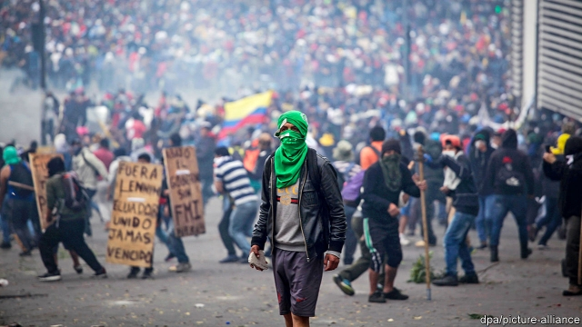

###### Looters v Lenín

# Ecuador falls into chaos after the president cuts fuel subsidies 

 

> print-edition iconPrint edition | The Americas | Oct 10th 2019 

PRESIDENT LENÍN MORENO is facing his biggest crisis since he was elected two and a half years ago to clean up the mess left by his populist predecessor, Rafael Correa. The country is in turmoil. The president’s decision to rid the country of cherished but wasteful fuel subsidies has provoked nationwide riots and looting. Shops, agricultural estates and government offices in Quito, the capital, have been ransacked. A curfew has been imposed in areas close to government buildings and airports. Mr Moreno felt obliged to move his government to the port city of Guayaquil—and to declare a state of emergency. The situation is scarily volatile. 

Meanwhile, prices at the pump have surged. Furious taxi drivers and bus drivers went on strike, blocking hundreds of crossroads. When their ring-leaders were arrested, even angrier protests erupted, egged on by trade unions, left-wing activists and students. Cuenca, the country’s third city, is being supplied by airlifts. Petroamazonas, a state oil company, has been forced to stop production at three oilfields, reducing national output from 550,000 to 385,000 barrels a day. 

Broadly speaking, the strife was prompted by Mr Moreno’s decision to comply with the terms of the IMF in order to win an injection of $4.2bn, 4% of GDP. This is needed to put Ecuador’s economy back on a solid footing after a decade of mismanagement under Mr Correa, a radical socialist who admired Hugo Chávez, the former president of Venezuela. Since coming to power, Mr Moreno has been moving cautiously ahead. But this month he took the risk of slashing the fuel subsidies (except for liquefied gas) that have cost the treasury $60bn in the past four decades. 

A recent study by the Inter-American Development Bank says that the subsidies benefited mainly the better-off. Moreover, much of the fuel was smuggled to Ecuador’s neighbours, Colombia and Peru, where official prices have been far higher. Mr Moreno knew his decision—by presidential decree—would provoke outrage. No previous government had dared to do it. 

His administration had been slow to finalise its package of tax and labour reforms. So the IMF has commended Mr Moreno for his audacity in taking the subsidy-cutting decision by decree. Some economists compare him favourably with Argentina’s president, Mauricio Macri, who has proved just as unpopular while enacting similar reforms more timidly. Mr Moreno has also decided to take Ecuador out of OPEC, the oil-producers’ club, in the hope of increasing exports, when and if the rioters calm down or have been squashed. 

To soften the hardship that many Ecuadoreans will suffer from the inevitable jump in transport fares and other prices, Mr Moreno has promised to increase welfare payments to poor families from $50 to $65 a month and to raise the threshold for eligibility to benefit nearly 5m of Ecuador’s 17m people. He also intends to reduce duties on mobile phones and computers. The middle class has so far been happy with his reforms. 

His chief political antagonist is his predecessor, Mr Correa, who is calling for early elections and says the president is reaping what he sowed. But Mr Correa has his own troubles, since he may soon face charges of corruption and illegal campaign financing during his time in office. He is in self-imposed exile in Belgium. He is also blamed by Mr Moreno for stirring up the violence during the protests—allegedly in cahoots with his friend Nicolás Maduro, Chávez’s despotic successor. 

Mr Moreno is determined not to suffer the fate of two previous presidents, who were overthrown thanks to riots, in 2000 and 2005. His team has quietly begun to negotiate with an influential organisation of indigenous people, known as CONAIE. Some university, church and UN figures are mediating. 

Much hangs on how the unrest plays out. Mr Moreno’s hope is that he will weather the storm and enable Ecuador to follow the example of reform set by Chile or Uruguay, rather than fall back into another decade of instability like the one that preceded the rise of Mr Correa. ■ 

