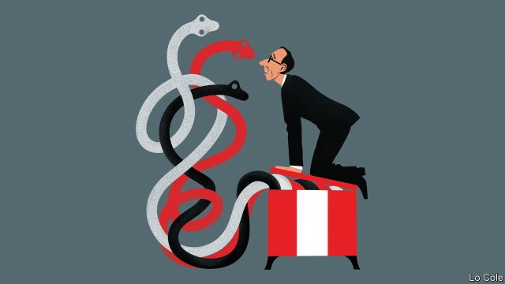

###### Bello

# Peru’s president opens Pandora’s box 

 

> print-edition iconPrint edition | The Americas | Oct 12th 2019 

IN THIS CENTURY Peru has stood out from much of the rest of Latin America for two reasons. First, thanks to free-market policies, its economy has grown much faster. Whereas 55% of the population were poor in 2001, today only 21% are. Second, despite this rapid progress, polls show that Peruvians are unusually scornful of their politicians and their democracy. Yet political stability has been preserved. 

It is now threatened. In July the president, Martín Vizcarra, locked in a power struggle with an opposition-controlled congress, proposed a general election (in which he would not stand) a year early, next April. But a congressional committee rebuffed that idea. On September 30th Mr Vizcarra controversially dissolved the Congress, calling an election for a new one for January. 

This was not a coup, as more excitable opponents claim. The courts and other bodies of state are functioning normally, as are the media and a permanent committee of the dissolved congress. Mr Vizcarra’s action was wildly popular. Many of his opponents in congress were corrupt and self-serving, as well as obstructive. But the president’s fait accompli is constitutionally questionable. It may come to be seen as marking the end of Peruvian exceptionalism. 

The precarious political balance was first endangered by the election in 2016, won by just 41,000 votes (out of 17m) by Pedro Pablo Kuczynski, a former banker. His opponent, Keiko Fujimori, who had won a majority in congress, never accepted defeat. Though she had few ideological differences with the government, she set out to bring it down. After Mr Kuczynski was forced to resign over corruption allegations, Mr Vizcarra, the vice-president, took over. Ms Fujimori is in jail, under investigation (though not charged) for illicit campaign donations from Odebrecht, a Brazilian construction firm. Her supporters consider it a case of partisan injustice. 

Under Peru’s semi-parliamentary constitution the president can dissolve congress if it twice denies confidence to his cabinets (it had done this once to Mr Kuczynski). The conflict boiled over when congress exercised its power to choose new members of the constitutional tribunal, to which Ms Fujimori is appealing. Relying on a broad interpretation of the constitution, and with congress seemingly poised to impeach him, Mr Vizcarra chose to make it an issue of confidence. “Everyone played at the edge of the abyss, with great irresponsibility,” says Martín Tanaka, a political scientist at the Catholic University in Lima. The tribunal may rule on Mr Vizcarra’s actions, but is likely to take at least three months. 

Ms Fujimori’s father, Alberto, ruled Peru as an autocrat from 1990 to 2000. He slew inflation and the Shining Path terrorist movement, but left a legacy of systematic corruption and a country politically divided. Fujimorismo represents something deep in Peruvian society: popular capitalism, the informal economy and the idea that rules are to be manipulated rather than respected. Partly under its influence, political parties have been hollowed out and turned into vehicles for private interests. 

Rather than working with congress, Mr Vizcarra sought popularity by championing anti-fujimorismo. His supporters are jubilant. But without the glue of presidential candidacies, the new congress may be unruly. As part of an attempt last year to reform political and judicial institutions through a referendum, Mr Vizcarra courted popularity with a ban on legislators serving consecutive terms. Far from solving a problem, that created one. Peruvians could already throw out the dross, and often did. The new rule will deprive the new congress of experience. 

Peru’s economic miracle was fading anyway. Since 2013 growth has slowed sharply. To revive, it needs help from government. Several big mining and irrigation projects are stalled. Mr Vizcarra has blocked one mine, and has proved a poor administrator. The risk now is that politics harms the economy. 

There are no easy answers to Peru’s conflict of powers. In the 1960s a similar stand-off ended with the president being ousted by a military coup. At least Peru today has been spared that. In many ways, the fujimorista majority in congress invited its own demise. But by blundering into what some consider an abuse of presidential power, Mr Vizcarra has thrown into question the rules of Peru’s political game. And he has set a precedent which may be copied by rulers whose intentions are far worse. 

