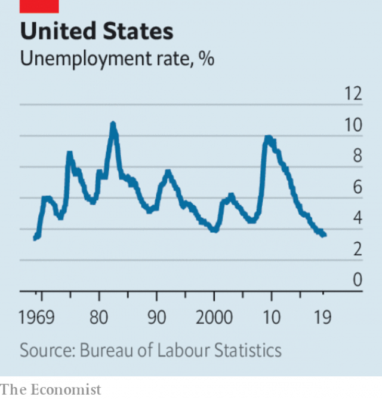

###### Macroeconomics

# Business this week 

> Oct 12th 2019 

The OECD advanced proposals to ditch the current rules covering international corporate tax, “which date back to the 1920s and are no longer sufficient” in a globalised world, and create a system that acknowledges the “digitalisation” of the world economy. The plan would end decades of practice by allowing a country to tax a company that does “significant business” within its borders, even if it has no base there. The OECD wants to create a multilateral framework to override the patchwork of unilateral laws. The new system would apply not only to tech companies such as Apple and Facebook, which have been criticised for avoiding tax in countries like Britain and France, but also luxury-goods firms, carmakers and other highly globalised industries. 

Hong Kong’s stock exchange dropped its £32bn ($39bn) unsolicited bid for the London Stock Exchange. The LSE had rejected the offer, reiterating its commitment to buy Refinitiv, a financial-data provider. The British bourse has said it sees Shanghai as the gateway to Chinese markets, and has forged closer links with investors there. See article. 

Trying to put the era of Carlos Ghosn behind it, Nissan appointed Makoto Uchida as its new chief executive, replacing the ousted Hiroto Saikawa, who was Mr Ghosn’s protégé. Mr Uchida will head a new three-man leadership team at the Japanese carmaker, which is slashing production in the face of falling sales. 

BP announced that Bob Dudley is to retire as chief executive early next year and be replaced by Bernard Looney, who heads its upstream business. Mr Dudley took the helm at BP in 2010, soon after the Deepwater Horizon disaster, steering the company through a flood of legal claims that ate into its profits. Before that he had headed TNK-BP, the company’s joint venture in Russia, which eventually fell foul of the authorities. 

A jury in Philadelphia ordered Johnson & Johnson to pay $8bn in punitive damages to a man who claims his childhood use of Risperdal, an antipsychotic drug, caused him to grow breasts. The company, which faces more than 13,000 lawsuits over Risperdal, said it would appeal against the verdict, which it described as “excessive and unfounded”. 

 

America’s unemployment rate dropped to a 50-year low, of 3.5%. A broader measure of under-utilisation in the labour market fell to 6.9%, its lowest since 2000. See article. 

Millions of people in northern California had their electricity cut off by Pacific Gas & Electric, as the utility endeavoured to prevent wildfires ignited by its power lines. PG&E filed for bankruptcy protection in January amid claims that its equipment had sparked deadly infernos. The blackout could last for days and affects Silicon Valley and the Bay Area, though not San Francisco. Southern California Edison said it was considering similar action, which would affect the Los Angeles area. 

America lost its top spot to Singapore in the World Economic Forum’s annual competitiveness index. Hong Kong, the Netherlands and Switzerland made up the rest of the top five. Britain was ninth in the 141-country survey. 

At a signing ceremony at the White House, America and Japan sealed their new trade deal. The Trump administration sought the accord after pulling out of a transpacific agreement, which covers 11 countries. This bilateral pact is more limited in scope, mostly covering agricultural goods and avoiding thorny issues, such as car exports. Still, the deal does lower tariffs, a change from the tit-for-tat penalties levied in America’s dispute with China. Ahead of another increase in tariffs on $250bn-worth of Chinese goods, Chinese officials travelled to Washington for a further round of trade talks. 

Ahead of the talks, America increased the pressure on China by adding more Chinese companies to its trade blacklist, including startups working in artificial intelligence. One of them, Megvii, which develops facial-recognition technology, had recently filed for an IPO in Hong Kong. America says the firms are “implicated in the implementation of China’s campaign of repression” against Muslims in Xinjiang. See article. 

Meanwhile, Apple pulled an app from the iPhone that enabled protesters in Hong Kong to map police movements after it was heavily criticised in Chinese state media. 

News that PizzaExpress might fold unless it can restructure its debt prompted campaigns on Twitter to save the 54-year-old restaurant group. Founded in London, the chain helped pioneer casual dining in Britain, concentrating its branches in upper-crust areas. It has gone through several private-equity owners. In response to the outpouring of affection, the pizza firm tweeted that “it feels good to be kneaded” and reassured investors that it was “still making dough”. 

