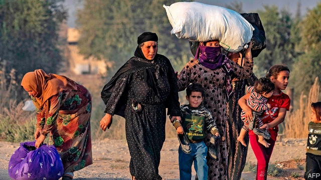

###### Macroeconomics

# Politics this week 

 

> Oct 12th 2019 

Turkey invaded northern Syria to crush Kurdish militias, after Donald Trump said he would pull American troops out of the region, giving Turkey a green light. President Trump was widely condemned for abandoning the Kurds, who fought alongside America against Islamic State and still guard captured IS prisoners in camps. He justified the betrayal by claiming that the Kurds “didn’t help us in the second world war”. Actually, they did. Kurds of the Assyrian Parachute Company fought for the Allies in Greece and Albania, among other places. See article. 

Protests against the government continued in Iraq. The authorities responded with force, killing more than 100 people and wounding 4,000. The government also shut down the internet and imposed curfews, but it has been unable to fix the economy or curb graft. See article. 

An election observer in Mozambique was shot dead, allegedly by police, ahead of a presidential poll already marred by violence and irregularities. See article. 

Hong Kong’s government invoked a colonial-era emergency law to ban the wearing of masks during protests. Thousands of people, many of them masked, protested. Others clashed with police, started fires and vandalised property, resulting in the first closure of the city’s mass-transit rail network in 40 years. See article. 

Nationalists and supporters of the Communist Party in China claimed to be outraged by the general manager of the Houston Rockets, who had tweeted the words “Fight for freedom, stand with Hong Kong”. China’s state broadcaster, CCTV, suspended broadcasts of games involving America’s National Basketball Association. Other Chinese firms severed ties with it. Basketball stars are still free to criticise America. See article. 

North Korea and America resumed disarmament talks for the first time in seven months. But North Korea broke them off after a day, accusing America of intransigence. The dictatorship threatened to test more long-range missiles and nuclear bombs if it does not get more of what it wants by the end of the year. See article. 

The lower house of Malaysia’s parliament voted for a second time to repeal the country’s “fake news” law, which was imposed by the previous government to stifle criticism. 

Thailand ordered owners of publicly accessible wireless networks to keep records of their customers’ identities or their browsing history, to help the authorities identify people who criticise the government or the monarchy. 

New Zealand’s government said it would admit more refugees, and scrap rules that have impeded applicants from Africa and the Middle East. See article. 

Negotiations between the European Union and Britain over Brexit appeared close to collapse. Boris Johnson, Britain’s prime minister, had put forward a new deal he thought the House of Commons might accept, but the EU said it would be hard to resolve differences before the October 31st deadline. After Downing Street briefed that it was all the fault of Germany and Ireland, Donald Tusk, the president of the EU, told Mr Johnson to stop the “stupid blame game”. That was the mildest rebuke Mr Johnson has faced in recent weeks. See article. 

A gunman spouting anti-Semitic slogans killed two people in the German city of Halle and tried to force his way into a synagogue. 

France’s security services faced scrutiny following the killing of four policemen in Paris earlier this month by a colleague. The murderer, a Muslim convert, turned out to have praised the slaughter in 2015 of 12 people at Charlie Hebdo, a satirical magazine, for poking fun at the Prophet. Yet he still had access to top-secret police intelligence files. See article. 

Portugal’s Socialist Party won the most seats in the country’s general election. But it fell short of an overall majority, suggesting that the prime minister, António Costa, will again have to seek allies on the radical left. See article. 

In Ecuador protesters complained about the withdrawal of fuel subsidies, at one point forcing their way into parliament. The unrest, the worst the country has seen for years, prompted the government to move temporarily from the capital, Quito, to the port city of Guayaquil. Lenín Moreno, the president, defended the cuts. His supporters pointed out that the subsidies were costly, wasteful and ecologically damaging. But they are popular. See article. 

Álvaro Uribe, Colombia’s president from 2002 to 2010, was questioned before the supreme court about accusations that through his lawyer he had tried to bully and bribe witnesses to retract claims that he had helped set up a unit of a paramilitary group in the 1990s. In 2012 Iván Cepeda, a left-leaning senator, first accused Mr Uribe of having links to paramilitary groups. Mr Uribe denies wrongdoing. 

America’s Democrats promised subpoenas to make officials testify in their impeachment inquiry, after the White House said it would not co-operate. Having urged Ukraine to investigate Joe Biden, Donald Trump publicly called on China, too, to investigate his potential election rival. Meanwhile, Ukraine’s prosecutor-general said he was reviewing a number of closed investigations, including a case against the energy firm that had employed Mr Biden’s son. He said he had not been put under any pressure to do so. See article. 

It emerged that Bernie Sanders suffered a heart attack when he was admitted to hospital with what his campaign had described as “chest discomfort”. He vowed to appear at the next Democratic debate. 

Microsoft uncovered attempts by hackers linked to the Iranian government to target email accounts associated with an American presidential campaign, reportedly Mr Trump’s. Though unsuccessful in their cyberattack, Microsoft said the hackers were “highly motivated” and “willing to invest significant time and resources” in their endeavour. 

