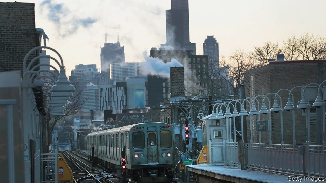
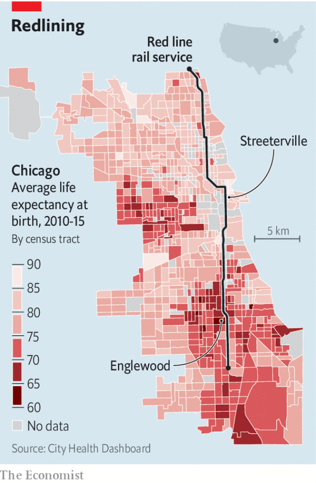

###### Down the tracks

# A ride along Chicago’s red line 

 

> print-edition iconPrint edition | United States | Oct 12th 2019 

SEVERAL PASSENGERS in one carriage of an “L” train, rattling south on the underground line to Chicago metro station, are unmistakably bourgeois. A grey-haired woman squints at a book of 501 French verbs. Opposite, a bespectacled man reads a study of Arctic peoples. Some seats on, an artist doodles on his pad. 

Many well-heeled occupants get off the Red line—a rail service running north-south for 23 miles—at Streeterville, a district where signs of prosperity abound. As an advertising gimmick, a luxury car adorns the L-station roof. At a farmers’ market, installed beside a contemporary art museum, shoppers browse for micro-greens, organic beef and gluten-free tamales. A violinist there explains she busks to save for college. Dollar bills fill her case. 

Streeterville has another distinction. Public-health researchers suggest that a baby born here can expect to live for an average of 90 years, the highest life expectancy in Chicago. That is 30 years longer than an infant born in the most blighted parts of Englewood, farther south along the Red line. No city in America has a bigger gap. 

Return to the train and much changes the farther south you ride. Passengers are younger, less ostentatiously set on self-improvement. A guard in a stab-vest, his hand on a canister of pepper spray, steps in. He confides that he is tracking a suspect. Reports of crime on the L system doubled from 2015 to last year; violent cases rose by 89%, to 447. This year is worse, he says, and “you can’t ask why any more.” 

 

He tells his own story of being assaulted when off-duty, and says he would deploy “a guard in every car” if he could. He leaves at Roosevelt station, and a boisterous group steps in. A woman accuses another of being “a crackhead”, provoking shrieks of laughter. A pair of young men move to let an elderly passenger sit down. 

Here the Red line runs outside, giving glimpses of a changing city: brick pagoda-roofs of Chinatown; high walls of the White Sox baseball stadium; warehouses and ex-factories of a former industrial zone. Men pace the carriages hawking green-and-white packets of cigarettes. The city grows noticeably poorer. 

In the south passengers step out to exhaust fumes and noise. Their stations are squeezed between a dozen lanes of roaring motorway traffic. Leave with them and you can spend an afternoon in depopulating Englewood, tracing a loop between the 63rd and 69th stations, seeing a crumbling city that is strikingly different from the prosperous one 20 minutes to the north. 

A few landmark buildings have been built at City Hall’s behest: a large new campus for a high school, a newish mall that includes a Whole Foods and a Starbucks. Elected officials hope these will spur more redevelopment, but that has not come yet. Many streets are notable for empty lots—where property has been demolished—or for dilapidated and boarded-up houses. 

On a few porches people gather. A main thoroughfare has a row of closed churches and open liquor shops where men congregate. Signs on the “Cadillac 4-in-1 Food Market” announce it has been “black-owned for 35 years”, but its door is buckled and the building is empty. 

On one corner a resident in a yellow high-vis vest, Melvin, says he is hired by the school system to protect children walking home from “any violence going on, any drug activity.” He praises most of Englewood’s locals as “great”, and says he has heard only one gunshot in a year on the job. Yet he says things change after dark. Youngsters suffer from “torn-down neighbourhoods, abandoned buildings that are drug-infested” and from guns. 

What does he make of the gap between life expectancy in Streeterville and here? “As crazy as it sounds, it is true,” says Melvin. “Children up north are not faced with what they face here,” he says, meaning shootings. Police have counted 1,600 violent crimes, including 50 murders, in Englewood and West Englewood in the past year, a far worse rate than most places. 

Lorna Thorpe at NYU Langone Health, a medical centre affiliated with New York University, helped to create the “City Health Dashboard”, which produced the 30-year estimate. She has applied public-health and other data from federal sources to census tracts inside 500 American cities. This allows fine-grained comparisons between the cities and between city neighbourhoods for dozens of factors, including obesity, binge-drinking, smoking, childhood poverty, health insurance and reported rates of mental distress. 

Ms Thorpe thinks many of those could contribute to the three-decade gap. But the most powerful “strong correlation”, she says, is between low life-expectancy and extreme racial segregation. Chicago remains exceptionally divided on racial lines. African-Americans make up 95% of the population in parts of Englewood, compared with just 2% in Streeterville. Segregation is associated with differences between neighbourhoods in income, poverty, marriage rates and more. 

Rob Paral, a demographer, agrees. The differences in life expectancy between rich, white northern districts and black southern ones are mostly a reminder that Chicago never broke up its racial “ghettoes”, he says. Poor and black residents were shuffled to the south when the city demolished public housing in the 1960s and 1970s. Now black folks are being squeezed again from places like Englewood—its population is just 25,000, nearly 40% smaller than in 2000—as people flee violence, poverty and broken housing, often leaving the city entirely.■ 

