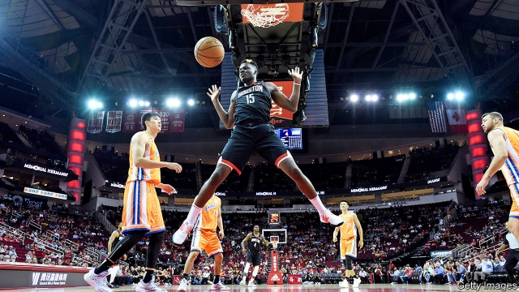

###### Alley-oops

# How not to do business in China 

 

> print-edition iconPrint edition | United States | Oct 12th 2019 

SOMEHOW DARYL MOREY must not have been fully briefed on the most-followed but least-discussed rule of doing business in China: do not say anything that might reflect negatively on the Communist Party. On the morning of October 5th in Tokyo, Mr Morey, the general manager of the Houston Rockets, a National Basketball Association (NBA) team heretofore loved by millions of Chinese fans, ignited a furore in China by tweeting a seven-word message in support of protesters in Hong Kong: “Fight for freedom”, he wrote. “Stand with Hong Kong.” In response to the tweet, which Mr Morey would later delete, the Communist Party showed its willingness to use market power to constrain speech beyond China’s borders—which in turn is hardening resistance in America to China’s influence. 

Chinese nationalists circulated the image from Twitter (which is blocked in China) on Chinese social media, and angrily asserted that Mr Morey was challenging China’s sovereignty over Hong Kong. China’s consulate in Houston issued a statement that China was “deeply shocked” and urged the Rockets to “correct the error”. The Chinese Basketball Association—chaired by Yao Ming, China’s greatest player and a former Rocket (helping explain the massive popularity of the team in China)—declared its “strong opposition” to Mr Morey’s tweet and said it would stop working with the Rockets. 

CCTV, the state broadcaster, and Tencent, an internet conglomerate that streams NBA games, announced they would not show Rockets games. Sponsors cut ties with the team. E-commerce sites stopped selling Rockets kit. The official NBA store in Beijing, the largest outside North America, was instructed by the authorities to remove all Rockets merchandise from the shelves, according to a salesman there (with the exception of Yao Ming jerseys). People’s Daily, the party’s mouthpiece, accused Mr Morey of being “pro-separatist”. The controlling owner of the Brooklyn Nets, Joe Tsai, a Taiwan-born billionaire who made his fortune at Alibaba, a Chinese e-commerce giant, published an open letter suggesting boundaries for acceptable speech about China. He implied that Mr Morey had endorsed a “separatist movement” in Hong Kong, which Mr Tsai called a “third-rail” issue. All “1.4bn Chinese citizens stand united when it comes to the territorial integrity of China”, Mr Tsai wrote. “This issue is non-negotiable.” 

China is by far the NBA's most important international market, with as many as 500m people watching at least one NBA game last season. NBA executives and players quickly tried to react as many businesses with a big China audience have done in the past, by distancing themselves from the perceived offence. Tilman Fertitta, the owner of the Rockets, said that Mr Morey did not speak for the team. Backtracking, Mr Morey later said that he “was merely voicing one thought, based on one interpretation, of one complicated event”. James Harden, the Rockets’ superstar, whose popularity in China increases the value of his endorsement deals, apologised in a television interview. “We love China,” he said. The NBA issued a statement that it was “regrettable” that Mr Morey had “deeply offended” the league’s fans in China. A Chinese version of the NBA's statement went further, saying the league was “extremely disappointed” by Mr Morey’s “inappropriate remarks”. 

Self-censoring to make money in China is a long-standing business practice. The most obvious example is Hollywood, where studios steer clear of any topics in their films that would upset Chinese authorities, so that they can maintain access to the world’s second-largest market. But virtually all foreign businesses operating in China have long self-censored in a more subtle, pernicious way, by never speaking publicly about any issue the Communist Party deems off-limits. Business leaders know they are expected to keep silent about the internment of as many as 1m Uighurs in Xinjiang (where the NBA operates a training academy, opened in 2016). 

The Morey episode shows it is getting trickier for businesses to navigate between expectations in America, where outcry is growing over China’s authoritarian tactics, and the ever-tougher demands of China under Xi Jinping. Adam Silver, the NBA's commissioner, having taken flak over the NBA's spineless initial response, clarified his support for free speech, saying “the NBA will not put itself in a position of regulating what players, employees and team owners say.” That may be true for the NBA, which has a tradition of supporting free speech for its stars. It also still earns most of its money in America. But China’s fierce reaction to Mr Morey’s tweet is certain to induce more self-censorship by executives in the future. And when they choose not to speak at all, few will take note.■ 

