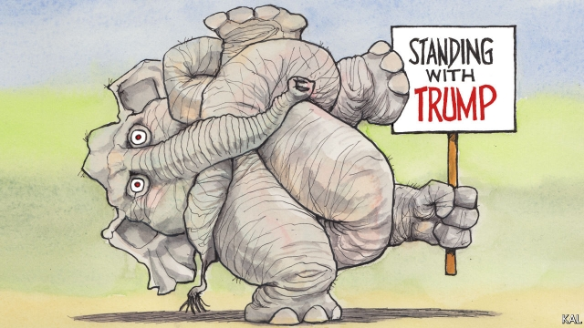

###### Lexington

# Institutional conservatives would condemn Donald Trump 

 

> print-edition iconPrint edition | United States | Oct 10th 2019 

AMERICANS WERE treated to the novel sight of Donald Trump’s Republican colleagues deserting him in droves this week. Even Mitch McConnell had had enough of Mr Trump’s latest dereliction of “American leadership”—which Lindsey Graham, usually one of the president’s staunchest defenders, declared “just unnerving to its core”. They were protesting against Mr Trump’s decision to abandon America’s Syrian Kurdish allies, not the foreign-policy scandal for which he will probably soon be impeached: his effort to coerce Ukraine into launching a bogus corruption investigation into Joe Biden. Even so, such an impassioned uprising against Mr Trump suggested to some that his Republican firewall may not be as solid as is generally assumed. 

There is little reason to think that. Republican senators have criticised Mr Trump’s foreign policies before, even as they have excused his rule-breaking closer to home. And though, as many have noted, there is bad news for Mr Trump in public opinion —always the likeliest predictor of political change—it is so far too modest to augur a dramatic shift. Polls suggest a big rise in support for impeaching the president among Democrats, a significant one among independents, and a modest uptick among Republicans. That is ominous for Mr Trump’s electoral prospects; having never had a 50% approval rating, he cannot afford to lose voters. But it is not grounds to imagine many Republican senators deserting him in the impeachment trial that now looks inevitable. 

The heat Mr Trump took from his party on the Kurds therefore does not suggest his hold on it is weakening. Rather it helps indicate why, after many presidential misdeeds, it remains so strong. 

Implicit in most criticism of Republicans’ acquiescence to Mr Trump is an assumption that it is tactical—that they would behave differently unconstrained. They are said to be opportunists who suffer the president’s rough edges because they love his policies. They are said to be cowards, who fear a condemnatory tweet or primary challenge. And some—such as Mr Graham, a national-security hawk—are said to have made nice with Mr Trump to remain influential on a cherished issue. This is all fair enough, yet it is not the full story. As the Kurdish episode illustrates, Republican politicians dislike a lot of the president’s policies, are not always intimidated by him, and no one can expect to influence him for long. 

The fervour Republicans such as Mr Graham display in their defence of Mr Trump—even after he has admitted most of the wrongdoing in Ukraine he stands accused of—also suggests something more than tactical. Notwithstanding his shaken core, the South Carolinian, once an eloquent proponent for impeaching Bill Clinton, proceeded to dismiss the apparently stronger case against Mr Trump as dangerous left-wing nonsense: “They’re about to destroy the nation for no good reason!” Some see in this doubling down by Mr Trump’s defenders a desperate effort to avoid facing up to their party’s debasement. Republicans “have now dug themselves into a position that they can’t leave without admitting that they sold out morally,” suggests Jonathan Haidt, a (centrist) social psychologist. Another explanation, conversations on and off the Hill suggest, is that even in their secret hearts Mr Trump’s Republican defenders object to his abuses much less than their critics suppose. 

The most generous explanation for this is the one they offer: that Mr Trump’s rule-breaking is mostly hot air. When Marco Rubio dismissed the president’s invitation to China to investigate Mr Biden as being “not a real request” he was representing that view. And, to be sure, a president who ponders shooting the legs from under illegal immigrants or nuking hurricanes or buying foreign countries often strains credulity. Yet given the damage Mr Trump has actually inflicted on norms and institutions—as documented in the 448-page Mueller report and nine-page Ukraine whistleblower’s complaint, neither of which many Republicans admit to having read—this is not a defence that withstands scrutiny. It is an example of the moral contortions politicians are especially good at executing, as Mr Haidt has also shown, to reach a desired position. 

The other big Republican contortion involves believing that, whatever Mr Trump has done, Democrats have done worse, or would do if they succeeded in their dastardly plot to steal power from him. This fundamental conviction among Republicans—almost the party’s animating principle—predates Mr Trump, enabled his takeover and is even more damaging than he is. 

The danger of such extreme right-wing partisanship is its endless capacity to turn standard political grudges—against Democrats’ hypocrisy on executive overreach, for example, or the media’s liberal bias—into an apologia for more egregious rule-breaking. Partisan Republicans accuse their opponents of doing the same thing, and offer examples to prove it. But just as the right has played an outsized role in driving partisanship generally (a dynamic termed “asymmetric polarisation”), so its rule-breaking is more conspicuous and arguably worse. The Democrats’ record on gerrymandering is dire; Republican attempts to suppress non-white voter turnout are a terrible stain. They also hint at a gloomily defensive apprehension, which has no counterpart on the ascendant left, that a Republican Party backed by a shrinking minority of mostly white voters cannot win power by fair means. 

It seems many Republican voters have already settled on that conclusion—though they would put it slightly differently. Shortly after Mr Trump’s election, two in three agreed with the statement that America needed a leader “willing to break some rules if that’s what it takes to set things right.” Mr Trump’s current standing with his party suggests even more would agree with it now. When articles of impeachment against Mr Trump are presented to them, Republican senators will essentially be asked whether they do, too. Their answer will decide more than the president’s fate. It will determine whether theirs is now the party of rule-breaking.■ 

