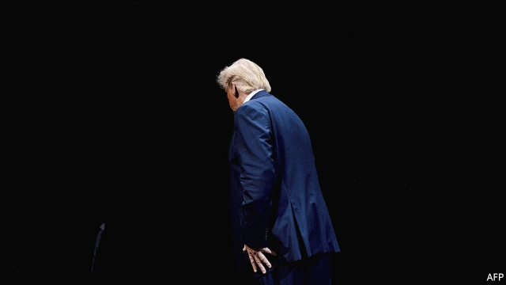

###### Wall of silence

# On impeachment, Congress struggles with an obstructive president 

 

> print-edition iconPrint edition | United States | Oct 10th 2019 

GORDON SONDLAND, America’s ambassador to the European Union (EU) and author of lawyerly texts denying “quid pro quo’s of any kind” between Mr Trump and Ukraine’s president, was due to testify before the three House committees on October 8th. That morning, in a tweet that showed he shared his ambassador’s fondness for errant apostrophes, the president blocked Mr Sondland from appearing before “a totally compromised kangaroo court, where Republican’s rights have been taken away.” Pat Cipollone, the White House counsel, later broadened this recalcitrance. The executive branch could not “be expected to participate in” the House’s impeachment inquiry, which he called a “highly partisan and unconstitutional effort”. Where does that leave Congress? 

As a matter of law, Mr Cipollone is wrong: the constitution gives the House of Representatives “the sole power of impeachment”. Mr Cipollone complained that the president cannot cross-examine witnesses or see the evidence against him. That misunderstands the process. In an impeachment proceeding the House plays the role of a grand jury, evaluating evidence and weighing whether to indict. The president mounts a defence in the Senate trial. 

Mr Cipollone has asserted that the lack of a full House vote to begin an impeachment inquiry renders the current process invalid. This has no basis in law or House rules. Nancy Pelosi, the House Speaker, may be playing politics in trying to ensure that Democrats from districts Mr Trump won do not have to cast a tough vote, but impeachment is a political process as well as a quasi-legal one. There are no rules that say Ms Pelosi needs backing from a floor vote to open an inquiry. Where Mr Cipollone is right is that support for the inquiry is partisan. But that is largely because many Republicans are now reduced to excusing conduct that before 2016 they would probably have deemed unacceptable. 

In a civil or criminal trial, people who flout a court’s instructions can be found in contempt, and either fined or imprisoned until they comply. This is not an option for those running the impeachment inquiry in the House. Congress has not detained anyone since 1935, when a Hoover administration official was held at the Willard Hotel. As fractious as American politics is today, Ms Pelosi dispatching the Capitol police to seize Mr Cipollone or Mr Sondland at the White House, possibly precipitating a physical confrontation between security forces, would make things worse. 

Some Democrats have considered reviving Congress’s powers of “inherent contempt” which, at least in theory, allow them to levy fines on recalcitrant witnesses. Adam Schiff, the House Intelligence Committee chair, suggested fines of $25,000 per day. That would solve two problems for the House, and appeals for two reasons. First, it would be quick, whereas obtaining penalties for civil contempt charges can require lengthy court battles. Second, criminal contempt citations require the Justice Department to prosecute, which, under William Barr, the attorney-general, it is vanishingly unlikely to do. But it is an untried strategy. The House would first have to establish rules, and provide contemnors with some form of due process. The House majority would almost certainly face a legal challenge if it invoked inherent contempt, limiting its capacity to change anyone’s behaviour. 

Democrats thus find themselves with a familiar dilemma. How should they exercise oversight when the White House refuses to follow the rules? One option would be to move swiftly to an impeachment vote and make the stonewalling part of an obstruction charge. Yet Democrats would rather take more time in the hope of swaying public opinion, which seems to be moving their way (see Lexington). If they impeach the president on what sounds like a technicality, and before conducting a full inquiry, it would be easier for Senate Republicans to defend him. 

That may explain the White House’s strategy. Reasoning that the House will probably vote to impeach eventually, why not get it over with now? As soon as the House votes to impeach, control of both the procedure and the news cycle will shift from Ms Pelosi and House Democrats to Mitch McConnell and Senate Republicans. By the time voters head to the polls next year, impeachment would be old news. And it will have been more than a year since the president’s lawyer affirmed in writing that seeking intervention from a foreign government in an American election “was completely appropriate”.■ 

