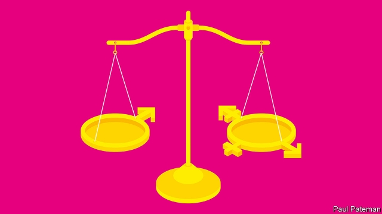

###### Sextualism

# SCOTUS grapples with the meaning of sex 

 

> print-edition iconPrint edition | United States | Oct 12th 2019 

HISTORY WAS made at the Supreme Court on October 8th. The word “transgender” made its debut in an argument and the chief justice repeatedly used the pronoun “they” to describe an individual. Under discussion was Aimee Stephens, formerly Anthony Stephens, who had been fired from her job as a funeral director in Michigan after announcing she would start living as a woman. Her boss, a conservative Christian who holds that biological sex is “an immutable God-given gift”, felt he could not condone what he considered a physical impossibility by allowing Ms Stephens to wear frocks to work. He also thought that the sight of a man dressed as a woman would discombobulate grieving customers. So he fired her. After an appeals court ruled in Ms Stephens’s favour, her boss took his case to the Supreme Court. 

The case has received so much attention that it has at times threatened to overshadow the first gay-rights cases the court will consider since it ruled in 2015 that gay marriage is a constitutional right. The same day, the court heard arguments in the case of Gerald Bostock, who says he was sacked as a social worker in Georgia after officials learned he played in a gay softball league, and Donald Zarda, a sky-diving instructor in New York, whose lawyers claim was fired after he reassured a female customer, to whom he was strapped for a dive, that he was homosexual. Mr Zarda, who died in 2014, won his case at an appeals court; Mr Bostock lost. 

For gay and transgender employees across America the stakes in these cases, which the court is likely to rule on by the spring, could barely be higher. Despite successive attempts, Congress has declined to pass a federal law protecting workers from discrimination on the grounds of sexual orientation or identity. Fewer than half of America’s states have such legislation. Research has found that gay and trans Americans report significantly higher rates of being treated badly at work and fired than their straight or non-transgender colleagues. An amicus brief filed by 206 businesses, including Amazon and Wells Fargo, in support of the cases before the court, argues that the absence of legislation makes it hard for businesses to recruit and retain the best employees. 

Eliding gay rights with transgender rights can jar. Sexual orientation and identity are essentially different, though they sometimes overlap. But the cases heard at the Supreme Court this week all hinge on whether the “sex” bit of Title VII of the Civil Rights Act of 1964, which bans employment discrimination on the grounds of “race, colour, religion, sex, or national origin,” protects such workers. Lawyers for all three argue that it does, because they would not have been fired were it not for their sex. Ms Stephens says she would not have been sacked had she been born female; lawyers for Messrs Bostock and Zarda argue that their attraction to men was considered a problem only because they were men. 

The authors of the Civil Rights Act manifestly did not have gay and transgender workers in mind when they added “sex” to their list of banned grounds for discrimination. In 1964 gay sex was still illegal in most states and transgender Americans mostly kept quiet. But a textualist reading of Title VII—that is, one that focuses on the words of laws rather than the intent with which they were written—suggests that “sex” does indeed protect gay and transgender employees. That is supported by a ruling by the champion of textualism, the late Justice Antonin Scalia. In 1998 he wrote that a male worker could sue for harassment by other men because whereas “male-on-male sexual harassment in the workplace was assuredly not the principal evil Congress was concerned with when it enacted Title VII…statutory prohibitions often go beyond the principal evil to cover reasonably comparable evils.” 

The cases are further bolstered by another, older precedent. In 1989 the justices sided with a female executive denied a promotion for being too “macho”. The court ruled that stereotyping—expecting workers to conform to the conventions of their biological sex—was a form of gender discrimination under Title VII. It would not take a giant leap of logic to conclude that discrimination against gay and transgender people is predicated on sex stereotyping—people should be attracted to the opposite sex and conform to the sex they are assigned at birth—and is therefore illegal. 

Yet the Supreme Court never rules without an eye to the wider politics of such cases. During the hearings on October 8th, Chief Justice John Roberts, who could cast a swing vote if the justices vote along ideological lines, said he was worried a ruling in favour of gay and trans employees would leave religious employers inadequately protected. Justice Neil Gorsuch, an ardent textualist, suggested that “when a case is really close” it might be better to leave decisions that would cause “massive social upheaval” to Congress. 

His questioning about single-sex bathrooms, an issue that has roiled America in recent years, suggests that he considers Ms Stephens’s case to be especially vexed. Conservative Christians are not the only Americans who consider biological sex to be immutable. YouGov, The Economist’s pollster, asked a sample of 1,500 adults to imagine they were meeting someone for the first time who was born male but identifies as female. Half (44%) considered such a person to be male, while half (44%) thought she was female. The rest preferred not to say. Some worry that a ruling for Ms Stephens could lead to the erasure of sex-specific rules at work, such as those governing the provision of single-sex bathrooms. 

Transgender activists are often too quick to dismiss such fears. Responding to a question from Justice Sonia Sotomayor about how the law should respond to women who do not want to share bathrooms with people who look a lot like men, a lawyer for the American Civil Liberties Union, which is representing all three gay and trans plaintiffs, said this was not the question before the court. It could address it, he added, when it arose in a future case. 

He also said that the available evidence so far showed “no upheaval”. Given that several states have already passed laws protecting trans employees from being fired, this is a more convincing response. The fear about shared bathrooms in part reflects how popular acceptance of transgender rights lags behind that of gay rights. That is not surprising. According to data from the Williams Institute, a think-tank at UCLA, there are around ten times as many gay, lesbian or bisexual Americans as there are trans ones. Gay marriage has largely been accepted because most Americans know a gay person; fewer have a transgender acquaintance. 

Mr Gorsuch is right that such questions would be better hammered out by lawmakers who, unlike Supreme Court justices, are elected by the people. There, much will depend on the outcome of next year’s elections. If the Democrats flip the Senate they may pass the Equality Act, which would ban discrimination against gay and trans Americans in public and commercial life. This passed the House in May, but stands no chance of becoming law before 2020. In the meantime, gay and transgender Americans await the justices’ decision.■ 

