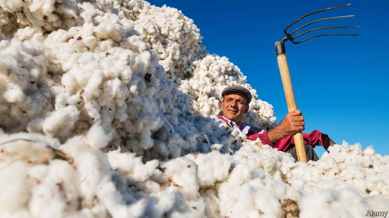

###### About a boycott

# For the sake of workers, Uzbekistan is privatising its cotton industry 

 

> print-edition iconPrint edition | Asia | Oct 19th 2019 

UNDER THE blazing sun in a cloudless blue sky, green foliage droops with unfurling white cotton bolls. In the Fergana Valley in the heart of Central Asia, in the shadow of snow-dusted mountains, the cotton is ripe for picking. If the Uzbek authorities have their way, it will become T-shirts and skirts, to be sold around the world. Uzbekistan, already the world’s seventh-biggest producer of cotton, wants to become a force in the garment industry, too, on a par with the likes of Bangladesh, China and Vietnam. 

Output from Uzbekistan’s apparel industry rose by 80% between 2014 and 2018. Exports of raw cotton have plunged as the crop is turned into fabric and clothes instead. In 2016 half the country’s output was exported; last year only 16% was. Uzbekistan’s textile factories can now get through 720,000 tonnes of cotton a year—roughly as much as its farmers produce. Next year the government hopes to eliminate the export of raw cotton altogether. It is aiming for a 340% rise in the value of exports to $7bn by 2025. The mood is “very optimistic”, says Ilkhom Khaydarov, the head of the Textile and Garment Industry Association. 

But Uzbekistan has an image problem. Over 300 Western clothing brands and retailers, including international giants such as Disney, Nike and Walmart, boycott Uzbek cotton in protest at the massive, state-organised system of forced labour that until recently was used to harvest the crop. As a result, most exports of textiles go to the countries of the former Soviet Union and elsewhere in Asia, not to the most lucrative customers in the rich world. 

The use of forced labour was a legacy of Soviet days, when more or less everyone in cotton-growing regions—schoolchildren, civil servants, doctors—was dragooned into picking cotton at harvest-time. The government insists that this is a thing of the past. The president, Shavkat Mirziyoyev, has spent his three years in office trying to stamp out the practice, as part of a big overhaul of the cotton industry. 

Mr Mirziyoyev took power following the death of Islam Karimov, the strongman who had ruled Uzbekistan since it became independent from the Soviet Union in 1991. Mr Karimov had not only forced people to work in the fields; he had also maintained the government’s monopoly on the cotton trade. Farmers had to grow a certain amount of cotton, which they could sell only to the state, at a price that it fixed. Most still labour under this system, and can lose their land, which is leased from the state, if they do not meet their quota. But Mr Mirziyoyev has allowed farmers in designated areas to sell their cotton directly to private enterprises, at a mutually agreed price—although the farmers still have little bargaining power, notes Yuliy Yusupov, a local economist. The plan is to eliminate all the quotas and state purchases by 2023, leaving the industry in the hands of the private sector. 

It is “a real revolution”, says Mullajon Mansurov, who is inspecting cotton growing near the town of Uchqorgon. Mr Mansurov oversees cotton-growing in the Fergana Valley for Uztex, one of Uzbekistan’s biggest textile companies. Cutting out the middleman and dealing directly with farmers to cultivate cotton to the right specifications is “a huge plus”, echoes Fazliddin Sirojiddinov, Uztex’s boss. 

At one of the firm’s ten factories, on the outskirts of the capital, Tashkent, cotton is piled in shaggy bales. It chugs through gins and whirrs around spinning machines to become yarn. By the end of the production line, the yarn has been transformed into T-shirts, socks, towels and linen—to be exported to 45 countries. The firm is keen to show off how well it treats its workers: they earn seven times the minimum wage, with perks like free health care thrown in. 

The government, too, is keen to tout the country’s respect for workers. “Are you forced to pick cotton or do other work?” ask billboards advertising hotlines to collect reports of abuse. Officials found guilty of coercion are fined and fired. The government is determined to erase this “shame”, says Erkin Mukhitdinov, a deputy labour minister. Like many officials toiling to end forced labour, he has first-hand experience: he had to pick cotton as a student. 

Since 2017 pickers’ wages have increased by over 70%. Labourers must still pick around ten kilos—perhaps an hour’s work—to earn a dollar, but that is comparable to other menial jobs. Forced labour is still widespread but no longer “systemic”, says the International Labour Organisation, which the government has invited to monitor its progress. 

But the government continues to present cotton-picking as a civic duty. In September bureaucrats rewarded a 92-year-old woman with a television for picking 70kg. Local officials, who do not want to be blamed if quotas are not met, still have an incentive to press people into helping in the fields. The Uzbek-German Forum for Human Rights has collected a series of complaints from both workers in the public sector and employees of private firms who say they were ordered to join the harvest this year or to pay for replacement pickers. The Responsible Sourcing Network, which co-ordinates the international boycott of Uzbek cotton, says it will only be lifted if there is “substantial and sustainable” progress. 

To prove the government’s good intentions, Mr Mukhitdinov, among others, has been meeting with campaigners for workers’ rights. Last month he debated the reforms with a group of them over a pot of tea. That in itself was striking: one of the activists in attendance was Azamjon Farmonov, a former political prisoner who spent 11 years in a notorious prison camp, Jaslyk. The authorities ordered his release two years ago, and have since announced Jaslyk’s closure. 

The government and activists alike hope the impending privatisation of the industry will help to relieve the pressure on lowly officials and thus allow cotton prices to rise high enough to cover the costs of picking it without coercion. On Uztex’s factory floor, a smiling seamstress holds up a T-shirt emblazoned with a slogan that seems to speak to the industry’s aspirations. “Ready to be different,” it reads. ■ 

