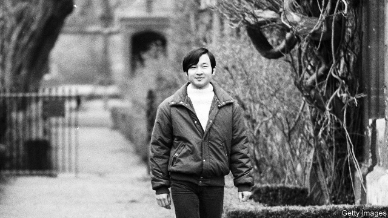

###### Slave to the tortoise shell

# Japan’s emperor is a prisoner in his own palaces 

 

> print-edition iconPrint edition | Asia | Oct 19th 2019 

IN HIS MEMOIR, “The Thames and I”, Prince Naruhito, as he was when he wrote it, recalls his brushes with greasy kippers and dingy pubs as a student at Oxford University in the 1980s. He recounts how doormen at a disco turned him away because he was wearing jeans—not the sort of reversal a Japanese royal often experiences. The picture above shows him dressed in his student gear. The two years he spent at Merton College researching transport on the Thames river in the 18th century were perhaps “the happiest time of my life”, he writes. 

Prince Naruhito became the 126th emperor of Japan in May when his father, Akihito, abdicated because of age and infirmity. He will be officially enthroned on October 22nd, in a ceremony which the many grand guests, including the vice-president of China and the prime minister of South Korea, will watch only by video monitor from another part of the palace. At the conclusion, they will shout “Banzai!” (Literally “10,000 years!”; ie, “Long live the emperor!”). The video link marks an improvement from April, when Emperor Akihito announced his abdication to the sun goddess, from whom he is supposed to be descended, in a ritual observed only by his son, Shinto priests and chamberlains. 

The life of Japan’s monarchs is absurdly formal and arcane. Emperor Naruhito’s cheery reflections on life in Britain nearly did not see the light of day. The Imperial Household Agency, the bureaucracy that dictates what Japanese royals can and cannot do, did not want the book published because they feared it would invite familiarity and ridicule. Its mandarins go to extraordinary lengths to protect the imperial family’s image. When Emperor Naruhito’s brother, Fumihito, got married, in 1990, a photographer was banned from the palace for taking a picture of his bride brushing hair out of his eyes, rather than in a formal pose. The family, says Shihoko Goto of the Wilson Centre, an American think-tank, is so tightly bound by rules that it makes “the House of Windsor seem positively lax”. 

The Japanese press, by and large, is respectful of the boundaries set by the Imperial Household Agency. It was foreign publications, for instance, that broke the news first of Naruhito’s engagement in 1993 and then of his wife’s depression in 2004, even though lots of Japanese journalists were aware of both. Unlike in most European monarchies, there is no prurient tabloid coverage of the royals’ love lives—although there is frequent criticism of royal wives and daughters whenever they are perceived to be shirking their duties. 

The royal family’s relatively limited personal wealth, meanwhile, means that there is little scope for playboy princes or tearaway princesses. The emperor’s main interest is the management of water. Most of the royal family’s assets were confiscated after the second world war. The palaces and estates it uses are owned by the state, which also pays for their upkeep and for the maintenance of the royal household. One expert estimates that Akihito, now styled “emperor emeritus”, had only about ¥5m ($46,000) a year to spend on personal purchases and activities. His father, Emperor Hirohito, left an estate of less than ¥2bn when he died in 1989. 

That leaves the royal family as a species of cosseted but absurdly circumscribed civil servant, their lives arranged in minute detail by bureaucrats, their public statements carefully vetted to ensure they do not overstep their role as constitutional figureheads. Although the emperor and empress, much like monarchs from other countries, undertake goodwill trips abroad and encouraging visits to schools and charities at home, traditionalists see the emperor’s main job as performing obscure Shinto rituals. Next month he will offer rice from two regions of Japan (chosen based on priests’ interpretation of the cracks in a burnt tortoise shell) to the gods to thank them for the harvest, flanked by torch-bearing priests. He also has to grow his own rice, with a little help, presumably, from the imperial gardeners. Empress Masako’s tasks include tending to the silkworms of the Imperial Cocoonery, feeding them mulberry leaves and weaving structures from rice straw on which they spin their cocoons. Both emperor and empress compose classical poems to be declaimed to the court several times a year. 

Whether Emperor Naruhito wants or would be able to modernise his role is uncertain. He battled on his wife’s behalf after she was upbraided for tiny infractions of sexist palace protocol, from speaking marginally longer than he did at their first joint press conference, to walking—gasp—a step ahead of her husband in public. Naruhito complained in 2004 that Masako, a former diplomat, “had completely exhausted herself” trying to adapt to life in the palace, where her “personality” had been stifled. But if he would like to be succeeded by his daughter, rather than his nephew (current law bars women from the throne, although there have been reigning empresses in the past), he has not given any hint of it. 

Emperor Akihito discreetly pushed back both against the dated rituals of royal life and against the tub-thumping nationalists who revere them. He gave the first televised address by a Japanese emperor after the tsunami and nuclear accident of 2011. Shortly afterwards he visited some of those made homeless by the disaster, sharing a cup of tea with them while sitting on the floor. He also appeared to question, albeit obliquely, the plan of the prime minister, Shinzo Abe, to amend the clause of the constitution that commits Japan to pacifism. In 2001 he brought up a distant Korean ancestor at a press conference—a snub to those who cling to ideas of racial purity, notes Ken Ruoff of Portland State University. More recently, he persuaded the obviously reluctant government to pass a law to allow him to abdicate. 

Constitutionally, the emperor is “the symbol of the state and of the unity of the people”. But the imperial cocoon in which he is kept risks making him more of a relic. Much like his father, Emperor Naruhito is relatively informal when touring the country, petting dogs and chatting with schoolchildren. But younger Japanese seem to have little interest in the royal family—and the royal family has scant leeway to make itself more relevant. ■ 

