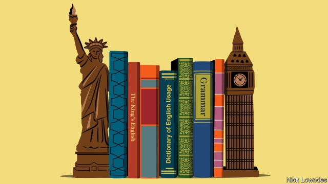

###### Johnson

# How America saved old-fashioned English grammar 

 

> print-edition iconPrint edition | Books and arts | Oct 17th 2019 

IS AMERICA RUINING English or giving it new life? Most of this old transatlantic debate concerns words. Is elevator an improvement on lift? Why say transportation when transport will do? Sometimes it involves spelling, specifically the American reforms that made British centre into American center. Pragmatic change or dumbing down? And, of course, the quickest way to tell a Yank from a Brit is by pronunciation. 

But the differences between British and American English go beyond words, sounds and spelling to grammar itself. Here they can be subtle, but they are many: the index of the “Cambridge Grammar of the English Language” mentions regional differences in 95 places. America being the parvenu, most people assume that any variations between the two countries result from American innovation, to the (sometimes mock) horror of Britons. In reality, America has often been the conservative one, and Britain the innovator. When British speakers borrow American habits, they are sometimes unwittingly readopting an older version of their language. 

Take the past participle of get, which in Britain is got and in America gotten. To some Britons, American gotten is a cute or irritating invention. In fact, it is the older form, which came from Old Norse. “Gotten” appears in a Bible translation of 1535: “Treasures that are wickedly gotten, profit nothinge.” It persisted for centuries before fusing with the past tense, got, in Britain. Not that America was entirely conservative; it has a got too. But Americans use it differently: “He’s got a car” means he owns one, while “He’s gotten a car” means he has acquired one. 

Get gets Brits in another expression: “Can I get…?”, now nearly as ubiquitous in London restaurants as it is in Seattle. Part of the British complaint is that the American expression wrongly uses “can” rather than “may”. But possibility often requires permission, which is why the two overlap in meaning. Can has been used for permission at least since 1489, according to the Oxford English Dictionary. May is in steep decline in America in general, partly as can further colonises its role in signalling permission. But it is in almost as stark a retreat in Britain, too. According to one study, may’s frequency in British speech declined by 40% between 1961 and 1991. That is well before American influence was magnified by shows such as “Friends”—often blamed for the “Can I get…?” invasion. 

In a striking case, a piece of grammar was virtually dead in Britain and moribund in America, before an unlikely revival there and subsequent re-export to the mother country—the subjunctive, as in formulations like “The teacher asks that each student bring [not ‘brings’] a pencil.” In 1926 H.W. Fowler, godfather of English-usage writers, considered this subjunctive “dying” in “A Dictionary of Modern English Usage”, except in archaic phrases such as “so be it” or in “pretentious journalism”. 

The subjunctive had also been on its way out in America, but started to reappear in the mid-to-late 19th century, as Lynne Murphy, a linguist, recounts in “The Prodigal Tongue”. No one knows why; theories include greater Bible reading (which would have kept Americans acquainted with older grammar) and immigrants who spoke subjunctive-filled languages. Whatever the reason, the subjunctive stuck out as a Yankeeism, irking British commentators such as Kingsley Amis, a novelist: “Be careful with any American writings, which often indulge in subjunctive forms.” 

Yet it is on its way back in Britain, too. British writers still often replace it with the indicative; a recent report on the BBC website reads, “Facebook is determined that the future of the internet is shaped more in Brussels and Berlin than Beijing.” Strictly, the subjunctive requires “be shaped” rather than “is”. But some Britons have been happy to re-import the habit. The Guardian style guide endorses the subjunctive, which “can add elegance to your writing”. This is a slightly odd phrasing—matters of grammar are usually framed in terms of correctness, not elegance—but it is clear the subjunctive is having a second life. 

Stereotypes often have a grain of truth. Americans have indeed innovated extensively with English, as with other things. But language never sits still: the British variety itself went on changing after 1776, as all living languages must. Americans, for their part, eagerly import fashionable British slang. Instead of bemoaning new-fangled Americanisms, British observers could spare a thank you to the old colonies for keeping traditional English safe.■ 

